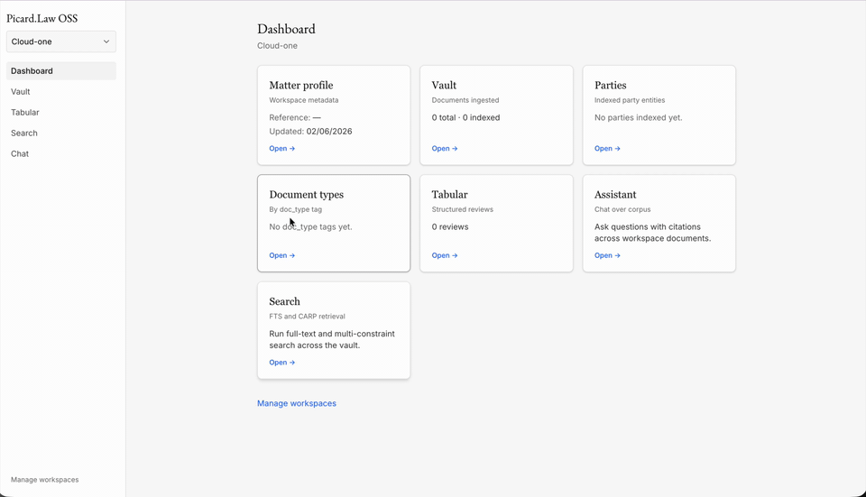
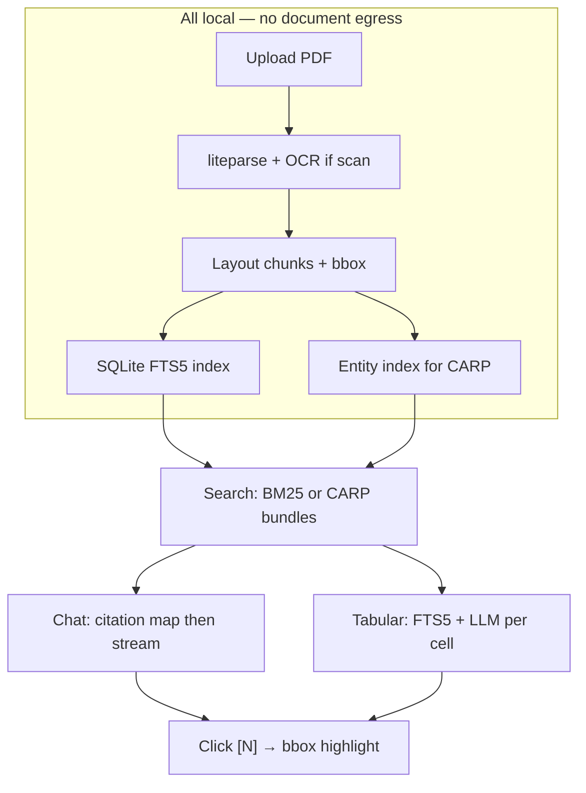

# Picard OSS

Picard OSS is a **local-first legal document assistant** for legal engineers: a Next.js frontend, a FastAPI backend, SQLite + FTS5 retrieval, and citation-grade chat with bbox-grounded PDF highlights. Upload PDFs, search with BM25 or multi-constraint CARP, and get answers that **refuse when evidence is missing**.

**Website:** [picard.law](https://picard.law) (hosted SaaS) · **Repo:** [github.com/iamsaurabhc/picard-oss](https://github.com/iamsaurabhc/picard-oss)

No Supabase, Neo4j, or cloud object storage required — documents live under `.picard-data/` on your machine.

## Demo



*~20s preview (first portion of the recording). Full screen capture: [`media/picard-oss-demo.mov`](media/picard-oss-demo.mov).*

---

## How it works locally

Documents, parsed chunks, and search indexes live under `.picard-data/` on disk — no vector DB, no cloud object storage. Parsing, OCR, retrieval, and PDF bytes stay on your machine; the only optional network call is your LLM provider (OpenAI or Ollama). Every answer path ends in **one-click verification** — click a citation, jump to the bounding box on the source PDF.



| Stage | What happens | Why it matters |
| ----- | ------------ | -------------- |
| **Parse** | liteparse (LiteParse-compatible) extracts layout chunks with normalized bbox; scans use local PaddleOCR/Tesseract | Spatial provenance for every downstream citation |
| **Index** | FTS5 BM25 + entity/page index (CARP foundation) — no embeddings | Exact legal phrases and multi-constraint queries without a vector store |
| **Retrieve** | Search page or chat/tabular retrieval scoped to workspace | Relevance over similarity; refuse gate on zero evidence |
| **Verify** | `[N]` pills (chat) or `p.N` pills (tabular) → `MultiHighlightPDFViewer` bbox overlay | One-click source check, not page-only guessing |

**Citation chat**

```
Query → FTS5/CARP retrieve → refuse if empty → citation map [1..N] → LLM synthesize → SSE stream
                                                                              ↓
                                                            UI: [N] pills → PDF bbox overlay
```

**Tabular review**

```
Column prompt → FTS5 keywords → top chunks → LLM JSON cell → [[page:N||quote:…]] → same PDF panel
```

**Workflow library (Phase 6)**

Built-in assistant and tabular playbooks ship as validated **LightFlow `flow_json`** DAGs (~18 built-ins). Browse them under **Workflows** in the sidebar: filter by type, preview the step graph, validate, export JSON, or hide built-ins. Attach an **assistant workflow** in Chat to pin CARP intent and add playbook guidance; start a **tabular workflow** when creating a review to copy preset columns. **Run** and **Edit in Agent** are disabled until Phase 7b/7a. Set **Deployment profile** (firm/court) in Settings to filter incompatible built-ins.

**Design choices**

- **FTS5 over vectors** — "limitation of liability" beats semantically similar boilerplate from the wrong agreement
- **CARP** — party + date + condition via page intersection, not keyword soup
- **Evidence contract** — citations assigned before synthesis; zero evidence → refuse (no LLM call)
- **Bbox-grounded UX** — lawyers verify specific language, not "somewhere on page 47"

**Roadmap (post-v1, in development)**

- Native binaries for Windows, Linux, and macOS
- Agentic drafts — guideline docs + CSV → templated outputs for multiple parties and use cases
- LightFlow workflow **execution** and agent authoring (Phase 7)
- Optional web research (air-gap off by default)
- Report extraction, compliance checks, and more

Details: [docs/ARCHITECTURE.md](docs/ARCHITECTURE.md) · [docs/phase2-eval.md](docs/phase2-eval.md) · [docs/phase3-eval.md](docs/phase3-eval.md)

---

## Contents

- [How it works locally](#how-it-works-locally) — parse → index → retrieve → verify (all on your machine)
- `[frontend/](frontend/)` — Next.js app (workspaces, search, chat, PDF viewer)
- `[backend/](backend/)` — FastAPI API, liteparse ingestion, FTS5 + CARP, citation chat
- `[scripts/](scripts/)` — `start.sh`, PaddleOCR sidecar, eval harness
- `[docs/](docs/)` — Phase 2/3 evaluation guides
- `[media/](media/)` — Demo GIF (README) and source screen recording
- `[docs/ARCHITECTURE.md](docs/ARCHITECTURE.md)` — Full design blueprint
- [Eval metrics & quality gates](#eval-metrics--quality-gates) — R/C/F/CT/FG/AB IDs (CI + per-answer UI roadmap)

---

## Prerequisites

- Python 3.11 or newer
- Node.js 18 or newer (20+ recommended)
- git
- macOS or Linux (Windows via WSL)

**At least one LLM provider** (pick one):

- [OpenAI API key](https://platform.openai.com/api-keys) — default; powers chat, query understanding, and SLM entity extract
- [Ollama](https://ollama.com/) — fully local (`ollama pull llama3.2`)

**Optional:**

- PaddleOCR sidecar for scanned PDFs — see [OCR for scanned PDFs](#ocr-for-scanned-pdfs)

Search and CARP work without any LLM. Chat and query understanding need a provider key or Ollama.

---

## Data directory

Picard uses **SQLite on disk** — no external database to provision. On first run, the backend creates:

```
.picard-data/
├── picard.db          # chunks, FTS5, entities, chat sessions
├── pdfs/              # uploaded PDF bytes
└── models/            # optional GLiNER cache (if NER enabled)
```

`start.sh` pins data to the repo root (`.picard-data/`). Override with `PICARD_DATA_DIR` in `backend/.env` if needed.

Installed builds use OS-default paths (`~/Library/Application Support/Picard` on macOS, etc.) — see [`backend/app/paths.py`](backend/app/paths.py).

---

## Distribution (Docker, desktop, updates)

### Docker Compose

```bash
docker compose up --build
# Optional OCR: docker compose --profile ocr up --build
# Optional ML deps in image: INSTALL_ML=true docker compose build backend
```

Open [http://localhost:3000](http://localhost:3000). Data persists in the `picard-data` volume.

### Production supervisor (local)

```bash
chmod +x scripts/picard-supervisor.sh
./scripts/picard-supervisor.sh
```

Runs FastAPI + Next.js standalone (no hot reload).

### Desktop installers

Build Tauri bundles (DMG / EXE / DEB) — see [`docs/RELEASE.md`](docs/RELEASE.md):

```bash
cd desktop && npm install && npm run tauri:build
```

Releases publish to GitHub with a [`releases/manifest.json`](releases/manifest.json) for download pages and in-app updates.

**macOS:** If Gatekeeper says the app is “damaged”, see [`docs/MACOS_INSTALL.md`](docs/MACOS_INSTALL.md) (quarantine / first open — not a bad DMG).

### Settings in the app

Use **Settings** in the sidebar (or the first-run wizard) to enter API keys and preferences locally. Keys are stored encrypted under your data directory and are never returned by the API.

---

## Environment

Create local env files:

```bash
cp .env.example backend/.env
grep NEXT_PUBLIC .env.example > frontend/.env.local
```

### `backend/.env`

Minimal setup (OpenAI):

```bash
PICARD_DATA_DIR=.picard-data
DATABASE_URL=sqlite:///.picard-data/picard.db

LLM_PROVIDER=openai
LLM_MODEL=gpt-4o-mini
OPENAI_API_KEY=sk-...

ENABLE_CARP=true
ENABLE_LLM_QUERY_UNDERSTANDING=true
ENABLE_SLM_ENTITY_EXTRACT=true
ENABLE_CONTEXT_RANKER=true

# OCR (scanned PDFs — start PaddleOCR separately or via START_PADDLE_OCR=1)
LITEPARSE_OCR_SERVER_URL=http://localhost:8829/ocr
LITEPARSE_OCR_LANGUAGE=eng
```

Fully local (Ollama — no cloud API key):

```bash
LLM_PROVIDER=ollama
LLM_MODEL=llama3.2
OLLAMA_BASE_URL=http://localhost:11434
```

See `[.env.example](.env.example)` for tiered models, CARP tuning, and feature flags. Full reference: [API keys & LLM configuration](#api-keys--llm-configuration).

### `frontend/.env.local`

```bash
NEXT_PUBLIC_API_URL=http://localhost:8000
```

---

## Install

`start.sh` creates the Python venv and installs npm deps on first run. To install manually:

```bash
python3 -m venv backend/.venv
source backend/.venv/bin/activate
pip install -r backend/requirements.txt

npm install --prefix frontend
chmod +x scripts/start.sh scripts/eval-search.sh scripts/start-paddleocr.sh
```

---

## Run locally

**Single command** (backend :8000 + frontend :3000):

```bash
./scripts/start.sh
```

Or run each service separately:

```bash
# Terminal 1 — backend
cd backend && source .venv/bin/activate
export PICARD_DATA_DIR=../.picard-data
export DATABASE_URL=sqlite:///../.picard-data/picard.db
uvicorn app.main:app --reload --host 0.0.0.0 --port 8000

# Terminal 2 — frontend
npm run dev --prefix frontend
```

Open [http://localhost:3000](http://localhost:3000).


| Page                       | URL                                                                  |
| -------------------------- | -------------------------------------------------------------------- |
| Workspaces                 | [http://localhost:3000/workspaces](http://localhost:3000/workspaces) |
| Search (FTS5 + CARP debug) | [http://localhost:3000/search](http://localhost:3000/search)         |
| Chat                       | [http://localhost:3000/chat](http://localhost:3000/chat)             |
| API health                 | [http://localhost:8000/health](http://localhost:8000/health)         |
| OpenAPI                    | [http://localhost:8000/docs](http://localhost:8000/docs)             |


---

## First run

1. Start the stack (`./scripts/start.sh`).
2. Set `OPENAI_API_KEY` in `backend/.env` (or configure Ollama) and restart if you added keys after first boot.
3. Open **Workspaces** → create a workspace (e.g. `Chester eval`).
4. Upload a PDF — text-native PDFs parse immediately; scans need [OCR](#ocr-for-scanned-pdfs).
5. Wait for `parse_status=done` on the document row.
6. Open **Search** — try `"plaintiff claimed damages"` or a multi-entity CARP query.
7. Open **Chat** — attach workspace documents, ask a question, click `[1]` to jump to the bbox in the PDF viewer.

Eval corpus (Chester v Municipality of Waverly, 627 chunks) ships in tests — see [Testing & evaluation](#testing--evaluation).

---

## Troubleshooting

**Chat returns “refused” with no answer.** Retrieval found zero evidence — expected for unanswerable queries (AB-01). Upload and parse documents first; broaden keywords; check workspace scope. Inspect CARP diagnostics on the Search page.

**`OPENAI_API_KEY` errors or empty chat stream.** Add a key to `backend/.env` and restart the backend, or switch to Ollama (`LLM_PROVIDER=ollama`, `ollama pull llama3.2`).

**Document stuck at `parsing`.** Check backend logs. For scans, ensure OCR is running (`curl http://localhost:8000/health/ocr`). Retry via the document UI or `POST /documents/{id}/retry`.

**Scanned PDF has no searchable text.** Start PaddleOCR: `START_PADDLE_OCR=1 ./scripts/start.sh` or `./scripts/start-paddleocr.sh` in a separate terminal. First install takes a few minutes.

**Frontend cannot reach API.** Confirm `NEXT_PUBLIC_API_URL=http://localhost:8000` in `frontend/.env.local` and that the backend is on port 8000.

**CARP returns empty bundles.** Entity index may be incomplete — run `python backend/scripts/backfill_entities.py` after changing entity extract settings.

---

## Useful checks

```bash
# Backend tests (from repo root)
cd backend && source .venv/bin/activate
pytest -m "not slow" -q
pytest -m corpus -q

# Full eval harness
./scripts/eval-search.sh

# Frontend lint + build
npm run lint --prefix frontend
npm run build --prefix frontend

# API smoke
curl -s http://localhost:8000/health
curl -s http://localhost:8000/health/ocr
```

---

## What you get (Phases 0–4)


| Phase                    | Status | Highlights                                                                        |
| ------------------------ | ------ | --------------------------------------------------------------------------------- |
| **0 — Scaffolding**      | ✅      | Monorepo, `./scripts/start.sh`, health checks                                     |
| **1 — Ingestion**        | ✅      | PDF upload → liteparse chunks + bbox, FTS5 index, entity index for CARP           |
| **2 — Relevance engine** | ✅      | BM25 search, query understanding, CARP bundles, eval harness                      |
| **3 — Citation chat**    | ✅      | Streaming Q&A, refuse gate, `[N]` pills → PDF highlight, hybrid entity extraction |
| **4 — Tabular review**   | ✅      | Column presets, FTS5+LLM cells, SSE batch, flags, Excel export, review chat panel |

---

## API keys & LLM configuration

### OpenAI (default)

```bash
LLM_PROVIDER=openai
LLM_MODEL=gpt-4o-mini
OPENAI_API_KEY=sk-...
```

Powers: chat synthesis, structured query understanding, SLM entity extract, context ranker.

### Ollama (fully local)

```bash
LLM_PROVIDER=ollama
LLM_MODEL=llama3.2
OLLAMA_BASE_URL=http://localhost:11434
```

### Tiered models (optional)

```bash
ENABLE_TIERED_MODELS=true
SLM_MODEL=gpt-4o-mini
LLM_MODEL=gpt-4o
ENABLE_CITATION_JUDGE=true
```

### Feature flags

```bash
ENABLE_CARP=true
ENABLE_LLM_QUERY_UNDERSTANDING=true
ENABLE_CONTEXT_RANKER=true
ENABLE_SLM_ENTITY_EXTRACT=true
ENABLE_NER_ENTITY_EXTRACT=false    # enable after ./scripts/entity-ab.sh
ENABLE_HYBRID_SEARCH=false         # FTS + local embeddings (fastembed)
```

With hybrid search on, `./scripts/start.sh` downloads the ONNX embedding model into `.picard-data/models/fastembed`. Re-index existing PDFs once: `./scripts/backfill-embeddings.sh`.

Chat and search **refuse** (no LLM call) when retrieval returns zero evidence — [evidence contract](docs/ARCHITECTURE.md#7-evidence-contract-adapted-from-picardlaw).

---

## OCR for scanned PDFs

Picard auto-detects **digital** vs **scan** PDFs. Digital PDFs parse at 150 DPI with no OCR. Scans use liteparse OCR at 300 DPI.


| PDF type                | Behavior                                               |
| ----------------------- | ------------------------------------------------------ |
| Digital (embedded text) | Direct extraction, no OCR                              |
| Scan / image-only       | PaddleOCR if server reachable, else Tesseract fallback |


```bash
curl -s http://localhost:8000/health/ocr | jq
```

Start PaddleOCR:

```bash
START_PADDLE_OCR=1 ./scripts/start.sh    # bundled
# or
./scripts/start-paddleocr.sh             # separate terminal
```

```bash
LITEPARSE_OCR_SERVER_URL=http://localhost:8829/ocr
LITEPARSE_OCR_LANGUAGE=eng
LITEPARSE_DPI_DIGITAL=150
LITEPARSE_DPI_OCR=300
# LITEPARSE_REQUIRE_PADDLEOCR=false
```

OCR runs locally — no document bytes leave your machine.

---

## API quick reference

Interactive docs: [http://localhost:8000/docs](http://localhost:8000/docs)

### Workspaces & documents

```bash
curl -s -X POST http://localhost:8000/workspaces \
  -H 'Content-Type: application/json' \
  -d '{"name": "Matter Alpha", "matter_ref": "2024-001"}'

curl -s -X POST "http://localhost:8000/workspaces/{workspace_id}/documents" \
  -F "file=@contract.pdf"

curl -s "http://localhost:8000/documents/{document_id}"
```

### Search (FTS5 + CARP)

```bash
curl -s http://localhost:8000/search -H 'Content-Type: application/json' -d '{
  "query": "limitation of liability",
  "workspace_id": "YOUR_WORKSPACE_ID",
  "retrieval_mode": "simple"
}'

curl -s http://localhost:8000/search -H 'Content-Type: application/json' -d '{
  "query": "case context for supreme court and refused",
  "workspace_id": "eca7aebb-0b4d-433d-8e73-9144c04eb0d7",
  "retrieval_mode": "multi_constraint"
}'
```

### Citation chat (SSE)

**UI:** Open [Chat](http://localhost:3000/chat) — the left sidebar lists prior threads for the active workspace. The latest conversation loads automatically; use **New chat** or pick a row to switch. Share or refresh with `?session={uuid}`. Document scope and citations restore when you reopen a thread.

```bash
SESSION=$(curl -s -X POST http://localhost:8000/chat/sessions \
  -H 'Content-Type: application/json' \
  -d '{"workspace_id": "YOUR_WORKSPACE_ID"}' | jq -r .id)

curl -s "http://localhost:8000/workspaces/YOUR_WORKSPACE_ID/chat/sessions" | jq .

curl -N http://localhost:8000/chat/stream \
  -H 'Content-Type: application/json' \
  -d "{\"session_id\": \"$SESSION\", \"workspace_id\": \"YOUR_WORKSPACE_ID\", \"message\": \"What damages did the plaintiff claim?\"}"
```

Events: `retrieval` → `content` → `done` (references with chunk_id, page, bbox). Refused queries set `refused: true` with **no LLM synthesis**.

---

## Eval metrics & quality gates

Picard ships **dedicated legal-retrieval metrics** — not generic embedding cosine scores. Each metric has a stable ID (R-01, C-02, CT-01, …) used in CI, gold labels, and (soon) the chat UI after every answer.

**Roadmap:** After each chat response, the UI will surface a compact **answer quality panel** — retrieval mode, evidence counts, citation resolution, refuse/abstention status, and CARP diagnostics — so legal engineers can audit *why* an answer was anchored or refused without leaving the thread. Today, retrieval diagnostics appear in **Chat** (`PreResponseWrapper`) and **Search** (CARP debug panel); post-synthesis metrics (CT/FG/AB) run in the eval harness and will move inline next.

### Metric families

| Family | IDs | What it measures |
|--------|-----|------------------|
| **R** — Snippet retrieval | R-01–R-07 | Chunk Recall@10, Precision@10, document match rate, expansion lift, bbox coverage |
| **C** — CARP bundles | C-01–C-09 | Constraint extraction F1, page intersection P/R, decoy rejection, baseline beat vs OR-BM25 |
| **F** — Refuse (retrieval) | F-01–F-05 | Zero-evidence refuse rate, false refuse rate, diagnostics completeness |
| **P** — Performance | P-01–P-04 | p95 search/CARP latency, candidate set size |
| **S** — Scope safety | S-01–S-02 | Cross-workspace leakage, document scope enforcement |
| **E** — Entity extract | E-01–E-06 | Span F1, canonical collisions, CARP downstream regression |
| **CT** — Citations | CT-01–CT-02 | `[N]` marker resolution, pinpoint bbox accuracy (manual sample) |
| **FG** — Faithfulness | FG-01–FG-03 | Claim-level grounding, cross-bundle conflation rate (CBCR) |
| **AB** — Abstention (chat) | AB-01–AB-02 | Missed refusal rate, misleading answer rate |

**Why CARP metrics differ from generic RAG:** Conjunctive queries (“party X + date Y + condition Z”) need **bundle-level** precision/recall and decoy rejection — chunk Recall@K inflates when OR-retrieval returns unrelated co-mentions on different pages.

### Evaluation tiers

| Tier | Where | Purpose |
|------|-------|---------|
| **A — Automated CI** | `pytest -m corpus`, `eval_scorecard.py` | Regression gates on Chester gold corpus (`gold_labels.jsonl`) |
| **B — Weekly / harness** | `eval_chat_chester.py`, `eval_entity_ab.py`, RAGAS baselines | Chat pipeline + entity A/B without blocking every PR |
| **C — Manual legal review** | [docs/phase3-chat-eval.md](docs/phase3-chat-eval.md) | Pinpoint citation accuracy (CT-02 ≥ 90%), bbox alignment (L-05) |

### Per-answer signals (today → next)

| Signal | Available now | After answer (planned) |
|--------|---------------|------------------------|
| Retrieval mode (SIMPLE / CARP) | Chat + Search | ✅ inline panel |
| Chunk / bundle counts | Chat `retrieval` SSE event | ✅ inline panel |
| CARP constraint + intersection diagnostics | Search debug panel; chat `diagnostics` JSON | ✅ formatted panel |
| Refused / abstained (F-01, AB-01) | Chat refuse UX | ✅ inline panel |
| Citation map resolution (CT-01) | Backend validator + pytest | post-answer badge |
| Cross-bundle conflation (FG-02) | Layer 3 validator | post-answer warning |
| Faithfulness / pinpoint (FG-01, CT-02) | Eval harness + manual Tier C | post-answer score (when SLM judge enabled) |

Gold queries anchor to the **Chester v Municipality of Waverly** corpus (627 chunks) — e.g. `chester_bench_001` (exact damages line), `chester_carp_002` (must refuse), `chester_chat_ab01` (unanswerable chat). Full matrix: [docs/ARCHITECTURE.md §15.2](docs/ARCHITECTURE.md#152-evaluation-matrix-by-phase).

---

## Testing & evaluation

```bash
cd backend && source .venv/bin/activate
pytest -m "not slow" -q
pytest -m corpus -q
./scripts/eval-search.sh
python scripts/eval_scorecard.py          # Tier A scorecard JSON (tier_a_pass)
python scripts/eval_chat_chester.py       # Chester NL chat gold
python scripts/eval_entity_ab.py          # rules vs hybrid NER A/B
python scripts/backfill_entities.py
python scripts/export_test_corpus.py      # snapshot → test/fixtures/corpus/
```

**Tier A** (automated): R-01/R-05 recall, C-02/C-09 CARP vs OR-BM25, F-01 refuse-without-LLM, CT-01 citation map — see [Eval metrics](#eval-metrics--quality-gates).

**Tier C** (manual): bbox alignment (L-05), pinpoint accuracy (CT-02 ≥ 90%) — [docs/phase3-chat-eval.md](docs/phase3-chat-eval.md).

---

## Picard OSS vs [Picard.law](https://picard.law) vs [Mike OSS](https://github.com/willchen96/mike)


|            | **Picard OSS**                      | **[Picard.law](https://picard.law)** | **[Mike OSS](https://mikeoss.com)**                              |
| ---------- | ----------------------------------- | ------------------------------------ | ---------------------------------------------------------------- |
| Deployment | Single machine                      | Managed SaaS / enterprise            | Cloud (Supabase + R2)                                            |
| Retrieval  | SQLite FTS5 + CARP                  | GraphRAG + Neo4j                     | Vector + workflows                                               |
| Data       | `.picard-data/` local               | Enterprise tiers                     | Supabase + object storage                                        |
| Auth       | None (single-user local)            | Firm-grade                           | Supabase Auth                                                    |
| Best for   | Legal engineers, air-gap, AGPL eval | Production legal AI                  | Full-stack legal platform                                        |
| License    | [AGPL-3.0](LICENSE)                 | Commercial                           | [AGPL-3.0](https://github.com/willchen96/mike/blob/main/LICENSE) |


Hosted product on unreleased modifications? [COMMERCIAL-LICENSE.md](COMMERCIAL-LICENSE.md) · [saurabh.c@picard.law](mailto:saurabh.c@picard.law)

---

## Licensing


| Use case                                             | License                                                                        |
| ---------------------------------------------------- | ------------------------------------------------------------------------------ |
| Local dev, PoC, evaluation on your hardware          | [AGPL-3.0](LICENSE) — no fee                                                   |
| Forking or redistributing modified versions          | AGPL-3.0 — source to users; network use triggers AGPL for SaaS                 |
| Production / hosted service without AGPL obligations | [Commercial license](COMMERCIAL-LICENSE.md) — [picard.law](https://picard.law) |


---

## Keywords

local-first legal AI · legal document assistant · citation-grade RAG · FTS5 legal search · CARP multi-constraint retrieval · bbox PDF citations · legal engineers · liteparse · refuse gate · evidence-first legal tech · open source legal AI · privilege-safe document AI · contract review OSS