# Picard-OSS Architecture & Implementation Plan

This document is the authoritative blueprint for **picard-oss**: an open-source, **local-first** legal document assistant. It synthesizes production patterns from sibling projects where available; paths to `../legaldocx/` and `../mike/` are **optional external references** — patterns are described inline so the OSS repo stands alone.

| Source project             | Reference doc (optional)                                                                                                        | What we inherit                                                                                              |
| -------------------------- | ------------------------------------------------------------------------------------------------------------------------------- | ------------------------------------------------------------------------------------------------------------ |
| **LegalDocX / Picard.law** | `legaldocx/Platform/06-evidence-first-production-legal-ai.md`                                                                   | Evidence contract, refuse-or-anchor, citation-before-synthesis, layered validation, bbox-grounded provenance |
| **Mike**                   | `mike/docs/PRODUCT-STRENGTHS.md`                                                                                                | Tabular review UX, citation-linked PDF viewer, column intelligence, DocPanel patterns, streaming chat UX     |


**What picard-oss deliberately is not:** a fork of LegalDocX's Neo4j GraphRAG stack, Supabase SaaS control plane, or Mike's cloud deployment model. picard-oss trades graph complexity and managed infra for **SQLite + FTS5 + local filesystem** — optimized for a single machine, zero cloud dependency, and fast time-to-first-query.

**Document status (Jun 2026):** Phases **0–4** and **5a** (desktop, CI, release, settings) are **shipped**. Phases **5b–10** are **planned** — especially the **agentic era** (Citation Kernel §7.6, full Tool Registry §4.2.10, HITL §4.3, workflow library + LightFlow execution, LightAgent + mem0 authoring, composite playbooks §10.8, templates, connectors). Sections marked *planned* describe target behavior, not necessarily current code.

---

## Table of contents

1. [Strategic positioning](#1-strategic-positioning)
   - [1.1 User success criteria](#11-user-success-criteria)
2. [Core philosophy & differentiators](#2-core-philosophy--differentiators)
   - [2.5 Deployment profiles (firm / court)](#25-deployment-profiles-firm--court)
   - [2.6 Four surfaces, one evidence contract](#26-four-surfaces-one-evidence-contract)
3. [Design decisions & rationale](#3-design-decisions--rationale)
4. [Technology stack](#4-technology-stack)
   - [4.1 Tiered model routing (optional SLM orchestration)](#41-tiered-model-routing-optional-slm-orchestration)
   - [4.2 Assistant modes & tool stack (post-v1)](#42-assistant-modes--tool-stack-post-v1)
     - [4.2.5 LightFlow execution (Phase 7b)](#425-lightflow-execution-phase-7b)
     - [4.2.6 Step agent role catalog](#426-step-agent-role-catalog)
     - [4.2.8 Explicitly rejected](#428-explicitly-rejected)
     - [4.2.9 LightAgent upstream constraints](#429-lightagent-upstream-constraints)
     - [4.2.10 Picard Tool Registry](#4210-picard-tool-registry)
   - [4.3 Deterministic cores & HITL checkpoints](#43-deterministic-cores--hitl-checkpoints)
5. [System architecture](#5-system-architecture)
   - [5.2.2 Request flow: LightFlow run (Phase 7b)](#522-request-flow-lightflow-run-phase-7b)
   - [5.4 Shipped platform services (Phase 5a)](#54-shipped-platform-services-phase-5a)
6. [Data model (SQLite)](#6-data-model-sqlite)
   - [6.3 Post-v1 tables (workflows, agent, connectors)](#63-post-v1-tables-workflows-drafts-csv-web-snapshots)
7. [Evidence contract (adapted from Picard.law)](#7-evidence-contract-adapted-from-picardlaw)
   - [7.4 Multi-tier evidence (post-v1)](#74-multi-tier-evidence-post-v1)
   - [7.5 Per-step refuse in Agent mode (post-v1)](#75-per-step-refuse-in-agent-mode-post-v1)
   - [7.6 Citation Kernel (agentic baseline)](#76-citation-kernel-agentic-baseline)
8. [Ingestion pipeline](#8-ingestion-pipeline)
   - [8.3 Entity extraction at ingest (CARP foundation)](#83-entity-extraction-at-ingest-carp-foundation)
   - [8.3.4 Entity extraction evolution (EX-1–EX-5)](#834-entity-extraction-evolution-ex-1ex-5)
   - [8.6 CSV & structured data ingest (Phase 8)](#86-csv--structured-data-ingest-phase-8)
9. [Relevance engine (FTS5)](#9-relevance-engine-fts5)
  - [9.5 Multi-constraint contextual retrieval (CARP)](#95-multi-constraint-contextual-retrieval-carp)
10. [Citation-grade assistant](#10-citation-grade-assistant)
   - [10.0 Assistant modes overview](#100-assistant-modes-overview)
   - [10.5 Agent mode — authoring (Phase 7a)](#105-agent-mode--authoring-lightagent--mem0-phase-7a)
   - [10.6 Listing map-reduce (multi-doc orchestration)](#106-listing-map-reduce-multi-doc-orchestration)
   - [10.7 Workflow execution (LightFlow, Phase 7b)](#107-workflow-execution-lightflow-phase-7b)
   - [10.8 Composite use-case playbooks](#108-composite-use-case-playbooks)
11. [Structured tabular review (adapted from Mike)](#11-structured-tabular-review-adapted-from-mike)
   - [11.5 Workflow library (Phase 6+)](#115-workflow-library-phase-6)
   - [11.6 LightFlow workflow model](#116-lightflow-workflow-model)
12. [Frontend architecture](#12-frontend-architecture)
   - [12.6 Assistant modes UX (Chat vs Agent)](#126-assistant-modes-ux-chat-vs-agent)
13. [API surface](#13-api-surface)
14. [Development plan (phased)](#14-development-plan-phased)
15. [Testing & acceptance criteria](#15-testing--acceptance-criteria)
  - [15.1 Baseline corpus (Chester)](#151-baseline-corpus-chester)
  - [15.2 Evaluation matrix by phase](#152-evaluation-matrix-by-phase)
  - [15.3 Eval harness & gold labels](#153-eval-harness--gold-labels)
  - [15.3.1 CI gates (shipped)](#1531-ci-gates-shipped)
  - [15.4 Automated tests](#154-automated-tests)
  - [15.5 Manual legal review (Tier C)](#155-manual-legal-review-tier-c)
16. [Future extensions (post-v1)](#16-future-extensions-post-v1)

---

## 1. Strategic positioning

### Problem statement

Legal professionals need AI assistance that:

1. Runs **locally** (privilege, air-gap, no document egress)
2. Returns **verifiable** answers with page-level citations
3. Supports **bulk structured review** (tabular extraction across many contracts)
4. Starts quickly without Neo4j clusters, Celery workers, or cloud OCR bills
5. *(Post-v1)* Runs **evidence-aware playbooks** — dynamic workflows bound to CARP query intents, not generic chat
6. *(Post-v1)* Drafts documents from **templates + tabular/CSV data + corpus evidence** with section-level provenance
7. *(Post-v1)* Optionally fetches **user-supplied URLs** (cached snapshots) without breaking the local citation contract

### Position in the ecosystem

```
┌─────────────────────────────────────────────────────────────────────┐
│  Picard.law (LegalDocX)     Production SaaS · GraphRAG · Neo4j      │
│  ─────────────────────      Enterprise tiers · Landing AI · Credits │
└─────────────────────────────────────────────────────────────────────┘
                                    │
                    evidence contract + citation discipline
                                    ▼
┌─────────────────────────────────────────────────────────────────────┐
│  picard-oss (this repo)     Local-first OSS · FTS5 · SQLite         │
│  ─────────────────────      Single-machine · liteparse · Ollama     │
└─────────────────────────────────────────────────────────────────────┘
                                    │
                    tabular UX + DocPanel + column intelligence
                                    ▼
┌─────────────────────────────────────────────────────────────────────┐
│  Mike                       Cloud legal assistant · Supabase · R2     │
│  ─────                      Workflows · DOCX edits · collaboration  │
└─────────────────────────────────────────────────────────────────────┘
```

### v1 success criteria


| Criterion                      | Measure                                                                                     |
| ------------------------------ | ------------------------------------------------------------------------------------------- |
| Local-only operation           | No network calls required except optional LLM API                                           |
| First query latency            | < 5s retrieval + synthesis on 50-page NDA (local Ollama)                                    |
| Citation accuracy              | 100% of inline `[N]` markers resolve to valid chunk + bbox (CT-01, §15.2)                   |
| Refuse behavior                | Zero-evidence queries never invoke LLM (F-01 / AB-01, §15.2)                                |
| Tabular extraction             | User defines 5 columns × 10 documents; each cell links to source (TB-01)                   |
| Multi-constraint context query | Party + date + condition → co-occurring bundles, not keyword soup (C-02–C-04, §15.2)        |
| Single-command startup         | One script boots backend + frontend                                                         |


### Post-v1 success criteria (Phases 6–10)

| Criterion | Measure | Phase |
| --------- | ------- | ----- |
| Workflow intent routing | Selecting a playbook triggers correct CARP/FTS5 intent (WF-01) | 6 |
| Deterministic workflow run | Same approved DAG + input → same step order (LF-01, US-08) | 7b |
| Agent citation integrity | Multi-step agent answers: 100% corpus claims use valid `[N]` (AG-01, CK-02) | 7a |
| Per-step refuse | Empty retrieval → `step_refused` or LightFlow stop (AG-02, LF-03, CK-01) | 7a/7b |
| Agent ≡ chat parity | Same golden queries: agent Q&A matches chat citation refs (UC-02) | 7a |
| Composite playbooks | Web→corpus, contracts Q&A, guideline+CSV drafts pass UC-01–UC-03 | 7a–9 |
| CSV provenance | Row/column citation resolves to ingested CSV cell (CSV-01) | 8 |
| Template draft gaps | Unfilled placeholders listed explicitly; ≥90% evidence-backed slots filled (DR-01) | 8 |
| External tier separation | Connector/web claims use `[ext:N]` only; never bbox `[N]` (WEB-01) | 9 |
| Air-gap default | With connectors off, zero outbound HTTP during assistant use (WEB-02) | 9 |
| Compliance export | Court profile produces AI Register JSON (CP-01) | 7+ |


### 1.1 User success criteria

Engineering gates (§15.2) prove correctness; **US-*** criteria express what legal users should *feel* works. Instrument US-01+ in product analytics when available.

| ID | Persona | Success statement | Measurable proxy |
|----|---------|-------------------|------------------|
| **US-01** | Associate | "I verified the answer in one click" | ≥80% answers with ≥1 citation clicked within 2 min |
| **US-02** | Associate | "It refused instead of guessing" | AB-01 pass + refuse UX comprehension (Tier C) |
| **US-03** | Paralegal | "I reviewed 10 NDAs in one sitting" | Tabular batch completes; TB-01 ≥85%; Excel export used |
| **US-04** | Knowledge manager | "Same DD playbook every deal" | WF-03: re-run saved workflow ≤3 UI actions |
| **US-05** | Agent user | "It remembered how our firm works" | AG-04: mem0 recall improves plan on 2nd session (golden) |
| **US-06** | Court clerk | "I can prove what AI touched" | CP-01: AI Register export lists tools + run IDs |
| **US-07** | IT / air-gap | "No document left the machine" | WEB-02 + desktop offline path ([`docs/RELEASE.md`](RELEASE.md)) |
| **US-08** | Workflow user | "The run did exactly the steps I approved" | LF-01, LF-02 (deterministic LightFlow) |
| **US-09** | Workflow user | "I see which step failed and why" | LF-04 + `FlowRunTimeline` trace UI |
| **US-10** | Agent user | "Agent answers with the same citations as chat" | UC-02: agent `answer_from_corpus` ≡ chat refs on golden set |


---

## 2. Core philosophy & differentiators

### 2.1 Local first

All documents, parsed chunks, metadata, chat history, and tabular results live under a user-local data directory (default: `~/.picard-data/` or `.picard-data/` in project root).

**Why:** Legal documents are privileged. Firms evaluating OSS need a credible "documents never leave this machine" story without standing up Supabase, R2, or Neo4j Aura.

**What we skip from LegalDocX/Mike:** Supabase Auth/Storage, Cloudflare R2, Azure Container Apps, Redis pub/sub (v1 uses in-process or SQLite-backed job state).

**Post-v1 external access (Phase 9):** Optional URL fetch stores **cached text snapshots** under `~/.picard-data/snapshots/` — not live browsing, not search discovery, not document egress. Disabled by default (`ENABLE_WEB_RESEARCH=false`) for air-gap deployments.

### 2.2 Relevance over similarity (FTS5, not vectors)

Legal retrieval fails when vector search returns **semantically similar but legally irrelevant** text — e.g., a limitation-of-liability clause from the wrong agreement because the embedding space clusters "boilerplate legalese."

picard-oss uses **SQLite FTS5 (BM25)** plus **metadata filters** (document type, parties, dates) for retrieval.

**Why FTS5 for v1:**


| Factor                  | FTS5                                              | Vector embeddings                       |
| ----------------------- | ------------------------------------------------- | --------------------------------------- |
| Setup                   | Built into SQLite, zero extra services            | Requires embedding model + vector store |
| Legal keyword precision | Exact phrase matching ("limitation of liability") | Fuzzy semantic neighbors                |
| Explainability          | BM25 score + matched terms                        | Opaque cosine distance                  |
| Local perf              | Sub-millisecond on 10K chunks                     | GPU/model load for embed + search       |
| Index time              | Instant on insert                                 | Batch embed every chunk                 |


**Tradeoff we accept:** FTS5 misses conceptual paraphrases ("cap on damages" vs "limitation of liability"). Mitigation: **query expansion** via LLM (Phase 2) and optional metadata tags (Phase 1).

**Critical gap at scale:** A single BM25 query cannot answer **multi-constraint contextual questions** — e.g. "case context for party ABC, date 18/05/2019, with condition C" across 100,000 pages where each entity appears on hundreds of pages independently. Section [§9.5](#95-multi-constraint-contextual-retrieval-carp) defines **Constraint-Aware Retrieval (CARP)**: a lightweight entity + page-co-occurrence layer that preserves legal integrity without Neo4j.

**What we skip from LegalDocX:** Neo4j graph traversal, entity communities, multi-hop obligation chains. CARP replaces the *need* for graph traversal on conjunctive context queries — not the full GraphRAG feature set.

### 2.3 Zero-hallucination citation UX

Every extracted or generated fact maps to a **spatial bounding box** on the source PDF. The UI highlights the exact region when the user clicks a citation.

Inherited from Picard.law's evidence contract (see [LegalDocX citation discipline](../legaldocx/Platform/03-citation-discipline.md)):

- Citations assigned **before** LLM synthesis
- **Refuse gate** on empty retrieval
- Post-generation validation (slimmed for OSS — see §7)

**Why bbox, not page-only:** Lawyers verify specific language. Page-level citation forces manual scanning; bbox overlay is one-click verification.

### 2.4 Professional monotone aesthetics

Shadcn UI + Tailwind, restrained gray palette, serif accents for headings (inspired by Mike's EB Garamond usage). Optimized for **high-density legal workflows** — sticky columns, compact tables, minimal chrome.

### 2.5 Deployment profiles (firm / court)

Picard supports two **deployment profiles** (settings: `agent_profile`, default `firm`). Profiles gate tools, copy, and exports — not the core evidence contract.

| Profile | Default | Connectors | Agent guardrails |
|---------|---------|------------|------------------|
| **`firm`** | Yes | MCP, email, cloud ingest when user enables | Standard HITL on exports |
| **`court`** | Registry / judicial admin | Off by default; local vault only unless approved | Tool denylist (no risk scoring, outcome prediction, credibility scoring); mandatory disclosure on exports; mem0 retention cap |

**Regulatory alignment (India, draft 2026):** The Supreme Court's draft *Regulations for Use of AI in Courts, 2026* emphasizes **human primacy**, advisory AI, explainability, purpose limitation, and absolute prohibitions on algorithmic adjudication and risk scoring (Reg 19–20). Picard's **court** profile maps to permissible uses (legal research, citation verification, summarisation, admin assistance, conversational helpers with oversight) and blocks prohibited patterns in the tool registry. **Firm** profile targets private-matter work with the same evidence contract but fewer export restrictions.

### 2.6 Four surfaces, one evidence contract

Picard is not generic "chat with tools." Four user surfaces share one contract (§7):

| Surface | Shipped | User job | Engine | Evidence shape |
|---------|---------|----------|--------|----------------|
| **Chat (RAG)** | Phase 3 | Fast grounded Q&A | RAG DAG in `chat.py` | `[N]` → bbox on PDF via Citation Kernel |
| **Tabular** | Phase 4 | Bulk extract across documents | FTS + cell LLM | Cell markers → PDF (Tier B) |
| **Agent (author + ad-hoc Q&A)** | Phase 7a *planned* | Describe goal, upload scope, cited Q&A | LightAgent + mem0 + **same Citation Kernel as Chat** | Per-tool `[N]` maps; optional `flow_json` draft |
| **Workflow run** | Phase 7b *planned* | Execute approved playbook deterministically | **LightFlow** (v0.8+) | Per-step Citation Kernel outputs + merged `[N]` / `[ext:N]` maps |

**Chat mode** keeps a **deterministic retrieval DAG** and single-turn LLM context (session history is UI-only). **Agent mode** authors workflows and handles exploratory multi-tool chat — but **corpus Q&A uses the identical Citation Kernel** as Chat (§7.6); agent adds orchestration (upload, scope, multi-step), not a weaker RAG path. **Workflow run** executes saved `flow_json` via `LightFlow.run(trace=True)` — same step order on every re-run. Listing map-reduce (§10.6) informed the DAG shape but is not the execution engine (§4.2.5).

---

## 3. Design decisions & rationale


| Decision          | Choice                                     | Rationale                                              | Rejected alternative                                      |
| ----------------- | ------------------------------------------ | ------------------------------------------------------ | --------------------------------------------------------- |
| Database          | SQLite + FTS5                              | Single file, portable, no server process               | Postgres/Supabase (cloud dep)                             |
| Backend language  | Python (FastAPI)                           | liteparse, litellm, legal NLP libs are Python-native   | Express-only (Mike's stack; weaker PDF parsing ecosystem) |
| PDF parser        | liteparse                                  | OSS layout-aware chunks + bbox; LlamaParse alternative | Landing AI (cloud egress, cost)                           |
| Job queue (v1)    | FastAPI BackgroundTasks + SQLite job table | No Redis/Celery for single-user local                  | Celery + Redis (LegalDocX complexity)                     |
| Auth (v1)         | None (single-user local)                   | Reduces scope; local machine = trust boundary          | Supabase JWT (Mike/LegalDocX)                             |
| LLM routing       | litellm + optional tiered roles            | One interface; SLM/LLM split when configured           | Hard-coded OpenAI SDK; mandatory OpenRouter              |
| Tabular UI        | Custom table + Shadcn (Mike-inspired)      | Full control, monotone styling                         | Ag-Grid (heavier, license considerations)                 |
| DOCX support      | PDF-only v1; markdown drafts Phase 8       | Simpler viewer pipeline                                | Mike's DOCX + tracked changes (post-v1)                  |
| Workflows library | Phase 6 — evidence-aware local playbooks   | Binds to CARP intents; ~20 built-ins, profile-tagged | Mike builtinWorkflows clone |
| Agent orchestration | **LightAgent + mem0** (7a author); **LightFlow** (7b run); Chat = frozen RAG DAG | Picard tools wrap CARP/FTS; refuse per step (§7.5) | LangGraph; custom `workflow_runner.py` |
| Distribution | Tauri + Docker + GHCR (Phase 5a, shipped) | Native installers, updater, `requirements-core` split | Web-only |
| Pipeline prompts | `prompt_registry.json` overrides (shipped) | Tune pipeline without code | Hard-coded only |
| Long-term memory | mem0 local store (Phase 7a) | Flow patterns — not legal conclusions | Vector memory as corpus substitute |
| Structured extraction | Pydantic + litellm JSON; Instructor optional | Already Pydantic-native FastAPI stack | LangChain `.with_structured_output()` |
| CSV ingest        | stdlib `csv` → SQLite (Phase 8)            | No dataframe memory spike                              | pandas, polars |
| Templates         | Jinja2 sandbox (Phase 8)                   | Local file templates with provenance-bound fill        | Mike free-form `generate_docx` |
| Web research      | httpx + trafilatura; URL-only (Phase 9)    | User-controlled egress; cached snapshots               | duckduckgo-search, Playwright, Crawl4AI |
| Workflow execution | **LightFlow** (LightAgent v0.8+), `picard_flow_runner.py` (Phase 7b) | Deterministic DAG; trace events; role-based step agents | Custom `workflow_runner.py`; Burr, Temporal |
| Workflow authoring | LightAgent + mem0 → `flow_json` (Phase 7a) | Dynamic flows from user requirements | Static-only playbooks |
| Multi-constraint retrieval | CARP (entity index + page intersection) | Party+date+condition at 100K pages without Neo4j | Full GraphRAG (LegalDocX) |
| Entity extraction | Hybrid rules → doc-type routing → NER (EX-1–EX-5) | CARP needs auditable spans + canonicals; regex alone misses parties/IDs on real corpora | Pure regex (v1 baseline); per-chunk LLM at ingest scale |


---

## 4. Technology stack


| Layer           | Technology                              | Version target                 |
| --------------- | --------------------------------------- | ------------------------------ |
| Frontend        | Next.js (App Router), React, TypeScript | Next 15+, React 19             |
| UI              | Tailwind CSS, Shadcn UI, Lucide Icons   | Monotone theme                 |
| Backend         | Python, FastAPI, Uvicorn                | Python 3.11+                   |
| ORM             | SQLAlchemy 2.x                          | Async optional in v1           |
| Database        | SQLite + FTS5                           | WAL mode enabled               |
| PDF parsing     | liteparse                               | Layout chunks + bbox           |
| LLM             | litellm                                 | Ollama default, cloud optional |
| Entity NER (EX-3+) | GLiNER small ONNX (+ ContractNER for contracts) | Apache-2.0; CPU-first; optional |
| Citation parsing (EX-3+) | eyecite (US), Blackstone (UK litigation, optional) | BSD-2-Clause / Apache-2.0 |
| PDF viewer      | react-pdf (pdf.js)                      | Custom bbox overlay layer      |
| Export          | openpyxl or ExcelJS (frontend)          | Tabular Excel export           |
| Monorepo layout | `/frontend`, `/backend`, `/scripts`     | Single repo                    |


### 4.1 Tiered model routing (optional SLM orchestration)

LegalDocX runs **volume work on SLMs, synthesis on LLMs** (see [LegalDocX deployment tiers](../legaldocx/Platform/02-on-prem-deployment.md): entity extraction and citation validation on 3B, synthesis on 70B/cloud). picard-oss adopts the same **role split** — but keeps it **optional**. Default mode uses one model for everything; tiered mode activates only when a cheap model is configured.

**OpenRouter is not a separate logic layer.** litellm already routes to OpenRouter via model strings (`openrouter/meta-llama/llama-3.2-3b-instruct:free`). OpenRouter is useful when one API key unlocks many cheap SLMs + one capable LLM. It is **not required** — native OpenAI, Anthropic, or Ollama support the same tiered pattern natively.

---

#### 4.1.1 Where SLM helps vs where rules/SQL are enough

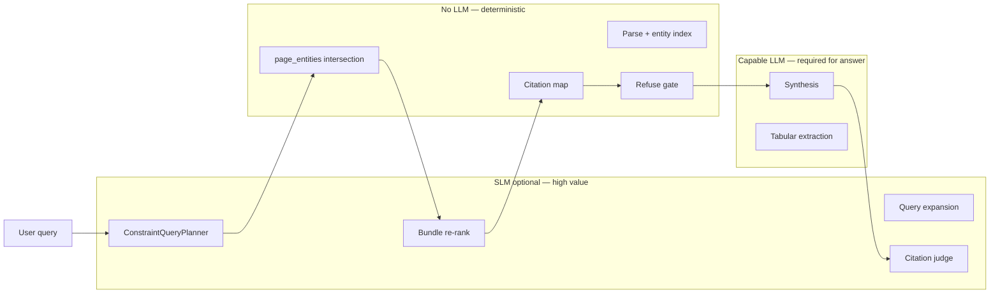

| Pipeline step | Rules/SQL sufficient? | SLM adds value? | Priority | Why |
|---------------|----------------------|-----------------|----------|-----|
| Parse + entity index (§8.3) | **Partial** — rules authoritative for date/amount/condition; NER augments party/ID (EX-3) | Low for bulk; **Medium** for party linker (EX-4) | **EX-3 active** | Rule-first + ONNX NER keeps ingest local and auditable; SLM per-chunk still too expensive |
| **ConstraintQueryPlanner** (§9.5) | Partial — regex catches obvious party/date/condition | **High** | **P1** | *"case context for the ABC side letter re 18 May warranties"* needs NL → structured constraints |
| Query expansion (§9.2, simple path) | Partial — raw keywords often work | **High** | **P1** | Cheap, frequent; bridges lexical gaps without vectors |
| CARP page intersection | **Yes** — SQL on `page_entities` | None | Skip | Set logic must stay deterministic and auditable |
| Bundle scoring (BM25 + proximity) | **Yes** for most queries | Medium | P2 | SLM re-rank helps when intersection returns 20–200 pages and BM25 tie-breaks poorly |
| Refuse gate + citation map | **Yes** | None | Skip | Legal integrity requires deterministic numbering |
| **Synthesis** (chat answer) | No | N/A — needs **capable LLM**, not SLM | Required | Quality-critical; do not downgrade |
| **Citation judge** (§7, post-synthesis) | Partial — FactVerifier lite is regex | **High** | **P2** | LegalDocX layer 5; cheap validation pass catches wrong `[N]` assignments |
| Tabular column prompt gen | Templates cover presets | Medium | P3 | SLM fine for expanding column labels to prompts |
| Tabular cell extraction | FTS5 + JSON schema often enough | Medium | P3 | Complex legal columns may need capable LLM; simple yes/no/date → SLM |
| Agent tool loop (post-v1) | Per-step refuse + citation map deterministic | Capable LLM for tool selection | P2 | Phase 7a — authoring; 7b LightFlow; see §4.2 |
| Dynamic `flow_json` authoring | No | **High** | P3 | Phase 7a — Agent proposes LightFlow DAG from workspace inventory |

**Bottom line:** The highest-ROI SLM insertion points are **before retrieval** (ConstraintQueryPlanner, query expansion) and **after synthesis** (citation judge). The CARP core (intersection, refuse gate, citation map) should stay deterministic.

---

#### 4.1.2 Operating modes

| Mode | When | Behavior |
|------|------|----------|
| **Single model (default)** | User sets only `LLM_MODEL`; no `SLM_MODEL` | All optional LLM steps use the same model or fall back to rules. **No OpenRouter needed.** Simplest setup. |
| **Tiered (same provider)** | User has OpenAI only: `SLM_MODEL=gpt-4o-mini`, `LLM_MODEL=gpt-4o` | Pre/synthesis/post steps routed by role. **Skip OpenRouter** — one API key, two model IDs. |
| **Tiered (OpenRouter)** | User sets `OPENROUTER_API_KEY` + role models | One key routes SLM tasks to cheap models (Llama 3.2 3B, Gemini Flash) and synthesis to capable models (Claude, GPT-4o). Best cost/latency when user wants multi-vendor without multiple keys. |
| **Tiered (Ollama local)** | `SLM_MODEL=ollama/llama3.2:3b`, `LLM_MODEL=ollama/llama3.3:70b` | Air-gapped friendly; SLM runs locally for planner/expansion/judge; heavy model for synthesis. |

**Skip tiered routing entirely when:**

- User configures a single provider with one model (OpenAI-only with `gpt-4o`, Anthropic-only with `claude-sonnet-4`, etc.) **and** does not set `SLM_MODEL`
- `ENABLE_TIERED_MODELS=false` (default)
- No API key / Ollama unavailable → all SLM steps fall back to rules; synthesis refuses gracefully

This is **logical and recommended**: tiered routing is an optimization, not a correctness requirement. CARP, refuse gate, and citation maps work without any SLM.

---

#### 4.1.3 ModelRouter service (backend)

Single module — not a separate OpenRouter integration:

```python
# backend/app/services/model_router.py

class ModelRole(str, Enum):
    SLM = "slm"       # planner, expansion, judge, simple tabular
    LLM = "llm"       # synthesis, complex tabular

def resolve_model(role: ModelRole) -> str:
    if not settings.enable_tiered_models:
        return settings.llm_model                    # single-model mode
    if role == ModelRole.SLM and settings.slm_model:
        return settings.slm_model                    # e.g. gpt-4o-mini or openrouter/...
    return settings.llm_model

def should_use_slm(step: str) -> bool:
    """Skip SLM call if tiered disabled or step has rule-based fallback."""
    if not settings.enable_tiered_models:
        return False
    return step in {"constraint_planner", "query_expansion", "bundle_rerank", "citation_judge"}
```

All litellm calls go through `model_router.completion(role=..., ...)`. OpenRouter, OpenAI, Anthropic, and Ollama are selected via litellm env vars — same code path.

---

#### 4.1.4 Per-step routing (optimized flow)

```
User query
  │
  ├─ [SLM if tiered] ConstraintQueryPlanner
  │     Rule pass first → if confidence ≥ threshold, skip SLM
  │     SLM only for: ambiguous constraints, implicit dates, pronoun resolution
  │
  ├─ [SQL] CARP intersection / FTS5 search          ← never SLM
  │
  ├─ [SLM if tiered + >15 bundles] Bundle re-rank
  │     "Which bundles describe the same legal event?"
  │     Skip if ≤15 bundles (BM25 + proximity sufficient)
  │
  ├─ [SQL/rules] Refuse gate + citation map        ← never SLM
  │
  ├─ [LLM] Synthesis                                ← always capable model
  │
  └─ [SLM if tiered] Citation judge                 ← post-synthesis validation
        Skip if synthesis cited ≤3 chunks (overhead not worth it)
```

**SLM-primary, token+catalog fallback** is the ConstraintQueryPlanner pattern (cloud hybrid v1):

1. One SLM JSON call per query (`query_understanding.py`) — intent, `target_entity`, constraints, `search_passes`
2. If SLM unavailable → tokenize query + `resolve_party_canonicals` against workspace catalog (no regex intent classifiers)
3. Legacy regex NLP (`ENABLE_REGEX_NLP=true`) is an emergency kill-switch only — off by default
4. CARP / FTS / refuse gate remain deterministic SQL

---

#### 4.1.5 Cost/latency impact (100K-page query example)

| Step | Single gpt-4o | Tiered (mini + 4o) | Tiered + rule-first planner |
|------|----------------|---------------------|-----------------------------|
| ConstraintQueryPlanner | ~$0.001, ~300ms | ~$0.00003, ~150ms | **$0** (rules hit), ~5ms |
| Query expansion | skipped or same | ~$0.00003 | N/A (CARP path) |
| CARP intersection | — | — | ~50ms SQL |
| Synthesis (8 bundles) | ~$0.02, ~3s | ~$0.02 | ~$0.02 |
| Citation judge | skipped | ~$0.0001 | ~$0.0001 |
| **Total** | ~$0.021 | ~$0.020 | **~$0.020** |

SLM savings are modest per query but compound at volume. The bigger win is **latency on the pre-LLM path** — rule-first planner keeps CARP under 500ms without sacrificing accuracy on structured queries.

---

#### 4.1.6 Settings UI mapping

| User has | Recommended config | OpenRouter? |
|----------|-------------------|-------------|
| OpenAI only | `SLM_MODEL=gpt-4o-mini`, `LLM_MODEL=gpt-4o`, `ENABLE_TIERED_MODELS=true` | No |
| Anthropic only | `SLM_MODEL=claude-3-5-haiku-...`, `LLM_MODEL=claude-sonnet-4-...` | No |
| Ollama only | `SLM_MODEL=ollama/llama3.2:3b`, `LLM_MODEL=ollama/llama3.3:70b` | No |
| OpenRouter key | `SLM_MODEL=openrouter/...3b...`, `LLM_MODEL=openrouter/...sonnet...` | Yes (optional convenience) |
| One model, keep it simple | `LLM_MODEL=...` only, `ENABLE_TIERED_MODELS=false` | No |

---

#### 4.1.7 What we explicitly do not do

| Anti-pattern | Why avoided |
|--------------|-------------|
| SLM for refuse gate decisions | Must be deterministic — "no evidence" cannot be model-judged |
| SLM for page intersection | SQL set logic is auditable; model inference is not |
| SLM for synthesis by default | Legal answer quality requires capable model |
| Mandatory OpenRouter | Adds vendor dependency; litellm abstracts providers |
| SLM on every query unconditionally | Rule-first with confidence threshold; SLM only on fallback |

---

### 4.2 Assistant modes & tool stack (post-v1)

Phases 6–10 add workflows and **Agent mode** without replacing the shipped **Chat (RAG)** path. Picard's dominant RAM cost is **GLiNER/torch** at ingest (§8.3); the **agent pack** (`lightagent`, `mem0ai`) is optional — lazy-loaded and omitted from `requirements-core.txt` used by default desktop builds.

#### 4.2.0 Four orchestration paths

| Path | Shipped | Engine | When |
|------|---------|--------|------|
| **Chat (`rag`)** | Phase 3 | Citation Kernel via `chat.py` | Fast Q&A; single-turn LLM |
| **Agent ad-hoc Q&A (`agent`)** | Phase 7a *planned* | LightAgent + `answer_from_corpus` tool → **same kernel as Chat** | User uploads docs / sets scope; agent orchestrates, kernel answers |
| **Agent authoring (`agent`)** | Phase 7a *planned* | LightAgent + mem0 | Author `flow_json`, exploratory multi-tool chat |
| **Workflow run** | Phase 7b *planned* | **LightFlow** (LightAgent v0.8+) | User clicks **Run** on approved workflow |

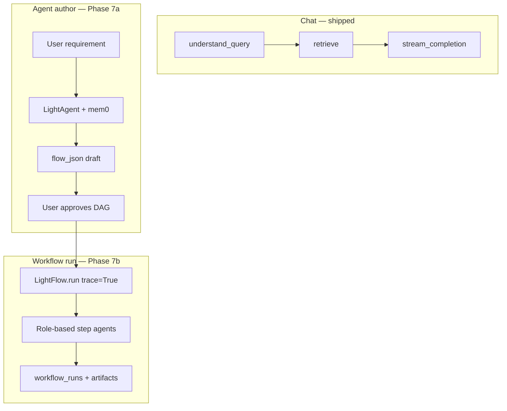

**Configuration layering:** `defaults/settings.json` → user `settings.json` → `prompt_registry.json` → workflow `flow_json` → session scope.

**LightFlow v0.8 constraints (upstream):** Non-streaming deterministic runs initially; no durable resume or mid-flow approval nodes yet. **Picard adds:** pre-run approval (`requires_approval`, court profile); trace → SSE after each `step_end`; artifact persistence in `workflow_runs`.

#### 4.2.1 Modular stack by layer

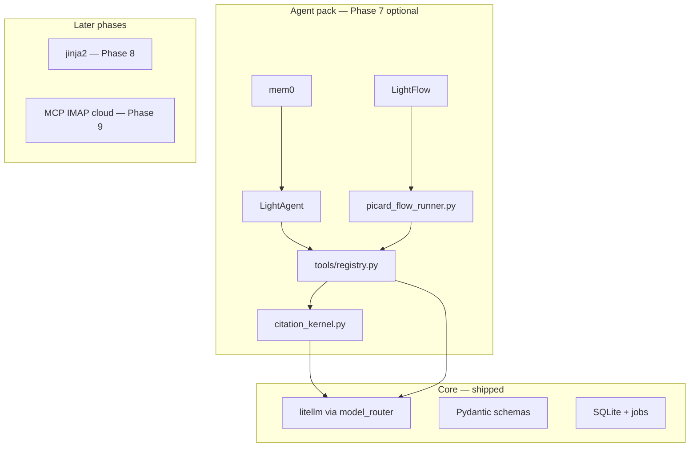

| Layer | Phase | Technology | New dependency? |
| ----- | ----- | ---------- | --------------- |
| Chat pipeline | 3 | `chat.py` RAG DAG → `citation_kernel.py` (7.0) | No |
| Citation Kernel | 7.0 | `citation_kernel.py` — shared Chat/Agent/LightFlow | No |
| Agent authoring | 7a | `lightagent_runtime.py` + `agent_memory.py` | Yes (`lightagent>=0.8`, `mem0ai`) |
| Workflow execution | 7b | `picard_flow_runner.py` + `flow_agent_factory.py` wrapping **LightFlow** | Same agent pack |
| Tool registry | 7 | `backend/app/tools/` — tier-gated Picard adapters | No |
| Connectors | 9 | MCP, IMAP, cloud watch → vault | Per connector |
| MCP server export | 10 | stdio exposure of corpus tools | Deferred |

#### 4.2.2 Agent authoring pattern (Phase 7a)

**Goal:** Conversational workflow design — not deterministic execution.

LightAgent runs with `PicardMemory` delegating to mem0 (`user_id = "{workspace_id}:{profile}"`). LLM provider keys flow from [`secrets_store.py`](../backend/app/services/secrets_store.py) / settings — same as Chat.

```python
# Conceptual — backend/app/services/lightagent_runtime.py
# POST /chat/stream with mode=agent branches here (not chat.stream_chat)
async def stream_agent_run(request, session):
    memory_hits = picard_memory.retrieve(request.message, user_id=...)
    yield sse("memory_hit", memory_hits)
    agent = LightAgent(model=..., memory=picard_memory, tools=registry.tools_for_profile(...))
    async for event in agent.run(request.message, stream=True, user_id=...):
        # Map LightAgent events → plan | tool_call | tool_result | content | approval_required
        if event.needs_approval:
            yield sse("approval_required", event.plan)
        ...
```

- **Tool adapters:** Python callables registered with LightAgent; each wraps existing services (`planned_retrieve`, CARP, tabular reads). **No** raw "read entire document" into context.
- **Per-step refuse:** Empty retrieval returns structured tool error → SSE `step_refused` (§7.5).
- **Persistence:** `agent_runs.events_json` (SSE array); optional link to `chat_sessions`.
- **Iterations:** `AGENT_MAX_ITERATIONS` default 5; court profile may lower cap.

**Authoring tools (7a):** `propose_flow` (draft `flow_json` from workspace inventory), `save_flow`, `validate_flow`, `list_workflows`, `read_workflow`. Output is a **DAG spec** (§11.6), not a one-shot answer.

**mem0:** Recalls prior flow patterns (`user_id = "{workspace_id}:{profile}"`) — preferences and workflow shapes, not legal conclusions.

#### 4.2.3 Structured extraction (tabular + drafts)

| Use case | Approach |
| -------- | -------- |
| Tabular cell JSON (`summary`, `reasoning`, `chunk_ids`) | litellm JSON mode + Pydantic parse (§11.2) |
| Schema retry on failure | Optional `instructor[litellm]` behind `ENABLE_INSTRUCTOR` |
| Template placeholder bindings | Pydantic `DraftBindings` model (Phase 8) |

**Avoid pandas/polars** for CSV — stdlib `csv` → SQLite. Sufficient for legal data sheets (typically &lt;50k rows); keeps memory flat.

#### 4.2.4 Web fetch (Phase 9, URL-only)

| Component | Choice |
| --------- | ------ |
| HTTP | httpx (already installed) |
| HTML → text | trafilatura (lazy-imported) |
| Search / discovery | **None** — user or workflow supplies URLs explicitly |
| JS-rendered sites | Deferred (Playwright/Crawl4AI too heavy for default) |
| Storage | `research_snapshots` table + `~/.picard-data/snapshots/` files |

When `ENABLE_WEB_RESEARCH=false`, the `web_fetch` tool is **not registered** — zero outbound HTTP.

#### 4.2.5 LightFlow execution (Phase 7b)

**Engine:** [LightFlow](https://github.com/wanxingai/LightAgent) (LightAgent v0.8+) — lightweight deterministic DAG runner chaining **role-based** `LightAgent` instances per step.

**Service:** `backend/app/services/picard_flow_runner.py` builds a `LightFlow` from stored `flow_json`, runs with `trace=True`, persists `LightFlowResult`, maps trace events to SSE.

```python
from LightAgent import LightAgent, LightFlow

flow = LightFlow()
for step_def in workflow.flow_json["steps"]:
    agent = flow_agent_factory.get(step_def["role"], profile=ctx.profile)
    flow.step(
        step_def["name"],
        agent=agent,
        depends_on=step_def.get("depends_on", []),
        max_retry=step_def.get("max_retry", 0),
        query=resolve_query(step_def, registry=QUERY_TEMPLATES),
    )

result = flow.run(user_input, trace=True, result_format="dict")
# Persist result["trace"] → workflow_runs.lightflow_trace_json
# Emit SSE: flow_start | step_start | step_end | flow_end
```

**LightFlow behavior (upstream):**

- Steps with `depends_on` auto-append dependency outputs to the step query when no custom `query` is set.
- Custom `query` may be a template string or registered `lambda_ref` resolved to `lambda context: ...` with `context["input"]`, `context["outputs"]`, `context["steps"]`.
- `max_retry` is per-step; flow stops with `success == False` if a step fails after retries.

**Picard extensions:** `flow_agent_factory.py` registers Picard tools per role (§4.2.6). Corpus steps enforce refuse gate (§7.5). Court profile validates `evidence_profile` before `flow.run`.

**Prior art (shipped):** [`listing_map_reduce.py`](../backend/app/services/listing_map_reduce.py) — discover → per-doc retrieve → reduce — informed DAG design, not replaced by listing alone.

#### 4.2.6 Step agent role catalog

Each `LightFlowStepDef.role` maps to a pre-configured `LightAgent` with a fixed tool allowlist:

| Role | Phase | Tools (via registry) | Evidence tier | Typical steps |
|------|-------|----------------------|---------------|---------------|
| `research` | 7b | `search_corpus`, `read_chunks` | A (`[N]`) | Matter Q&A, CARP brief, citation verify |
| `tabular` | 7b | `read_tabular_cells`, `list_tabular_reviews`, tabular batch trigger | B | DD column extract, cell review |
| `writer` | 8 | `draft_from_template`, section fill | D | Guideline drafts, multi-section memos |
| `web` | 9 | `web_fetch`, MCP proxy tools | C (`[ext:N]`) | User-supplied URL research |
| `compliance` | 7b | Checklist tools, `search_corpus` (admin scope) | A | Filing defect scan, court helpers |
| `coordinator` | 7b | None (merge-only) | — | Final synthesis from prior `outputs` |

**Dynamic flows:** Agent (7a) composes arbitrary DAGs from user context — e.g. `tabular_extract` → `research` → `writer` for guideline + CSV multi-draft; `web` → `research` → `writer` when connectors enabled (Phase 9).

#### 4.2.7 SLM routing for agent steps (extends §4.1)

| Pipeline step | Rules/SQL sufficient? | SLM adds value? | Phase |
|---------------|----------------------|-----------------|-------|
| Agent tool selection (LightAgent) | No — needs capable LLM | N/A | 7 |
| Dynamic `flow_json` authoring | No | **High** — Agent proposes LightFlow DAG from user requirement + inventory | 7a |
| `search_corpus` / CARP inside tools | **Yes** — deterministic | None | 7 |
| Per-step refuse gate | **Yes** | None | 7 |
| Tabular cell extraction (tool) | Partial | Medium | 7 |
| Template section fill | No | Capable LLM with fixed bindings | 8 |

#### 4.2.8 Explicitly rejected

| Option | Why rejected |
| ------ | ------------ |
| LangGraph / LangChain / CrewAI | Heavy deps + checkpoint RAM alongside torch/GLiNER |
| Custom `workflow_runner.py` DAG executor | Superseded by upstream **LightFlow** |
| Custom litellm loop as primary Agent runtime | Superseded by LightAgent; Chat keeps non-agent litellm path |
| Generic RAG tool replacing CARP | Breaks evidence contract and auditability |
| Mid-flow approval inside LightFlow | Not in v0.8; Picard uses pre-run approval only |
| smolagents | Code-execution agents — security risk for legal docs |
| Burr / Temporal / llm-nano-vm | SQLite + LightFlow trace sufficient |
| Playwright / Crawl4AI (default) | Browser RAM; document as Phase 9 limitation |
| pandas / polars (default CSV) | Unnecessary memory for typical legal CSVs |
| duckduckgo-search / search APIs | User decision: URL-only fetch (Phase 9) |

#### 4.2.9 LightAgent upstream constraints

Picard wraps [LightAgent](https://github.com/wanxingai/LightAgent) v0.8+ and **LightFlow** — it does not fork or reimplement the agent loop. Upstream provides orchestration; Picard owns the evidence contract.

| Upstream surface | Picard usage |
| ---------------- | ------------ |
| `LightAgent(..., memory=, tools=)` | Provider keys from `secrets_store` / settings; `PicardMemory` → mem0 |
| `agent.run(..., stream=True, result_format="event", trace=True)` | Agent mode SSE bridge (§5.2.1) |
| `agent.run(..., max_retry=N)` | Map to `AGENT_MAX_ITERATIONS` (default 5) |
| `tool_info` on callables | Picard tool registry (§4.2.10) |
| `LightFlow().step(...).run(..., trace=True)` | Workflow execution (§5.2.2, §10.7) |
| `RunResult.trace` / `export_trace()` | Debug + `agent_runs.events_json`; not a substitute for `references[]` |

**Upstream does not provide:** citation maps, CARP/FTS retrieval, refuse gates, tier separation, `flow_json` schema, HITL checkpoints, workspace scope, or legal validation. Those live entirely in Picard services and tool wrappers.

**Streaming:** LightAgent supports legacy OpenAI-style chunks and structured `StreamEvent` (v0.6.5+). Picard maps `StreamEvent` → SSE envelope `{"event","data"}` — not raw provider chunks to the UI. LightFlow v0.8 has **no step-level streaming**; Picard emits SSE after each `step_end` from trace.

#### 4.2.10 Picard Tool Registry

Every agent tool is a **thin adapter** over an existing shipped service — no parallel implementations. Registration: `backend/app/tools/registry.py` → `tools_for_profile(agent_profile)` applies court denylist (§10.5). Tools attach `tool_info` metadata for LightAgent and return **JSON strings** with at minimum:

```json
{
  "refused": false,
  "content": "optional synthesized text with [N] markers",
  "references": [{"index": 1, "chunk_id": "...", "page": 3, "bbox": {}}],
  "tier": "A",
  "citation_map_version": "1"
}
```

Corpus-facing tools **must** route through the Citation Kernel (§7.6). Tier B/C/D tools use their own namespaces (§7.4).

**Vault & workspace**

| Tool | Wraps | Side effect | HITL default (§4.3) |
| ---- | ----- | ----------- | ------------------- |
| `list_workspaces` | workspaces API | None | — |
| `create_workspace` | workspaces CRUD | Creates workspace | Court: HITL-SCOPE |
| `create_section` | workspace sections | Organizes docs | HITL-SCOPE |
| `list_documents` | `GET /documents` | None | — |
| `upload_documents` | `ingestion.py` | Enqueues parse | Scope toast |
| `wait_parse_job` | `jobs` table poll | None | — |
| `delete_document` | `DELETE /documents` | Destructive | HITL-SCOPE |
| `get_parse_status` | document + job metadata | None | — |
| `set_session_scope` | session `document_ids[]` | Binds corpus tools | HITL-SCOPE when > N docs |

**Retrieval & Q&A (Citation Kernel mandatory)**

| Tool | Wraps | Kernel mode |
| ---- | ----- | ----------- |
| `search_corpus` | `search.py` / CARP / planned / listing | Map only (`synthesize=False`) |
| `answer_from_corpus` | `chat.py` pipeline | Full kernel — **equivalent to Chat** |
| `read_chunks` | chunk load by id | Mini-map |
| `run_listing_map_reduce` | `listing_map_reduce.py` | Per-doc kernel + merge |

**Tabular (Tier B)**

| Tool | Wraps |
| ---- | ----- |
| `create_tabular_review` | tabular CRUD |
| `run_tabular_extract` | tabular batch job |
| `read_tabular_cells` | tabular reads |
| `list_tabular_reviews` | tabular list |

**Workflows & agent meta**

| Tool | Wraps |
| ---- | ----- |
| `propose_flow` | inventory → `flow_json` draft |
| `save_flow` / `validate_flow` | workflows API |
| `list_workflows` / `read_workflow` | workflows API |
| `run_workflow` | `picard_flow_runner.py` → LightFlow |

**CSV & drafts (Phase 8)**

| Tool | Wraps |
| ---- | ----- |
| `ingest_csv` | §8.6 csv → SQLite |
| `csv_bind` | deterministic join step |
| `draft_from_template` | Jinja + `DraftBindings` |
| `list_templates` | template store |

**External (Phase 9, gated)**

| Tool | Wraps | Default |
| ---- | ----- | ------- |
| `web_fetch` | httpx + trafilatura → `research_snapshots` | Off unless `ENABLE_WEB_RESEARCH` |
| `ingest_web_snapshot` | snapshot → vault + parse pipeline | HITL-URL + HITL-SCOPE |
| `connector_sync` | MCP / IMAP / cloud watch | Off; per-connector HITL |

**APIs not exposed as agent tools** (by design): raw settings/secrets mutation, destructive workspace delete without HITL, outbound email send. See §13 for full API list; **UC-04** requires every other shipped endpoint to map here or document an explicit exclusion.

---

### 4.3 Deterministic cores & HITL checkpoints

Agentic features split into **exploratory orchestration** (LightAgent tool selection — LLM-driven, iteration-capped) and **deterministic tool bodies** (Citation Kernel, ingest jobs, CARP, csv_bind, LightFlow step order). HITL gates are **Picard-owned** — LightFlow v0.8 has no mid-flow approval nodes (§4.2.8).

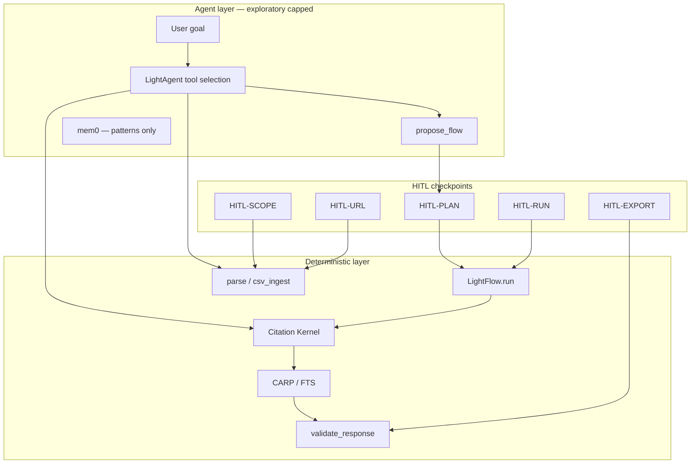

| Layer | Engine | Deterministic? | When |
| ----- | ------ | -------------- | ---- |
| Ad-hoc agent chat | LightAgent loop | Partial — tool *selection* is LLM; each tool *body* is deterministic | Open-ended goals; multi-upload Q&A |
| Approved workflow run | LightFlow | **Yes** — same `flow_json` + input → same step order (LF-01) | User clicks Run |
| Citation / retrieval / ingest | Citation Kernel + existing services | **Yes** — same query + corpus → same hits (modulo parse state) | Inside every corpus tool |
| HITL | Picard SSE + UI bars | Human gate — blocks side effects | Scope, URLs, plan, run, export |

**HITL checkpoint catalog**

| ID | Trigger | Blocks until approved | SSE event | UI component |
| -- | ------- | --------------------- | --------- | -------------- |
| **HITL-SCOPE** | Upload / ingest / `set_session_scope` over threshold (config: `agent_scope_confirm_min_docs`, default 10) | Corpus tools on new scope | `approval_required` | `ScopeConfirmBar` |
| **HITL-URL** | `web_fetch` / `ingest_web_snapshot` | Outbound HTTP / vault write | `approval_required` | `UrlApproveList` |
| **HITL-PLAN** | `propose_flow` completes | `save_flow` | `approval_required` | `FlowDAGPanel` + Approve |
| **HITL-RUN** | `requires_approval` workflow or court profile | `LightFlow.run` | Pre-run gate | `WorkflowApprovalBar` |
| **HITL-EXPORT** | Draft download / connector send | File egress | `approval_required` | `ExportConfirmDialog` |

**Determinism rules:**

- Once past **HITL-RUN**, LightFlow step order and registered tool bodies are fixed for that run.
- Exploratory agent: max `AGENT_MAX_ITERATIONS`; each iteration logged in `agent_runs.events_json`.
- **Invariant:** LightAgent chooses *which* deterministic tool to call; it never bypasses the Citation Kernel for corpus facts (§7.6).
- Firm profile: HITL-SCOPE skippable via settings; court profile: mandatory on scope, URLs, and exports.

---

## 5. System architecture

### 5.1 High-level topology

Three clients share one backend (loopback in desktop; configurable in dev):

```
┌──────────────────────────────────────────────────────────────────────────┐
│  Clients                                                                  │
│  ├── Browser / Next.js dev (localhost:3000 → API :8000)                  │
│  ├── Docker Compose (frontend :3000, backend :8000) — CI smoke            │
│  └── Desktop Tauri (shipped Phase 5a)                                     │
│       WebView → loopback :13130 (static UI) + Python sidecar :8000        │
│       Entry: desktop/run via PyInstaller sidecar + [`run_desktop.py`](../backend/run_desktop.py) │
└───────────────────────────────┬──────────────────────────────────────────┘
                                │ REST + SSE
                                ▼
┌──────────────────────────────────────────────────────────────────────────┐
│  frontend/  Next.js (shipped)                                             │
│  ├── Vault, workspaces, document upload                                   │
│  ├── Assistant: Chat (RAG) + Agent author (7a) + workflow run (7b)          │
│  ├── Settings, onboarding, prompt editor drawer (shipped)               │
│  ├── Tabular (TRTable, TRSidePanel, TRChatPanel) — Phase 4              │
│  ├── Workflows library (Phase 6, shipped)                                 │
│  └── Draft viewer (Phase 8 planned)                                       │
└───────────────────────────────┬──────────────────────────────────────────┘
                                ▼
┌──────────────────────────────────────────────────────────────────────────┐
│  backend/  FastAPI (shipped)                                              │
│  ├── /documents, /parse, /search, /chat/stream, /tabular                 │
│  ├── /settings, /prompts, /updates (Phase 5a)                            │
│  ├── /workflows, /agent/runs (Phase 6–7 planned)                          │
│  ├── /connectors, /compliance/* (Phase 9 planned)                         │
│  └── Services: chat, citations, listing_map_reduce, tabular, model_router │
│      Planned: lightagent_runtime, picard_flow_runner, flow_agent_factory, tools/ │
└───────────────────────────────┬──────────────────────────────────────────┘
                                ▼
   SQLite + FTS5 | ~/.picard-data/pdfs | prompt_overrides.json | mem0/ (Ph 7)
```

### 5.2 Request flow: chat with citations

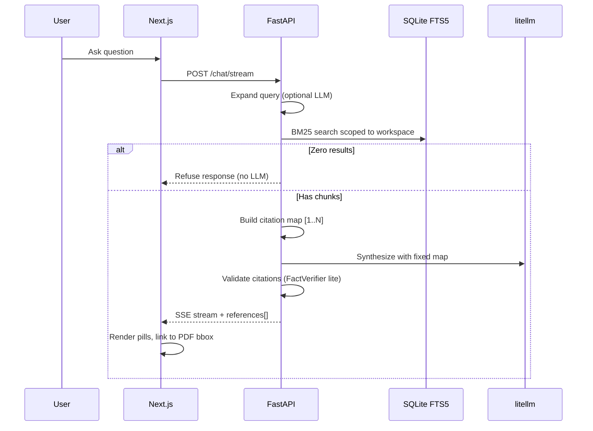


### 5.2.1 Request flow: agent authoring (Phase 7a, `mode=agent`)

Branches `POST /chat/stream` to `lightagent_runtime` (not `stream_chat`). Each corpus tool call runs refuse gate + citation map (§7.5).

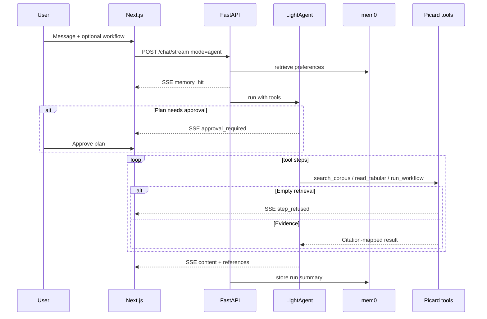

**Chat mode (default):** `mode=rag` or omit — uses §5.2 single-shot DAG. UI mode toggle (§12.6) sets client default; server validates `ENABLE_AGENT_MODE`.

### 5.2.2 Request flow: LightFlow run (Phase 7b)

Entry: `POST /workflows/{id}/run` after **HITL-RUN** (§4.3). Each corpus step invokes tools that delegate to the Citation Kernel (§7.6).

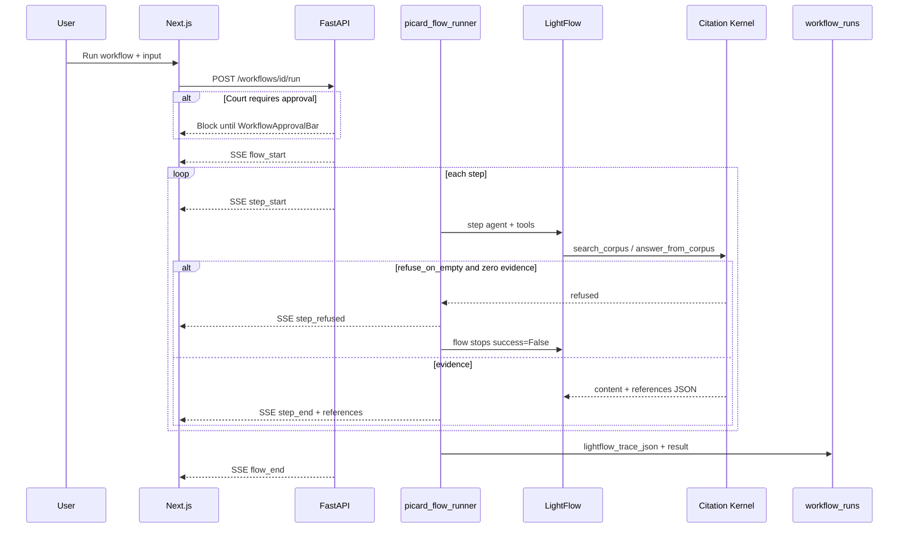

LightFlow v0.8 completes each step before the next; Picard emits SSE **after each `step_end`** — no token streaming mid-step. Full `lightflow_result_json` also returned for non-SSE clients (§10.7).

### 5.4 Shipped platform services (Phase 5a)

| Component | Path | Role |
|-----------|------|------|
| Settings merge | `settings_store.py`, `routers/settings.py` | User `settings.json` over `defaults/settings.json`; hot reload |
| Secrets | `secrets_store.py` | API keys outside repo |
| Prompt overrides | `prompt_registry.py`, `routers/prompts.py` | Per-step prompt editing in chat UI |
| Updates | `routers/updates.py`, Tauri updater | `releases/manifest.json` on gh-pages |
| Onboarding | `OnboardingWizard`, `onboarding-status` | First-run LLM configuration |
| CI | `.github/workflows/ci.yml` | Backend import, frontend build, compose smoke |
| Release | `.github/workflows/release.yml` | Docker push, Tauri bundles, manifest — see [`RELEASE.md`](RELEASE.md) |
| Desktop | `desktop/src-tauri/`, `run_desktop.py` | Sidecar backend; port cleanup; optional ML tessdata |

**CI gap:** Full `pytest -m corpus` Tier A gates are local/nightly — not yet required on every PR (§15.3.1).

### 5.3 Directory layout (target)

```
picard-oss/
├── frontend/
│   ├── app/
│   │   ├── workspaces/
│   │   ├── assistant/
│   │   ├── workflows/      Phase 6 — library UI
│   │   ├── drafts/         Phase 8 — provenance viewer
│   │   └── tabular/
│   └── components/
│       ├── pdf/          MultiHighlightPDFViewer
│       ├── chat/         CitationParser, ChatPanel, workflow picker
│       └── tabular/      TRTable, TRSidePanel (Mike-inspired)
├── backend/
│   ├── app/
│   │   ├── main.py
│   │   ├── models/       SQLAlchemy models
│   │   ├── services/
│   │   │   ├── ingestion.py
│   │   │   ├── search.py
│   │   │   ├── citations.py
│   │   │   ├── citation_kernel.py      Phase 7.0 — agentic baseline
│   │   │   ├── tabular.py
│   │   │   ├── lightagent_runtime.py   Phase 7a
│   │   │   ├── agent_memory.py         Phase 7a
│   │   │   ├── picard_flow_runner.py   Phase 7b
│   │   │   └── flow_agent_factory.py   Phase 7b
│   │   ├── tools/           Phase 7 — registry.py, corpus.py, vault.py, workflow_author.py
│   │   └── workflows/       Phase 6 — builtins.py
│   │   ├── routers/settings.py, prompts.py, updates.py  — shipped
│   │   └── routers/
│   └── requirements.txt
├── scripts/
│   └── start.sh          Boot backend + frontend
└── ARCHITECTURE.md
```

---

## 6. Data model (SQLite)

### 6.1 Core tables

```sql
-- Workspaces (matters / projects)
CREATE TABLE workspaces (
  id TEXT PRIMARY KEY,
  name TEXT NOT NULL,
  matter_ref TEXT,              -- optional CM-style reference (from Mike)
  created_at TEXT NOT NULL,
  updated_at TEXT NOT NULL
);

-- Documents
CREATE TABLE documents (
  id TEXT PRIMARY KEY,
  workspace_id TEXT NOT NULL REFERENCES workspaces(id),
  file_name TEXT NOT NULL,
  local_path TEXT NOT NULL,     -- relative path under .picard-data/
  content_hash TEXT,            -- SHA-256 dedup (from LegalDocX)
  page_count INTEGER,
  parse_status TEXT DEFAULT 'pending',  -- pending | parsing | done | error
  parse_error TEXT,
  created_at TEXT NOT NULL,
  FOREIGN KEY (workspace_id) REFERENCES workspaces(id)
);

-- Layout-aware chunks from liteparse
CREATE TABLE chunks (
  id TEXT PRIMARY KEY,
  document_id TEXT NOT NULL REFERENCES documents(id),
  page_number INTEGER NOT NULL,
  chunk_type TEXT NOT NULL,     -- heading | paragraph | table | list
  bbox_json TEXT NOT NULL,      -- {"x0":0,"y0":0,"x1":100,"y1":20} normalized 0-1
  text_content TEXT NOT NULL,
  token_count INTEGER,
  FOREIGN KEY (document_id) REFERENCES documents(id)
);

-- FTS5 virtual table (mirrors chunks.text_content)
CREATE VIRTUAL TABLE chunks_fts USING fts5(
  text_content,
  content='chunks',
  content_rowid='rowid',
  tokenize='porter unicode61'
);

-- Extracted metadata for filtering
CREATE TABLE metadata_tags (
  id TEXT PRIMARY KEY,
  document_id TEXT NOT NULL,
  tag_key TEXT NOT NULL,        -- e.g. party_a, governing_law, doc_type
  tag_value TEXT NOT NULL,
  source_chunk_id TEXT,
  FOREIGN KEY (document_id) REFERENCES documents(id)
);

-- Entity catalog (parties, dates, conditions, identifiers) — powers CARP (§9.5)
CREATE TABLE entities (
  id TEXT PRIMARY KEY,
  workspace_id TEXT NOT NULL REFERENCES workspaces(id),
  entity_type TEXT NOT NULL,    -- party | date | condition | identifier | amount
  canonical_value TEXT NOT NULL, -- normalized: "abc", "2019-05-18", "condition c"
  display_value TEXT NOT NULL,   -- preferred UI label
  UNIQUE(workspace_id, entity_type, canonical_value)
);

-- Every detected mention of an entity in a chunk
CREATE TABLE entity_mentions (
  id TEXT PRIMARY KEY,
  entity_id TEXT NOT NULL REFERENCES entities(id),
  document_id TEXT NOT NULL REFERENCES documents(id),
  chunk_id TEXT NOT NULL REFERENCES chunks(id),
  page_number INTEGER NOT NULL,
  char_start INTEGER,
  char_end INTEGER,
  surface_text TEXT NOT NULL,   -- literal text in document, e.g. "18/05/2019"
  confidence REAL DEFAULT 1.0,
  FOREIGN KEY (entity_id) REFERENCES entities(id)
);

-- Materialized page ↔ entity index for fast set intersection
CREATE TABLE page_entities (
  document_id TEXT NOT NULL,
  page_number INTEGER NOT NULL,
  entity_id TEXT NOT NULL REFERENCES entities(id),
  mention_count INTEGER DEFAULT 1,
  PRIMARY KEY (document_id, page_number, entity_id)
);

-- Chat
CREATE TABLE chat_sessions (
  id TEXT PRIMARY KEY,
  workspace_id TEXT,
  title TEXT,
  created_at TEXT NOT NULL,
  updated_at TEXT NOT NULL,
  document_ids_json TEXT   -- JSON array; [] = workspace-wide scope
);

CREATE TABLE chat_messages (
  id TEXT PRIMARY KEY,
  session_id TEXT NOT NULL,
  role TEXT NOT NULL,           -- user | assistant
  content TEXT NOT NULL,
  references_json TEXT,         -- serialized references[] from evidence contract
  created_at TEXT NOT NULL,
  FOREIGN KEY (session_id) REFERENCES chat_sessions(id)
);

-- Tabular review (Mike-inspired)
CREATE TABLE tabular_reviews (
  id TEXT PRIMARY KEY,
  workspace_id TEXT NOT NULL,
  title TEXT NOT NULL,
  columns_config_json TEXT NOT NULL,
  document_ids_json TEXT NOT NULL,
  created_at TEXT NOT NULL
);

CREATE TABLE tabular_cells (
  id TEXT PRIMARY KEY,
  review_id TEXT NOT NULL,
  document_id TEXT NOT NULL,
  column_key TEXT NOT NULL,
  summary TEXT,
  reasoning TEXT,
  flag TEXT,                    -- green | grey | yellow | red
  status TEXT DEFAULT 'pending',
  source_chunk_ids_json TEXT,
  UNIQUE(review_id, document_id, column_key)
);

-- Background jobs (replaces Redis/Celery for v1)
CREATE TABLE jobs (
  id TEXT PRIMARY KEY,
  job_type TEXT NOT NULL,       -- parse | entity_extract | tabular_batch | metadata_extract | csv_ingest | workflow_run
  payload_json TEXT NOT NULL,
  status TEXT DEFAULT 'pending',
  progress REAL DEFAULT 0,
  result_json TEXT,
  error TEXT,
  created_at TEXT NOT NULL,
  updated_at TEXT NOT NULL
);
```

### 6.2 Indexing strategy


| Index | Purpose |
| ------------------------------------- | ------------------------- |
| `chunks(document_id, page_number)` | Page-scoped retrieval |
| `chunks(document_id, section_key)` | Section-scoped bundle assembly |
| `metadata_tags(document_id, tag_key)` | Filter by party, doc type |
| `documents(content_hash)` | Dedup on upload |
| `entity_mentions(entity_id, document_id, page_number)` | Entity → pages lookup |
| `entity_mentions(document_id, page_number)` | Page → entities lookup |
| `page_entities(entity_id, document_id, page_number)` | CARP set intersection |
| `entities(workspace_id, entity_type, canonical_value)` | Canonical entity lookup |
| FTS5 `chunks_fts` | BM25 full-text search |


**FTS5 sync:** SQLAlchemy event listeners or explicit triggers keep `chunks_fts` in sync on chunk insert/update/delete.

### 6.3 Post-v1 tables (workflows, agent, connectors, drafts)

Added in Phases 6–10 (*planned* unless noted). All local SQLite — no cloud sharing tables.

```sql
-- Workflow library (Phase 6)
CREATE TABLE workflows (
  id TEXT PRIMARY KEY,
  workspace_id TEXT,              -- NULL = global built-in
  type TEXT NOT NULL,             -- assistant | tabular | lightflow (primary for composite)
  title TEXT NOT NULL,
  practice_area TEXT,
  prompt_md TEXT,                 -- legacy assistant/tabular seed
  columns_config_json TEXT,       -- tabular seed
  flow_json TEXT NOT NULL,        -- LightFlow DAG: steps[], roles, depends_on, queries (§11.6)
  flow_version TEXT DEFAULT 'lightflow-0.8',
  input_schema_json TEXT,         -- optional: required vault docs, csv file id, urls[]
  evidence_profile_json TEXT NOT NULL,  -- requires_corpus, allowed_intents, role denylist
  profile TEXT DEFAULT 'any',     -- firm | court | any
  source TEXT DEFAULT 'builtin',  -- builtin | user | agent_authored
  requires_approval INTEGER DEFAULT 0,
  is_builtin INTEGER DEFAULT 0,
  created_at TEXT NOT NULL,
  updated_at TEXT NOT NULL
);

CREATE TABLE hidden_workflows (
  workflow_id TEXT NOT NULL,
  created_at TEXT NOT NULL,
  PRIMARY KEY (workflow_id)
);

CREATE TABLE workflow_runs (
  id TEXT PRIMARY KEY,
  workflow_id TEXT NOT NULL REFERENCES workflows(id),
  workspace_id TEXT NOT NULL,
  session_id TEXT,                -- optional link to chat session
  status TEXT DEFAULT 'running', -- running | done | refused | error
  steps_json TEXT,                -- legacy per-step snapshot (optional mirror)
  lightflow_trace_json TEXT,      -- flow_start / step_start / step_end / flow_end events
  lightflow_result_json TEXT,     -- LightFlowResult dict
  success INTEGER,                -- 0 | 1
  error TEXT,
  result_json TEXT,               -- Picard artifacts (draft ids, citation maps)
  created_at TEXT NOT NULL,
  updated_at TEXT NOT NULL
);

-- CSV / structured data (Phase 8)
CREATE TABLE workspace_data_files (
  id TEXT PRIMARY KEY,
  workspace_id TEXT NOT NULL REFERENCES workspaces(id),
  file_name TEXT NOT NULL,
  local_path TEXT NOT NULL,
  row_count INTEGER,
  columns_json TEXT NOT NULL,     -- column names + types
  created_at TEXT NOT NULL
);

CREATE TABLE workspace_data_rows (
  id TEXT PRIMARY KEY,
  file_id TEXT NOT NULL REFERENCES workspace_data_files(id),
  row_index INTEGER NOT NULL,
  cells_json TEXT NOT NULL,       -- {col_name: value}
  UNIQUE(file_id, row_index)
);

-- Template drafts (Phase 8)
CREATE TABLE draft_documents (
  id TEXT PRIMARY KEY,
  workspace_id TEXT NOT NULL,
  template_id TEXT NOT NULL,
  title TEXT NOT NULL,
  content_md TEXT NOT NULL,
  sources_json TEXT NOT NULL,     -- per-section provenance + missing_evidence[]
  workflow_run_id TEXT,
  created_at TEXT NOT NULL
);

-- URL fetch snapshots (Phase 9)
CREATE TABLE research_snapshots (
  id TEXT PRIMARY KEY,
  workspace_id TEXT NOT NULL,
  url TEXT NOT NULL,
  url_hash TEXT NOT NULL,         -- dedup key
  fetched_at TEXT NOT NULL,
  text_path TEXT NOT NULL,        -- under ~/.picard-data/snapshots/
  byte_size INTEGER,
  UNIQUE(workspace_id, url_hash)
);

-- Agent runs (Phase 7)
CREATE TABLE agent_runs (
  id TEXT PRIMARY KEY,
  session_id TEXT,
  workspace_id TEXT NOT NULL,
  profile TEXT NOT NULL,          -- firm | court
  mode TEXT NOT NULL DEFAULT 'agent',
  plan_json TEXT,
  events_json TEXT,               -- persisted SSE event array
  status TEXT DEFAULT 'running',
  created_at TEXT NOT NULL,
  updated_at TEXT NOT NULL
);

-- mem0 sync audit (optional; vectors live under ~/.picard-data/mem0/)
CREATE TABLE memory_sync_log (
  id TEXT PRIMARY KEY,
  workspace_id TEXT,
  mem0_user_id TEXT NOT NULL,
  operation TEXT NOT NULL,
  created_at TEXT NOT NULL
);

-- Connector configs (Phase 9)
CREATE TABLE connector_configs (
  id TEXT PRIMARY KEY,
  workspace_id TEXT NOT NULL,
  kind TEXT NOT NULL,             -- mcp | imap | cloud_watch
  config_json TEXT NOT NULL,
  enabled INTEGER DEFAULT 0,
  created_at TEXT NOT NULL
);
```

`flow_json` is the **primary** execution spec for composite playbooks; `prompt_md` / `columns_config_json` remain for Mike-compatible assistant/tabular seeds. Court profile: `requires_approval=1` before `POST /workflows/{id}/run` (§10.7).

**Indexing (post-v1):**

| Index | Purpose |
| ----- | ------- |
| `workflows(workspace_id, type)` | Library filter |
| `workflow_runs(workflow_id, status)` | Run history |
| `agent_runs(workspace_id, created_at)` | Compliance export |
| `workspace_data_rows(file_id, row_index)` | Row lookup for `[csv:row:col]` |
| `research_snapshots(workspace_id, url_hash)` | Snapshot dedup |

**Picard-unique join (Phase 8):** CSV party columns matched to `page_entities` via CARP canonical resolution in `csv_entity_join.py` — cross-source workflows Mike cannot do.

---

## 7. Evidence contract (adapted from Picard.law)

picard-oss adopts the **refuse-or-anchor** principle from LegalDocX without the full five-layer Neo4j pipeline. v1 implements a **three-layer OSS citation pipeline**:

### Layer 1: Pre-synthesis citation map

Before any LLM token is generated:

1. Retrieve evidence via **simple FTS5** or **CARP bundles** (§9.5)
2. Flatten bundles to chunks; deduplicate by `chunk_id`
3. Assign `[1]..[N]` deterministically (one number per chunk; bundle metadata preserved for diagnostics)
4. Inject map into system prompt: "You may ONLY cite these references"

**Why:** Prevents the model from inventing citation numbers (LegalDocX `deterministic_citation_engine.py` pattern).

### Layer 2: Refuse gate

If retrieval returns **zero evidence** (empty FTS5 above threshold **or** CARP intersection empty at max proximity tier):

- Do **not** call the LLM
- Return structured response:

```json
{
  "answer": "No relevant information was found in the selected documents.",
  "references": [],
  "refused": true,
  "suggestions": ["Check documents are parsed", "Try different keywords", "Broaden workspace scope"]
}
```

**Why:** Strongest anti-hallucination control (LegalDocX refuse gate at `simple_agentic_query_engine.py`).

### Layer 3: Post-generation validation (OSS-slim)


| Pass              | Implementation                                               | LegalDocX equivalent          |
| ----------------- | ------------------------------------------------------------ | ----------------------------- |
| Marker existence  | Strip `[N]` not in map                                       | Same                          |
| FactVerifier lite | Regex extract amounts/dates; verify substring in cited chunk | Full FactVerifier             |
| BM25 reassignment | If claim text better matches different chunk, reassign `[N]` | `validate_and_fix_response()` |


**Deferred to post-v1 (enable via `ENABLE_CITATION_JUDGE` when tiered SLM configured):** SLM citation judge (LegalDocX layer 5).

### API response shape

```typescript
interface ChatResponse {
  answer: string;                    // Markdown with [N] markers
  references: Array<{
    index: number;
    chunk_id: string;
    document_id: string;
    page: number;
    bbox: { x0: number; y0: number; x1: number; y1: number };
    preview: string;
  }>;
  refused?: boolean;
  citation_validation?: {
    markers_valid: boolean;
    facts_stripped: number;
    markers_reassigned: number;
  };
}
```

### 7.4 Multi-tier evidence (post-v1)

Phases 7–9 extend the three-layer pipeline with **evidence tiers**. Each tier has its own citation namespace — never silently blended.

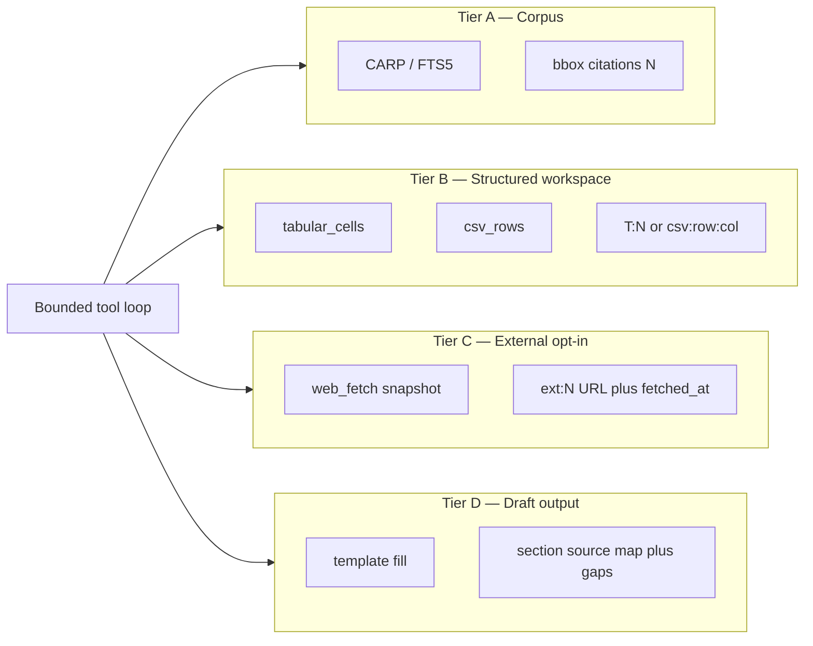

| Tier | Source | Citation form | Rules |
| ---- | ------ | ------------- | ----- |
| **A** | PDF corpus via CARP/FTS5 | `[N]` → chunk + bbox | Pre-assigned citation map (Layer 1); no free-form full-doc reads |
| **B** | Tabular cells, CSV rows | `[T:N]`, `[csv:file:row:col]` | Never substitutes for Tier A on legal-fact claims about PDF content |
| **C** | User-supplied URL snapshots | `[ext:N]` → URL + `fetched_at` | Disabled unless `ENABLE_WEB_RESEARCH=true`; distinct UI styling |
| **D** | Template-filled drafts | Section `sources[]` + `missing_evidence[]` | Outputs carry `draft: true`; not final legal documents |

### 7.5 Per-step refuse (Agent + LightFlow, post-v1)

Phase 3 refuse gate (Layer 2) applies at **conversation start** for single-shot **Chat** mode.

**Agent authoring (7a):** LightAgent applies refuse **inside each retrieval tool call**:

1. Tool `search_corpus` runs CARP/FTS5/intent routing (§9.5.9)
2. If zero evidence → return `{ refused: true }`; emit SSE `step_refused`
3. Exploratory agent may continue with other tools — it must **not** invent corpus facts for that step

**LightFlow execution (7b):** Each corpus step with `refuse_on_empty: true` (default for `research` / `compliance`):

1. Step agent must call `search_corpus` (or deterministic CARP handler) — not free-form full-doc read
2. Zero evidence → step returns failure; LightFlow stops (`success == False`) unless workflow marks step optional (future)
3. Step output appends structured `citations[]` (or inline `[N]` with step-local map) for downstream steps
4. **Writer steps** may only cite `[N]` from maps passed in `context["outputs"]`
5. **Web steps** (Phase 9): output tagged Tier C; downstream writer must not mix into bbox `[N]`

**Max agent iterations:** 5 (default, `AGENT_MAX_ITERATIONS`) — authoring only; LightFlow runs are bounded by DAG depth, not iteration cap.

### 7.6 Citation Kernel (agentic baseline)

The **Citation Kernel** is the single mandatory path for all Tier A corpus operations in Chat, Agent, and LightFlow. Phase 7.0 extracts it from [`chat.py`](../backend/app/services/chat.py) into `citation_kernel.py`; until then, `chat.py` *is* the reference implementation.

**Design invariant:** No corpus fact may reach an LLM without a pre-assigned `CitationMap`. LightAgent never receives raw full-document text from ad-hoc reads.

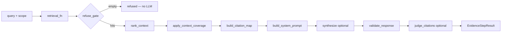

**Target module:** `backend/app/services/citation_kernel.py`

```python
@dataclass
class EvidenceStepResult:
    refused: bool
    content: str                    # validated answer with [N] markers
    citation_map: CitationMap
    references: list[dict]          # references_for_api shape
    validation: CitationValidation
    judge: dict | None
    diagnostics: dict               # retrieval mode, chunk_count, bundles

async def run_corpus_evidence_step(
    db, workspace_id, query, *,
    intent: str = "general",
    retrieval_fn: Callable[..., list[SearchHit]],
    retrieval_kwargs: dict,
    bundles: list[ContextBundleOut] | None = None,
    synthesize: bool = True,         # False for search_corpus-only
    allow_partial_disclosure: bool = False,
) -> EvidenceStepResult: ...
```

**Pipeline steps** (mirrors shipped chat):

1. Injected `retrieval_fn` → `hits`, optional `bundles`
2. `refuse_gate(hits)` → early `{refused: True}` — no synthesis LLM
3. `rank_context` + `apply_context_coverage`
4. `build_citation_map` + `build_system_prompt`
5. If `synthesize`: completion → `validate_response` → optional `judge_citations`
6. Return structured result — tools never return free-form strings without `references[]`

**Cross-step helpers** (reuse [`listing_map_reduce.py`](../backend/app/services/listing_map_reduce.py)):

| Function | Purpose |
| -------- | ------- |
| `merge_evidence_maps(maps)` | Global reindex for LightFlow coordinator / multi-`research` steps |
| `enforce_cite_from_maps(content, allowed_maps)` | Writer/coordinator guard — strip `[N]` not in upstream maps |
| `build_step_context_prompt(prior_outputs)` | Inject prior step sources into downstream query |

**Tool mapping**

| Tool | `synthesize` | Notes |
| ---- | ------------ | ----- |
| `search_corpus` | `False` | Returns map + `sources_prompt` only |
| `answer_from_corpus` | `True` | **Identical evidence bar to Chat** |
| LightFlow `research` step | `True` via step agent tools | Per-step local map; merged downstream |
| LightFlow `coordinator` | `True` | Merged maps from `depends_on` steps |

**Forbidden paths (explicit):**

- Raw full-document read into LLM context
- Corpus answers without pre-assigned citation map
- Mixing Tier C `[ext:N]` into Tier A `[N]` bbox citations (WEB-01)
- Storing legal conclusions in mem0 (§2.6, §4.2.2)

**Kernel file list** (shared with Chat):

| File | Role |
| ---- | ---- |
| `citations.py` | Map, prompt, validate, refuse, API refs |
| `citation_kernel.py` | Orchestration entry (Phase 7.0) |
| `excerpt_selector.py` | Preview selection |
| `context_ranker.py`, `context_coverage.py` | Pre-map ranking |
| `citation_judge.py` | Optional post-validation |
| `listing_map_reduce.py` | Merge / renumber precedent |

---

## 8. Ingestion pipeline

### 8.1 Upload flow

1. User uploads PDF via frontend multipart form
2. Backend saves to `{data_dir}/pdfs/{workspace_id}/{document_id}.pdf`
3. Compute SHA-256 `content_hash`; skip if duplicate in workspace
4. Insert `documents` row with `parse_status=pending`
5. Enqueue parse job (BackgroundTasks)

**From LegalDocX:** content-hash dedup on upload (`vault/page.tsx` pattern).  
**From Mike:** drag-and-drop upload on tabular view (Phase 4).

### 8.2 Parse flow (liteparse)

1. Worker loads PDF from local path
2. liteparse emits structured elements with:
  - `page_number`
  - `chunk_type` (heading, paragraph, table, list)
  - `bbox` (normalized coordinates)
  - `text_content`
3. Insert rows into `chunks`; sync FTS5 index
4. Update `documents.parse_status=done`, set `page_count`
5. Optional: fast metadata extraction (see 8.3)

**Chunk filtering (from LegalDocX):** Skip logos, marginalia, empty elements. Store tables as single chunks (preserve structure for "payment terms" table queries).

### 8.3 Entity extraction at ingest (CARP foundation)

After chunk insert, a background job extracts **typed entity mentions** and builds the page-co-occurrence index. This is not GraphRAG — it is a **canonical entity index** that makes multi-constraint queries possible at 100K+ page scale.

**Design invariant:** CARP intersection logic in `carp.py` stays deterministic SQL. Extraction only changes what gets indexed. Ingest and `constraint_planner.py` must agree on `(entity_type, canonical_value)` and use the same normalizers.

#### 8.3.1 v1 baseline pipeline (EX-0 — complete)

Shipped in product Phase 1; powers CARP in Phase 2:

```
For each chunk:
  1. Extract dates     → regex + dateparser → canonical ISO + surface forms
  2. Extract parties   → capitalization heuristics + known party list from doc header
  3. Extract conditions → section headings + "Condition X" / "Clause X" patterns
  4. Upsert entities   → entities table (workspace-scoped, deduped by canonical_value)
  5. Insert mentions   → entity_mentions (chunk_id, page, char span, surface_text)
  6. Upsert page_entities → increment mention_count per (document, page, entity)
```

| Entity type | Extraction method | Normalization example |
|-------------|-------------------|------------------------|
| `date` | Regex + `dateparser` | `18/05/2019`, `18 May 2019`, `2019-05-18` → `2019-05-18` |
| `party` | Proper-noun spans, "Party A/B", legal roles, courts | `"ABC Ltd"` → `abc ltd` (casefold) |
| `condition` | Heading path + `Condition [A-Z0-9]+` regex | `"Condition C"` → `condition c` |
| `identifier` | Case numbers, contract IDs | `"CV-2019-1234"` → exact match |
| `amount` | `£` / `$` patterns | `£1,000` → `1000_gbp` |

**Known v1 limits:** false identifier matches on prose; missed defined-term parties; Chester corpus extracts 0 dates via regex alone. These motivate EX-1–EX-5 below.

#### 8.3.2 Document-level metadata (fast path — EX-2)

Runs before or alongside entity extract; feeds doc-type routing and party gazetteers:

- Document type (NDA, MSA, lease, agreement) — **`extract_document_semantics`** SLM on first 5 pages (`slm_document.py`); `metadata_extractor.py` indexes tags from entity index when SLM is off
- Primary party names (feeds party extraction priors)
- Effective date, governing law

Stored in `metadata_tags` for coarse pre-filtering (`filter_documents_by_metadata` in `carp.py`).

**Why both entity_mentions and metadata_tags:** Tags are document-level summaries; mentions are page-level evidence. CARP uses mentions; vault filters use tags.

#### 8.3.3 Hybrid extraction architecture (target state)

Production ingest (cloud hybrid v1) is **one bounded SLM call per document** (`ENABLE_SLM_ENTITY_EXTRACT`) writing `metadata_tags` + `entities` + `page_entities`. Rule/GLiNER layers remain behind `ENABLE_RULE_ENTITY_EXTRACT` / `ENABLE_NER_ENTITY_EXTRACT` for local-first phases — not the default hot path.

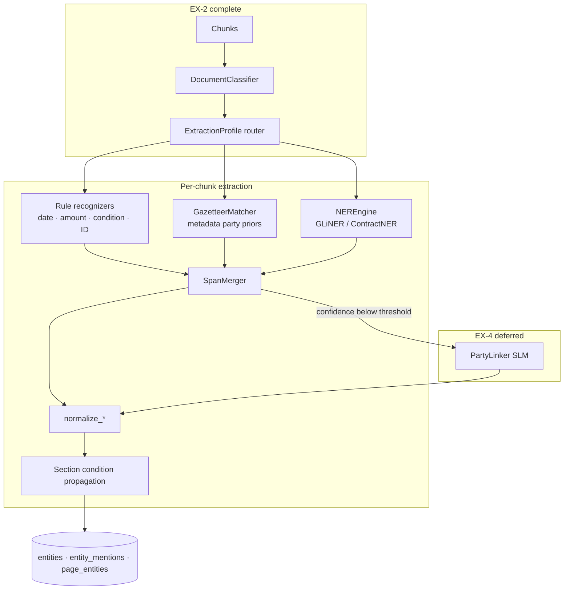

**Merge policy (non-negotiable):**

1. Rule match on span overlap → rule wins (`confidence=1.0`, `source=rule`)
2. NER fills unmatched spans if score ≥ `NER_THRESHOLD_HIGH` (default 0.85)
3. Scores in `NER_THRESHOLD_LOW`–`HIGH` → index but flag for review (EX-5)
4. SLM linker (EX-4) only for party canonical disambiguation on pages 1–3 — never bulk per-chunk

**Document-type profiles** (same five SQL types; different label sets and recognizers):

| `doc_type` | NER model | Emphasis |
|------------|-----------|----------|
| `contract` | ContractNER (`gliner-contractner-multi-v2.1`) | parties, effective date, amounts |
| `litigation` | GLiNER small + optional Blackstone | courts, parties, case numbers |
| `regulatory` | GLiNER + eyecite | citations, instruments, provisions |
| `unknown` | GLiNER small (general legal labels) | party, date, case number |

**Default OSS bundle:** `urchade/gliner_small-v2.1` via ONNX Runtime (Apache-2.0, CPU-first). Models cached under `${PICARD_DATA_DIR}/models/`. NER unavailable → rules-only fallback (current behavior).

#### 8.3.4 Entity extraction evolution (EX-1–EX-5)

Entity work is tracked separately from product phases (§14) because CARP depends on ingest quality before citation chat is legally safe.

| Sub-phase | Scope | Status | Deliverables |
|-----------|-------|--------|--------------|
| **EX-0** | v1 regex baseline + eval corpus | **Complete** | `entity_index.py`, Chester corpus, I-04 gate |
| **EX-1** | Recognizer registry; shared patterns ingest ↔ planner | **Complete** | Patterns in `entity_index.py` + `constraint_planner.py`; section-key condition propagation; `backfill_entities.py` |
| **EX-2** | Document-type routing + metadata priors | **Complete** | `metadata_extractor.py`, `metadata_tags`, `filter_documents_by_metadata`, filename `doc_type` rules |
| **EX-3** | NER layer (GLiNER ONNX + profiles) | **In progress — current** | `entity_extraction/` module, merge policy, `enable_ner_entity_extract` flag, E-01–E-04 gates |
| **EX-4** | Bounded SLM party linker | Planned | Outlines/Instructor JSON; `entities.aliases_json`; aligns with §4.1 tiered SLM |
| **EX-5** | HITL + active learning | Planned | Low-confidence mention review UI; gold span relabeling |

**EX-3 implementation target** (Phase 3 deliverable — see §14.3.0):

```
backend/app/services/entity_extraction/
├── recognizers/          # date, amount, condition, identifier, legal_actor
├── profiles.py           # doc_type → label set + recognizer list
├── ner/
│   ├── gliner_engine.py  # ONNX runtime, batched inference
│   └── contractner.py    # contract profile
├── merge.py              # span overlap, confidence, source tagging
└── __init__.py           # extract_entities_for_document (replaces monolith entry)
```

**Mention provenance** (EX-3 adds):

| Field | Values |
|-------|--------|
| `entity_mentions.confidence` | Rule: `1.0`; NER: model score |
| `entity_mentions.source` | `rule` \| `ner` \| `gazetteer` \| `slm` (EX-4) |
| Job payload | `extractor_version` e.g. `hybrid_v2.1.0` |

**Performance budget:** regex-only ≪ 1 ms/chunk; GLiNER small ONNX ≈ 80–200 ms/chunk CPU. For large matters, batch inference (size 8–16) and optional defer mode (`ENTITY_NER_MAX_PAGES`) index headings + early pages first.

**What we deliberately skip:** LexGLUE/LEDGAR clause classifiers (wrong task — clause *type*, not CARP spans); per-chunk 70B LLM extraction; full FOLIO ontology; Neo4j entity graphs.

### 8.4 Progress UX

Poll `GET /documents/{id}/status` → `{ parse_status, progress }`.

**Why not WebSockets in v1:** Mike and LegalDocX use SSE/WebSocket for multi-user cloud scale. Single-user local polling every 1s is sufficient; WebSocket in Phase 5 polish.

### 8.6 CSV & structured data ingest (Phase 8)

When `ENABLE_CSV_INGEST=true`:

1. User uploads CSV via multipart form (XLSX deferred post-v1)
2. Parse with stdlib `csv` — **no pandas/polars** (§4.2)
3. Insert `workspace_data_files` + `workspace_data_rows` with row-indexed `cells_json`
4. Column metadata stored for citation refs: `[csv:{file_id}:row:{index}:col:{name}]`

**Entity join:** `csv_entity_join.py` matches party/org columns to `entities.canonical_value` via the same normalizers as CARP — enables composite workflows that combine CSV rows with PDF corpus retrieval.

**Job type:** `csv_ingest` in `jobs` table (BackgroundTasks).

---

## 9. Relevance engine (FTS5)

### 9.1 Query pipeline

```
User question
    → ConstraintQueryPlanner (classify SIMPLE vs MULTI_CONSTRAINT)
    → [SIMPLE path]
        → [Optional] LLM query expansion
        → FTS5 MATCH with BM25 ranking
        → Top N chunks (default N=12)
    → [MULTI_CONSTRAINT path]  — see §9.5 CARP
        → Entity index intersection → context bundles → top K bundles
    → [Optional] metadata filter (workspace, doc_ids, tags)
    → Citation map construction
```

**Routing rule:** If the planner extracts ≥2 typed constraints with intent `case_context`, `timeline`, or `obligations` → **CARP**. Otherwise → simple FTS5. User can force mode via API.

### 9.2 Query expansion

LLM prompt (cheap SLM if tiered — see §4.1 — else same as synthesis model or skip):

> Convert this legal question into a FTS5 query using phrases in quotes and OR for synonyms. Question: "{user_query}"

Example:

- Input: "What is the liability cap?"
- Output: `"limitation of liability" OR "liability cap" OR "cap on damages"`

**Why:** Bridges FTS5 lexical gap without vector embeddings.

### 9.3 Ranking & truncation


| Parameter            | Default | Rationale                                   |
| -------------------- | ------- | ------------------------------------------- |
| `top_k`              | 12      | Fits ~8K context tokens with chunk previews |
| `min_bm25_rank`      | -10.0   | Filter noise (tune on legal corpus)         |
| `max_chunks_per_doc` | 4       | Prevent one long doc dominating results     |


### 9.4 Scoped search

Always filter by `workspace_id`. Optional `document_ids[]` from UI selection (Mike's attach-docs pattern).

### 9.5 Multi-constraint contextual retrieval (CARP)

**CARP** = **C**onstraint-**A**ware **R**etrieval **P**ipeline. It answers questions where the user expects **co-occurring legal context** across multiple entities — party + date + condition — not independent keyword hits.

This is the production-grade pattern picard-oss uses instead of LegalDocX's Neo4j multi-hop traversal for conjunctive context queries. It is deliberately **simple and auditable**: set intersection on indexed entities, proximity-tier scoring, context bundles — no graph database.

---

#### 9.5.1 Reference use case (100K pages)

| Corpus fact | Scale |
|-------------|-------|
| Total pages ingested | **100,000** (~500K–2M chunks) |
| Party **ABC** mentioned | ~**100 pages** (many unrelated contexts) |
| Date **18/05/2019** mentioned | ~**hundreds of pages** (multiple parties, events) |
| **Condition C** referenced | **many pages** (often by section heading, not body text) |

**User query:** *"What is the case context for party ABC, date 18/05/2019, with condition C?"*

**What the user actually wants:** Excerpts where these constraints describe the **same legal event or transaction** — not a union of every ABC mention, every date mention, and every Condition C clause in the matter.

---

#### 9.5.2 How naive FTS5 fails (and why OR/AND alone is insufficient)

| Approach | Query shape | Result on this use case | Legal integrity problem |
|----------|-------------|-------------------------|-------------------------|
| **Naive BM25** | `"ABC" OR "18/05/2019" OR "condition c"` | Top-12 chunks from **union** of ~500+ pages | Answer conflates unrelated ABC deals with unrelated dates |
| **Strict chunk AND** | `"ABC" AND "18/05/2019" AND "condition c"` in one chunk | **Misses valid context** — party in paragraph 1, date in table footer, condition in section heading |
| **FTS5 NEAR only** | `NEAR("ABC" "18/05/2019", 50) AND "condition c"` | Fails when condition appears in **heading_path** but not adjacent tokens | Condition C often lives in section title, body references it indirectly |
| **Top-K without coarse filter** | BM25 over 2M chunks | Slow + dominated by high-frequency "condition c" boilerplate | Cannot scale to 100K pages within chat latency |

**LegalDocX avoids this** via entity discovery → graph traversal → content aggregation into `document_references[]` with bbox cascade (`simple_agentic_query_engine.py`). **picard-oss achieves the same user outcome** via entity index intersection + page/section proximity — without Neo4j.

---

#### 9.5.3 CARP architecture (four stages)

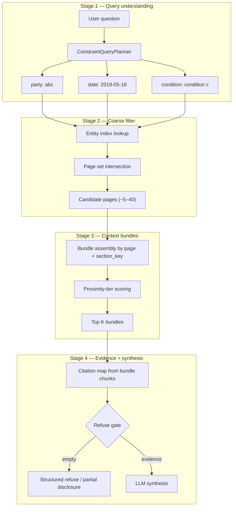

##### Stage 1: ConstraintQueryPlanner

Classify every query into a retrieval mode:

| Mode | Trigger | Pipeline |
|------|---------|----------|
| `SIMPLE` | Single topic, no entity conjunction | §9.1 FTS5 + expansion |
| `MULTI_CONSTRAINT` | ≥2 typed constraints (party, date, condition, identifier) | CARP |
| `TABULAR` | Column extraction prompt | Per-doc scoped FTS5 (§11) |

**Constraint extraction** (hybrid — **rules first, SLM fallback if tiered** — see §4.1):

```python
# Example output of ConstraintQueryPlanner
{
  "mode": "MULTI_CONSTRAINT",
  "constraints": [
    {"type": "party",      "canonical": "abc",           "surfaces": ["ABC", "ABC Ltd"]},
    {"type": "date",       "canonical": "2019-05-18",    "surfaces": ["18/05/2019", "18 May 2019"]},
    {"type": "condition",  "canonical": "condition c",   "surfaces": ["Condition C", "condition c"]}
  ],
  "intent": "case_context"   # vs "obligations" | "timeline" | "comparison"
}
```

**Date normalization is mandatory.** All surface forms map to one `canonical_value` at ingest and query time. Without this, `18/05/2019` and `May 18, 2019` never intersect.

##### Stage 2: Page set intersection (coarse filter)

For each constraint, lookup candidate pages from `page_entities`:

```sql
-- Pages mentioning party abc
SELECT document_id, page_number FROM page_entities pe
JOIN entities e ON pe.entity_id = e.id
WHERE e.workspace_id = :ws AND e.entity_type = 'party' AND e.canonical_value = 'abc';

-- Intersect with date and condition similarly
-- Result: pages where ALL constraints co-occur (same page)
```

**Intersection order:** Process **smallest entity set first** (party ~100 pages) → intersect with date → intersect with condition. At 100K pages this completes in milliseconds with proper indexes.

| Outcome | Page count | Next action |
|---------|------------|-------------|
| **Non-empty intersection** | e.g. 8 pages | Proceed to bundle assembly |
| **Empty intersection** | 0 pages | Escalate proximity tiers (§9.5.4) or refuse |
| **Too large intersection** | >200 pages | Tighten with section_key or BM25 within set |

**Why page-level, not chunk-level, intersection:** In legal PDFs, party name, date, and condition frequently appear in **different chunks on the same page** (header table + body + footnote). Chunk-level AND is too strict; page-level AND matches lawyer mental model ("what happened on this page of the record?").

##### Stage 3: Context bundle assembly

A **context bundle** is the unit of retrieval — not a single chunk. Inspired by LegalDocX `document_references[]` grouping and Mike's heading-path grouping in compliance matching.

```typescript
interface ContextBundle {
  bundle_id: string;
  document_id: string;
  page_start: number;
  page_end: number;           // usually same page; ±1 for adjacent-page tier
  section_key: string | null;
  heading_path: string | null;
  chunk_ids: string[];       // all chunks on page(s) in section
  constraints_matched: string[]; // ["party:abc", "date:2019-05-18", "condition:condition c"]
  proximity_tier: 'SAME_CHUNK' | 'SAME_PAGE' | 'SAME_SECTION' | 'ADJACENT_PAGE';
  bm25_score: number;
  coherence_score: number;   // section + heading boost
}
```

**Assembly algorithm:**

1. For each candidate page from Stage 2, collect all chunks on that page (and optionally ±1 page for adjacent tier).
2. Group by `section_key` if heading_path differs within page (e.g. footer date vs body condition).
3. Score each bundle:

```
bundle_score = (
  w1 * constraints_matched_count +      # 3/3 beats 2/3
  w2 * proximity_tier_score +         # SAME_CHUNK > SAME_PAGE > SAME_SECTION > ADJACENT
  w3 * bm25(query, bundle_text) +     # within-page relevance to "case context"
  w4 * coherence_score                # same section_key for all constraints
)
```

4. Return top **K bundles** (default K=8), expanding each to 2–6 chunks max for LLM context.

**Scale math at 100K pages:**

| Step | Input size | Expected output | Target latency |
|------|------------|-----------------|----------------|
| Entity lookup (party) | 100K pages | ~100 pages | <50ms |
| Intersect date | ~100 pages | ~15 pages | <10ms |
| Intersect condition | ~15 pages | ~5–8 pages | <5ms |
| Bundle assembly + BM25 | ~8 pages × ~5 chunks | 8 bundles, ~40 chunks | <200ms |
| **Total pre-LLM** | | | **<500ms** |

FTS5 never scans all 2M chunks — only chunks on the intersected page set.

##### Stage 4: Evidence contract + legal integrity

**Refuse gate (strict mode — default):** If no bundle matches all constraints at `SAME_PAGE` tier or better → **no LLM call**. Return structured refuse with diagnostic counts:

```json
{
  "refused": true,
  "answer": "No single page in this workspace contains party ABC, date 18/05/2019, and Condition C together.",
  "retrieval_diagnostics": {
    "party_abc_pages": 98,
    "date_2019_05_18_pages": 412,
    "condition_c_pages": 1203,
    "intersection_pages": 0,
    "closest_partial": {
      "party_and_date_pages": 12,
      "party_and_condition_pages": 3
    }
  },
  "suggestions": [
    "Try adjacent-page proximity (widens to ±1 page)",
    "Confirm date format — 18/05/2019 vs 2019-05-18",
    "Condition C may appear only in section headings — check heading_path index"
  ]
}
```

**Partial disclosure mode (optional, user-triggered):** When intersection is empty but partial overlaps exist, return bundles with explicit **integrity warnings**:

> "Party ABC and date 18/05/2019 co-occur on 12 pages, but Condition C appears on different pages in those documents. The following excerpts show the closest co-located context — verify whether they describe the same transaction."

Every partial bundle carries `constraints_matched` and `constraints_missing` arrays. The LLM prompt **forbids inferring** missing constraint links:

```
Do NOT state that Condition C applies to party ABC on 18/05/2019 unless
all three appear in the same bundle's source text. If constraints are split
across bundles, describe each separately with distinct citations.
```

**Post-generation validation (extends §7 Layer 3):**

| Check | Purpose |
|-------|---------|
| Date-in-citation | Every date in answer must match a cited chunk's extracted date entity |
| Party-in-citation | Party name claims require party entity mention in cited chunk |
| Cross-bundle conflation | Reject sentences citing `[1]` and `[2]` that imply a link when bundles have disjoint `constraints_matched` |

---

#### 9.5.4 Proximity escalation ladder

When strict page intersection returns 0 pages, escalate automatically (configurable):

| Tier | Scope | When to use | Legal risk |
|------|-------|-------------|------------|
| **T0 — SAME_CHUNK** | FTS5 `NEAR(party, date, 30)` | Entities in dense paragraphs | Lowest — strongest co-occurrence |
| **T1 — SAME_PAGE** | `page_entities` intersection | Default for CARP | Low — standard eDiscovery page view |
| **T2 — SAME_SECTION** | Same `section_key` within document | Condition C in heading, body references party+date | Medium — requires section_key from liteparse |
| **T3 — ADJACENT_PAGE** | page N ± 1 | Date in table on page 5, condition body on page 6 | Medium-high — disclose tier in UI |
| **T4 — REFUSE** | Stop | No escalation result | Safest — no synthesis |

Default auto-escalation: **T1 → T2 → T4**. T3 only when user enables " widen proximity" or query intent is `timeline`.

**UI transparency:** `PreResponseWrapper` shows: *"Retrieved 6 context bundles (same-page match) from 8 candidate pages out of 100,000."*

---

#### 9.5.5 Condition C and heading_path (structural retrieval)

Conditions in legal documents often appear as **section headings** with different body text. CARP handles this by indexing `heading_path` on chunks at parse time:

1. When liteparse emits a heading chunk `"Condition C — Warranties"`, extract entity `condition c` from heading.
2. Associate that entity with **all chunks sharing the same `section_key`** until the next heading at same level.
3. Page intersection treats section-linked condition as satisfied if the condition entity is in the heading chunk **and** party/date appear in any chunk with matching `section_key` on the same page.

This is the OSS equivalent of LegalDocX structural boost ("sections whose heading_path contains 'Condition'") without a knowledge graph.

---

#### 9.5.6 Comparison: CARP vs LegalDocX GraphRAG vs naive FTS5

| Dimension | Naive FTS5 | CARP (picard-oss) | LegalDocX GraphRAG |
|-----------|------------|-------------------|---------------------|
| Multi-entity conjunctive query | Poor (OR noise / AND too strict) | **Purpose-built** | Excellent |
| 100K page scale | Requires full scan | Indexed intersection → small candidate set | Neo4j indexed traversal |
| Infrastructure | SQLite only | SQLite + entity tables | Neo4j + Celery + Redis |
| Counterparty disambiguation | None | Canonical entity + workspace scope | Typed graph entities |
| Section-aware conditions | No | `heading_path` + `section_key` | Ontology + graph |
| Auditability | BM25 score | Constraint match diagnostics + bundle provenance | Citation validation metadata |
| Empty evidence | Hallucination risk | Refuse + partial disclosure | Refuse gate |

---

#### 9.5.7 API changes for CARP

**Search endpoint** — extended request:

```typescript
POST /search
{
  "query": "case context for party abc, date 18/05/2019, with condition c",
  "workspace_id": "...",
  "retrieval_mode": "auto",     // auto | simple | multi_constraint
  "proximity_max_tier": "SAME_SECTION",
  "allow_partial_disclosure": false
}
```

**Response** — adds retrieval diagnostics:

```typescript
{
  "mode": "MULTI_CONSTRAINT",
  "bundles": ContextBundle[],
  "chunks": Chunk[],              // flattened from bundles for citation map
  "retrieval_diagnostics": { ... },
  "proximity_tier_used": "SAME_PAGE"
}
```

**Chat stream** — extended `retrieval` event:

```typescript
{ "event": "retrieval", "chunk_count": 24, "bundle_count": 6,
  "refused": false, "mode": "MULTI_CONSTRAINT",
  "diagnostics": { "intersection_pages": 8, "total_pages": 100000 } }
```

---

#### 9.5.8 Implementation files (backend)

```
backend/app/services/
├── constraint_planner.py    # Query → constraints + mode (shares normalizers with entity extract)
├── entity_index.py          # CARP query helpers; ingest entry until EX-3 module lands
├── entity_extraction/       # EX-3: hybrid ingest pipeline (recognizers, NER, merge)
├── metadata_extractor.py    # EX-2: doc_type + optional SLM metadata
├── carp.py                  # Intersection, bundle assembly, scoring
├── search.py                # Routes SIMPLE → FTS5, MULTI_CONSTRAINT → CARP
└── citations.py             # Bundle-aware citation map + cross-bundle validation
```

---

#### 9.5.9 Entity matter listing (multi-document party portfolio)

For queries like *"list all cases against Google LLC"* across many PDFs in a workspace, CARP and `case_overview` are the wrong tools:

| Mode | Use when |
|------|----------|
| `case_overview` | One named matter (`X v Y`, list all **case details** for that dispute) |
| `entity_matter_listing` | One named **party** across **many documents** — enumerate each source file separately |
| CARP | Party + date + condition on the **same page** (same legal event) |

**Pipeline (`entity_matter_listing`):**

1. **ConstraintQueryPlanner** — intent `entity_matter_listing`; extract org party (`Google LLC`, `… Pvt. Ltd.`) via `ORG_PARTY_PATTERN` + entity catalog resolution (`resolve_party_canonicals`).
2. **Document discovery** — `lookup_documents_for_party` over `page_entities` (distinct `document_id`, sorted by mention count).
3. **Per-document retrieval** — `fts_search_on_pages` on entity pages + optional caption pass (`informant`, `commission`); quotas `min_chunks_per_doc` / `max_chunks_per_doc`.
4. **Ranking** — `listing` rank mode with document-floor guardrails (≥1 chunk per discovered doc when possible).
5. **Synthesis** — one `## [filename]` section per document; citations must not cross documents.

**Implementation:** `entity_listing_retrieval.py`, `query_understanding.py` (`TargetEntity`), `context_ranker.py` (`_listing_document_guardrails`), `citations.py` (listing prompt). Config: `CHAT_LISTING_*` env vars (see Appendix B).

---

#### 9.5.10 What we deliberately do NOT build (and why)

| Feature | Why deferred |
|---------|--------------|
| Full knowledge graph | CARP solves conjunctive context; graph adds ops cost without v1 benefit |
| Vector hybrid for CARP | Entity intersection is precise for named party/date/condition; vectors add ambiguity |
| Automatic "same transaction" inference | Legal integrity — user must verify; system surfaces co-occurrence, not legal conclusions |
| Cross-document entity coreference ("ABC" = "ABC Ltd" across docs) | v2: optional alias table; v1 uses canonical normalization only |

---

## 10. Citation-grade assistant

### 10.0 Assistant modes overview

| Mode | Request | Backend path | Shipped |
|------|---------|--------------|---------|
| **Chat (RAG)** | `POST /chat/stream` (default) | `stream_chat()` — §5.2 | Yes |
| **Agent (author)** | `POST /chat/stream` + `mode=agent` | `lightagent_runtime.stream_run()` — §5.2.1 | Phase 7a |
| **Workflow run** | `POST /workflows/{id}/run` | `picard_flow_runner.run()` — §10.7 | Phase 7b |

Chat and Agent share SSE envelope `{"event": "<type>", "data": "<json>"}` from [`routers/chat.py`](../backend/app/routers/chat.py). Workflow runs use the same envelope on a dedicated stream (§10.7).

### 10.1 Chat mode: streaming endpoint (shipped)

`POST /chat/stream` — Server-Sent Events when `mode=rag` (default).

| Event | Phase | Payload |
| ----- | ----- | ------- |
| `progress` | 3 | Retrieval phase labels |
| `snippet` | 3 | Preview hits |
| `retrieval` | 3 | `{ chunk_count, bundle_count, refused, mode, diagnostics }` |
| `content` | 3 | `{ delta }` |
| `references` | 3 | `{ references[], citation_validation }` |
| `done` | 3 | `{}` |
| `error` | 3 | `{ message }` |

**Agent-only events (Phase 7a):** `memory_hit`, `plan`, `approval_required`, `tool_call`, `tool_result`, `workflow_draft`, `step_refused`, `workflow_applied`, `tabular_read`, `draft_section`, `ext_reference`.

**LightFlow run events (Phase 7b):** `flow_start`, `step_start`, `step_end`, `flow_end` — see §10.7.

**Persistence (Phase 7a):** Assistant turns in agent mode store full event arrays in `agent_runs.events_json` (Mike-inspired pattern; optional mirror on `chat_messages`). Workflow runs persist `lightflow_trace_json` on `workflow_runs`.

### 10.2 System prompt (core)

```
You are a legal document assistant. Answer ONLY using the provided source excerpts.
Every factual claim MUST include an inline citation [N] matching the source list.
If the sources do not contain the answer, say so — do not use outside knowledge.
Do not invent citation numbers.

Sources:
[1] (doc: {name}, page: {p}): {preview}
...
```

### 10.3 Frontend: Assistant view

**Layout (from LegalDocX + Mike):** 50/50 split — chat left, PDF right.


| Component                 | Responsibility                        | Inspiration                             |
| ------------------------- | ------------------------------------- | --------------------------------------- |
| `CitationParser`          | Parse `[N]` → clickable pills         | LegalDocX `CitationParser.tsx`          |
| `MultiHighlightPDFViewer` | pdf.js + bbox overlay layer           | LegalDocX `MultiHighlightPDFViewer.tsx` |
| `DocPanel`                | One tab per document; preserve scroll | Mike `DocPanel.tsx`                     |
| `PreResponseWrapper`      | Collapsible retrieval status          | Mike `PreResponseWrapper.tsx`           |
| `ChatInput`               | Attach workspace documents            | Mike `ChatInput.tsx`                    |


**Citation click flow:**

1. User clicks `[2]`
2. Frontend looks up `references[2]`
3. PDF viewer navigates to `page`, draws monotone border on `bbox`
4. If different document → swap DocPanel tab (preserve other tabs)

### 10.5 Agent mode — authoring (LightAgent + mem0, Phase 7a)

When `ENABLE_AGENT_MODE=true` and `mode=agent`, `POST /chat/stream` delegates to **LightAgent** with **mem0** ([§4.2.2](#422-agent-authoring-pattern-phase-7a)). Chat mode (`mode=rag`) always uses `stream_chat()` regardless of the flag. **Workflow execution does not use Agent mode** — use §10.7.

| Concern | Design |
|---------|--------|
| Orchestration | LightAgent exploratory loop; max `AGENT_MAX_ITERATIONS` |
| Corpus Q&A | `answer_from_corpus` → **same Citation Kernel as Chat** (§7.6); not a separate RAG path |
| Memory | mem0 via `PicardMemory`; stores flow patterns — **not** legal conclusions (§2.6) |
| Profile | `agent_profile=firm\|court` filters tool registration (§4.2.10) |
| HITL | HITL-SCOPE / HITL-URL / HITL-PLAN (§4.3) |
| Output | `flow_json` draft + ad-hoc cited answers; **no** `LightFlow.run` in 7a |

**Tool surface:** Full registry in §4.2.10 — vault/upload/scope, `answer_from_corpus`, `search_corpus`, tabular, workflow author tools, and (Phase 8–9) CSV/draft/web tools. All corpus tools delegate to the Citation Kernel.

**Composite flows (§10.8):** UC-1 web→corpus, UC-2 contracts Q&A, UC-3 guideline+CSV — runnable ad-hoc in Agent mode or saved as `flow_json` for LightFlow.

**Dynamic authoring:** User describes goal → Agent inspects workspace → emits `flow_json` (§11.6) → `FlowDAGPanel` preview → **HITL-PLAN** → `workflows` row with `source=agent_authored`. **Run** is a separate UI action (§10.7).

**Built-in playbooks:** Stored as `flow_json` LightFlow graphs in Phase 6+ (§11.5), not prompt-only strings.

Court profile **denylist:** risk scoring, outcome prediction, credibility scoring, surveillance tools.

---

### 10.6 Listing map-reduce (multi-doc orchestration)

**Shipped** in Chat mode for `entity_matter_listing` when document count exceeds `chat_listing_map_max_docs`. Implements **discover → per-document retrieve → reduce** with progress SSE — informed composite DAG design; execution uses **LightFlow** in Phase 7b (§4.2.5), not this code path directly.

---

### 10.7 Workflow execution (LightFlow, Phase 7b)

**Entry:** `POST /workflows/{id}/run` after user approval (`requires_approval` for court). Body supplies run input per `input_schema_json` (doc scope, template id, CSV file id, `urls[]`, etc.).

**Backend:** `picard_flow_runner.py` loads `flow_json`, builds `LightFlow` via `flow_agent_factory.py`, runs `flow.run(..., trace=True, result_format="dict")`, persists trace + result to `workflow_runs` (§6.3).

**SSE events (trace-mapped):**

| Event | When |
|-------|------|
| `flow_start` | Run begins |
| `step_start` | Before each LightFlow step |
| `step_end` | After step completes (includes outputs summary) |
| `step_refused` | Corpus step failed `refuse_on_empty` (§7.5) |
| `flow_end` | `LightFlowResult` available |
| `error` | Unhandled failure |

**Non-streaming upstream:** LightFlow v0.8 completes each step before the next; Picard emits SSE **after each `step_end`** (trace polling or chunked flush). Full response body may also return `lightflow_result_json` for clients that do not subscribe to SSE.

**Court:** Block run if `requires_approval` and no approval record; validate `evidence_profile` role denylist before `flow.run`.

**Agent tool (optional):** `run_workflow(workflow_id)` delegates to the same runner — distinct from exploratory Agent chat.

| Step | Service |
|------|---------|
| Discovery | `listing_discovery.py` — FTS + `page_entities` |
| Map | Per-doc chunk quotas (`listing_map_reduce.py`) |
| Reduce | LLM synthesis with per-file `## [filename]` sections |

See §9.5.9 for intent routing vs CARP. Config: `enable_listing_map_reduce`, `chat_listing_map_*` in Appendix B.

---

### 10.8 Composite use-case playbooks

Three representative **composite flows** show how LightAgent orchestration + Citation Kernel + HITL compose into automatic end-to-end jobs. Each can run **exploratively** in Agent mode (7a) or as a saved **`flow_json` playbook** executed by LightFlow (7b). See §4.2.10 for the full tool registry.

#### UC-1: Web sources → new corpus → cited Q&A

**User story:** External material is fetched, user approves ingest into a workspace/section, system parses, then all answers use **Tier A `[N]` only** — not raw web text.

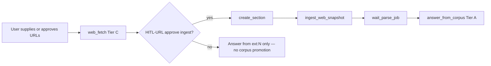

| Step | Tool | Tier | HITL |
| ---- | ---- | ---- | ---- |
| Fetch | `web_fetch` → `research_snapshots` | C `[ext:N]` | HITL-URL (court: off by default) |
| Promote | `ingest_web_snapshot` → parse pipeline | → A after parse | HITL-SCOPE — approve target workspace/section |
| Wait | `wait_parse_job` | — | Progress UI |
| Answer | `answer_from_corpus` | A `[N]` | Refuse if parse incomplete or zero chunks |

**Constraints:** No autonomous web *discovery* (no search APIs). Agent may *propose* URLs from user lists or connector configs; user approves before fetch (§4.2.4). After ingest, **WEB-01** applies — vault facts never cite `[ext:N]`.

**Example `flow_json` stub (Phase 9 builtin):**

```json
{
  "version": "0.8",
  "steps": [
    {"name": "fetch", "role": "web", "config": {"urls_from_input": true}},
    {"name": "ingest", "role": "research", "depends_on": ["fetch"], "config": {"action": "ingest_web_snapshot"}},
    {"name": "wait", "role": "research", "depends_on": ["ingest"], "config": {"action": "wait_parse"}},
    {"name": "answer", "role": "research", "depends_on": ["wait"], "refuse_on_empty": true, "query": {"template": "{{input.question}}"}}
  ]
}
```

#### UC-2: User adds contracts → agent Q&A (same as chat)

**User story:** User uploads multiple contracts in Agent session and asks questions — answers match Chat mode (citations, refuse, validation).

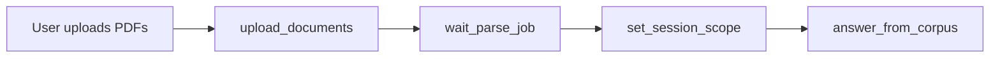

| Concern | Design |
| ------- | ------ |
| Same as chat? | **Yes** — `answer_from_corpus` invokes the same Citation Kernel as `stream_chat()` |
| Agent adds value | Multi-doc upload orchestration, scope management, follow-up tools (`read_chunks`, tabular seed), mem0 firm preferences |
| One-shot path | Agent may call `answer_from_corpus` once without multi-step planning |
| HITL | **HITL-SCOPE** when document count exceeds threshold (court: mandatory) |

#### UC-3: Guideline docs + CSV → compliant drafts

**User story:** Guideline PDFs in vault + CSV of party/deal data → template drafts with Tier A guideline citations, Tier B CSV refs, and explicit gaps.

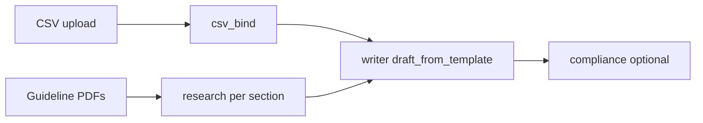

| Step | Role / tool | Tier | Phase |
| ---- | ----------- | ---- | ----- |
| CSV ingest | `ingest_csv` | B `[csv:row:col]` | 8 |
| Guideline retrieval | `research` + Citation Kernel | A `[N]` | 7b |
| Section fill | `writer` + `draft_from_template` | D — `sources[]` + `missing_evidence[]` | 8 |
| Cross-tier | Writer cites upstream `[N]` and `[csv:…]` — never substitutes Tier B for PDF legal facts | | |

**Automatic composition:** Agent inspects inventory → `propose_flow` → user edits `FlowDAGPanel` → **HITL-PLAN** → Run via LightFlow. Builtin: `csv_bind → research → writer → compliance`.

**Example `flow_json` stub (Phase 8 builtin):**

```json
{
  "version": "0.8",
  "steps": [
    {"name": "bind_csv", "role": "tabular", "config": {"csv_file_id_from_input": true}},
    {"name": "guidelines", "role": "research", "depends_on": ["bind_csv"], "refuse_on_empty": true,
     "config": {"document_ids_from_input": "guideline_doc_ids"}},
    {"name": "draft", "role": "writer", "depends_on": ["guidelines", "bind_csv"],
     "cite_from_steps": ["guidelines"], "config": {"template_id_from_input": true}},
    {"name": "review", "role": "compliance", "depends_on": ["draft"]}
  ]
}
```

**HITL:** HITL-PLAN on save; HITL-EXPORT on draft download; court blocks auto-send.

---

Tabular review is a **v1 flagship feature** — not Phase 4 afterthought. Mike's `[PRODUCT-STRENGTHS.md](../mike/docs/PRODUCT-STRENGTHS.md)` demonstrates this is where legal users spend bulk review time.

### 11.1 Column model

```typescript
interface TabularColumn {
  key: string;
  label: string;
  format: 'text' | 'bulleted_list' | 'number' | 'currency' |
          'yes_no' | 'date' | 'tag' | 'percentage' | 'monetary_amount';
  prompt: string;              // extraction instruction
  tag_options?: string[];      // for format=tag
}
```

**Presets (from Mike `columnPresets.ts`):** Parties, Governing Law, Effective Date, Term, Termination, Change of Control, Confidentiality, Assignment.

**Prompt generation:** `POST /tabular/generate-column-prompt` — LLM expands preset label into extraction prompt.

### 11.2 Cell extraction flow

For each (document × column):

1. Build FTS5 query from column prompt keywords
2. Retrieve top 3 chunks for that document
3. LLM extract with strict JSON schema:

```json
{
  "summary": "extracted value",
  "reasoning": "brief justification",
  "chunk_ids": ["chunk-uuid-1"],
  "flag": "green"
}
```

1. Store in `tabular_cells`; emit SSE progress event

**Batch:** `POST /tabular/{review_id}/generate/stream` — process cells sequentially or with concurrency limit (2) to avoid Ollama overload.

### 11.3 Cell UI (Mike patterns)


| Feature                | Implementation                                    |
| ---------------------- | ------------------------------------------------- |
| Sticky doc column      | CSS sticky + horizontal scroll                    |
| Flag dots              | green/yellow/red/grey                             |
| Citation pills in cell | Parse `[[page:N||quote:...]]` or chunk_id refs    |
| Side panel             | `TRSidePanel` — summary, reasoning, PDF highlight |
| Regenerate cell        | `POST /tabular/cells/{id}/regenerate`             |
| Excel export           | Strip citation markers; frontend ExcelJS          |


### 11.4 Tabular chat (Phase 4)

Dedicated chat panel inside review (`TRChatPanel`) with citations that scroll to table cells — adopt Mike's `TRCitationAnnotation` pattern in Phase 4. Enhanced in Phase 7 with agent tools (`read_tabular_cells`) for cross-table Q&A.

### 11.5 Workflow library (Phase 6+)

**Mike reference:** dual workflow types in [`builtinWorkflows.ts`](../mike/frontend/src/app/components/workflows/builtinWorkflows.ts) — `assistant` (`prompt_md`) and `tabular` (`columns_config`). Workflows attach to chat messages and seed tabular review columns on creation ([`PRODUCT-STRENGTHS.md`](../mike/docs/PRODUCT-STRENGTHS.md) §4).

Picard extends Mike's model with **evidence profiles**, **CARP intent bindings**, and **LightFlow `flow_json`** as the composite execution spec (§11.6).

**Phase 6 library UI:** List/filter workflows; **Run** (7b) vs **Edit in Agent** (7a); read-only `FlowDAGPanel` for `flow_json` deps.

**Built-in library (~15–20 playbooks):** Each ships as validated `flow_json` (LightFlow v0.8) plus optional `prompt_md` / `columns_config` for Chat/tabular seeds. **Composite builtins (§10.8):** `web_to_corpus_qa`, `contracts_agent_qa`, `guideline_csv_draft` — seeded in `backend/app/workflows/builtins.py`.

**Storage:** SQLite `workflows` + `hidden_workflows` (§6.3). Export/import JSON includes `flow_json`.

**Tabular seed:** `AddNewTRModal` accepts `workflow_id` → copies `columns_config`.

**CSV-as-column-source (Phase 8):** `csv_bind` deterministic step + `writer` steps in `flow_json`.

### 11.6 LightFlow workflow model

**Primary spec:** `flow_json` on `workflows` — not the legacy `WorkflowStep.kind` enum alone.

```typescript
interface PicardWorkflow {
  id: string;
  title: string;
  type: 'assistant' | 'tabular' | 'lightflow';
  profile: 'firm' | 'court' | 'any';
  source: 'builtin' | 'user' | 'agent_authored';
  requires_approval: boolean;
  prompt_md?: string;
  columns_config?: TabularColumn[];
  flow_json: {
    version: '0.8';
    input_hint?: string;
    steps: LightFlowStepDef[];
  };
  evidence_profile: {
    requires_corpus: boolean;
    allowed_intents?: QueryIntent[];
    allows_tabular: boolean;
    allows_csv: boolean;
    allows_web: boolean;
    denied_roles?: PicardAgentRole[];
  };
  input_schema_json?: Record<string, unknown>;
}

interface LightFlowStepDef {
  name: string;
  role: PicardAgentRole;
  depends_on?: string[];
  max_retry?: number;
  query?: 'auto' | { template: string } | 'lambda_ref';
  refuse_on_empty?: boolean;
  evidence_tier?: 'A' | 'B' | 'C' | 'D';
  cite_from_steps?: string[];   // writer/coordinator: allowed upstream step names for [N]
  output_format?: 'markdown_cited' | 'flow_json' | 'tabular_cells';
  config?: Record<string, unknown>;  // e.g. action: wait_parse | ingest_web_snapshot
}

type PicardAgentRole =
  | 'research'
  | 'tabular'
  | 'writer'
  | 'web'
  | 'compliance'
  | 'coordinator';
```

**Dynamic authoring (7a):** Example — *"DD memo from 12 NDAs + CSV party list + guideline template"* → Agent emits DAG: `ingest_check` → `tabular_extract` → `carp_obligations` → `draft_sections` → `compliance_review`.

**Builtin flow patterns:**

| User intent | Typical DAG |
|-------------|-------------|
| Matter research | `research` → optional second `research` (compare) |
| Guideline + corpus draft | `research` → `writer` |
| Guideline + CSV multi-party | `csv_bind` → `research` (per-party via config) → `writer` |
| Web → corpus Q&A (UC-1) | `web` → ingest/wait → `research` (Phase 9) |
| Contracts agent Q&A (UC-2) | upload/wait/scope → `research` (ad-hoc agent or single-step flow) |
| Guideline + CSV draft (UC-3) | `csv_bind` → `research` → `writer` → `compliance` |
| Web + vault synthesis | `web` → `research` → `writer` (Phase 9) |
| Court filing defect scan | `compliance` → `research` (admin scope) |
| Filing checklist | `compliance` with filing template `config` |

**Validation:** `POST /workflows/{id}/validate` lints `flow_json` + `evidence_profile` before save/run (WF-05).

---

## 12. Frontend architecture

### 12.1 Route structure

```
/                          → redirect to /workspaces
/workspaces                → list + create
/workspaces/[id]           → documents tab + link to assistant/tabular
/workspaces/[id]/assistant → chat + PDF split view; workflow picker (Phase 6)
/workspaces/[id]/workflows → workflow library (Phase 6)
/workspaces/[id]/drafts/[draftId] → template draft viewer with section provenance (Phase 8)
/workspaces/[id]/tabular   → list of reviews
/workspaces/[id]/tabular/[reviewId] → TRTable + TRSidePanel
/settings                  → LLM provider, data directory, model selection, agent/web flags
```

### 12.2 Shared component library


| Component         | Used in                           |
| ----------------- | --------------------------------- |
| `AppSidebar`      | Global nav (workspaces, settings) |
| `FileDirectory`   | Document picker for chat/tabular  |
| `ToolbarTabs`     | Workspace sub-nav                 |
| `RowActions`      | Bulk delete, export               |
| `RenameableTitle` | Inline rename reviews, workspaces |


### 12.3 State management

- **Server state:** TanStack Query for documents, reviews, cells
- **URL state:** `?chat=` for deep links (Mike pattern)
- **Local persistence:** sidebar collapse, panel widths in localStorage

### 12.4 Design tokens

```css
/* Monotone legal theme */
--background: oklch(0.98 0 0);
--foreground: oklch(0.15 0 0);
--accent: oklch(0.45 0.05 250);      /* restrained blue for citations */
--highlight: oklch(0.85 0.02 250);   /* bbox overlay fill */
--font-serif: 'EB Garamond', serif;  /* headings */
--font-sans: 'Inter', sans-serif;
```

### 12.6 Assistant modes UX (Chat vs Agent vs Run)

**Shipped (Chat mode):** [`chat/page.tsx`](../frontend/app/(app)/chat/page.tsx) — `RetrievalActivityPanel`, `MarkdownWithCitations`, `MultiHighlightPDFViewer`, session sidebar, `PromptEditorDrawer`, document scope picker.

**Planned — Agent authoring (7a):**

| Zone | Component | Behavior |
|------|-----------|----------|
| Header | `ModeToggle` | Chat ↔ Agent; profile badge (firm/court) |
| Thread | `MemoryHitChip` | mem0 recall before plan |
| Center | `AgentPlanPanel` / `FlowDAGPanel` | Edit `flow_json`; **Save workflow** (not execute) |
| Right | `ToolTimeline` + PDF | Exploratory tool steps; `[N]` citations |
| Footer | `ConnectorStrip` | Phase 9 sources |
| HITL | `ScopeConfirmBar` | HITL-SCOPE — confirm document/workspace scope |
| HITL | `UrlApproveList` | HITL-URL — approve fetch + ingest targets |

**Planned — Workflow run (7b):**

| Component | Phase | Role |
|-----------|-------|------|
| `WorkflowLibrary` | 6 | List; **Run** vs **Edit in Agent** |
| `FlowDAGPanel` | 6–7a | Read-only / edit DAG deps |
| `FlowRunDialog` | 7b | Collect run input (`input_schema_json`) |
| `FlowRunTimeline` | 7b | LightFlow trace (`step_start` / `step_end`) |
| `WorkflowApprovalBar` | 7b | Court pre-run approval |

**Mode switch:** Chat ↔ Agent does not start LightFlow. **Run workflow** works from library without Agent mode. Default: **Chat** (`CHAT_MODE_DEFAULT=rag`).

---

## 13. API surface

### Documents


| Method | Path                         | Description             |
| ------ | ---------------------------- | ----------------------- |
| POST   | `/workspaces/{id}/documents` | Upload PDF              |
| GET    | `/workspaces/{id}/documents` | List documents          |
| GET    | `/documents/{id}`            | Metadata + parse status |
| GET    | `/documents/{id}/file`       | Serve PDF bytes         |
| DELETE | `/documents/{id}`            | Remove doc + chunks     |


### Search


| Method | Path | Description |
| ------ | --------- | -------------------------- |
| POST | `/search` | Auto-routed FTS5 or CARP → chunks + optional bundles + diagnostics |


### Chat & assistant


| Method | Path                           | Description                  |
| ------ | ------------------------------ | ---------------------------- |
| POST   | `/chat/sessions`               | Create session               |
| POST   | `/chat/stream`                 | SSE; body `mode`: `rag` (default, shipped) or `agent` (Phase 7a) |
| GET    | `/chat/sessions/{id}/messages` | History                      |
| PATCH/DELETE | `/chat/sessions/{id}`      | Session update/delete (shipped) |


### Settings & prompts (shipped, Phase 5a)


| Method | Path | Description |
| ------ | ---- | ----------- |
| GET/PATCH | `/settings` | Merged app settings + secrets flags |
| GET | `/settings/onboarding-status` | First-run gate |
| GET/PUT | `/prompts` | Pipeline prompt overrides |


### Updates (shipped, Phase 5a)


| Method | Path | Description |
| ------ | ---- | ----------- |
| GET | `/updates/check` | Desktop updater manifest |


### Agent (Phase 7a+)


| Method | Path | Description |
| ------ | ---- | ----------- |
| GET | `/agent/runs/{id}` | Agent run + `events_json` |


### Workflows (Phase 6+)


| Method | Path | Description |
| ------ | ---- | ----------- |
| GET | `/workflows` | List built-ins + custom (filter by practice area, type) |
| POST | `/workflows` | Create custom workflow |
| GET | `/workflows/{id}` | Workflow detail |
| PATCH | `/workflows/{id}` | Update custom workflow |
| POST | `/workflows/{id}/hide` | Hide built-in |
| POST | `/workflows/{id}/export` | Export JSON (local sharing) |
| POST | `/workflows/{id}/validate` | Lint `flow_json` + `evidence_profile` (Phase 6) |
| POST | `/workflows/propose` | Agent returns draft `flow_json` (Phase 7a, optional) |
| POST | `/workflows/{id}/run` | LightFlow execution + SSE trace (Phase 7b) |


### Connectors (Phase 9+)


| Method | Path | Description |
| ------ | ---- | ----------- |
| GET/POST | `/connectors` | MCP / IMAP / cloud watch configs |


### Compliance (Phase 7+, court profile)


| Method | Path | Description |
| ------ | ---- | ----------- |
| GET | `/compliance/ai-register` | AI Register JSON export |
| GET | `/compliance/export-run/{id}` | Disclosure bundle for a run |


### Drafts & CSV (Phase 8+)


| Method | Path | Description |
| ------ | ---- | ----------- |
| POST | `/workspaces/{id}/data/csv` | Upload CSV → `workspace_data_*` |
| GET | `/workspaces/{id}/data/files` | List structured data files |
| POST | `/drafts` | Generate draft from template + bindings |
| GET | `/drafts/{id}` | Draft + section provenance |


### Tabular


| Method | Path                                    | Description          |
| ------ | --------------------------------------- | -------------------- |
| POST   | `/tabular/reviews`                      | Create review        |
| GET    | `/tabular/reviews/{id}`                 | Review + cells       |
| POST   | `/tabular/reviews/{id}/generate/stream` | Batch extraction SSE |
| POST   | `/tabular/cells/{id}/regenerate`        | Single cell          |
| POST   | `/tabular/generate-column-prompt`       | LLM column prompt    |
| GET    | `/tabular/reviews/{id}/export.xlsx`     | Excel download       |


### Workspaces


| Method | Path          | Description          |
| ------ | ------------- | -------------------- |
| CRUD   | `/workspaces` | Workspace management |


---

## 14. Development plan (phased)

**Current status (Jun 2026):**

| Product phase | Status |
|---------------|--------|
| Phase 0 — Scaffolding | Complete |
| Phase 1 — Ingestion + entity v1 | Complete |
| Phase 2 — FTS5 + CARP + eval harness | Complete |
| Phase 3 — Citation chat + listing map-reduce | **Complete** |
| Phase 4 — Tabular review | Complete |
| Phase 5a — Desktop, CI, release, settings | **Complete** |
| Phase 5b — OSS polish remainder | In progress |
| Phase 6 — Workflow library + `flow_json` schema | **Complete** |
| Phase 7.0 — Citation Kernel extraction | Planned |
| Phase 7a — Agent authoring (LightAgent + mem0) | Planned |
| Phase 7b — LightFlow execution | Planned |
| Phase 8 — Template drafting + CSV step packs | Planned |
| Phase 9 — Connectors (MCP, email, cloud) + optional URL fetch | Planned |
| Phase 10 — MCP server export | Planned (optional) |

**EX-3 (NER layer):** Continuous quality track (§8.3.4) — improves CARP/listing recall; does not block shipped Chat. Re-run `backfill_entities.py` → `export_test_corpus.py` after extractor changes.

**Post-v1 dependency note:** Phase 6 schema before Phase 7b execution. **Phase 7.0** (Citation Kernel extraction) blocks 7a tool registry — chat must delegate to kernel with regression green. Phase 7a can ship in parallel with 6 if `propose_flow` only outputs draft JSON. Phase 7b blocks on `flow_json` in DB + 7.0 kernel. Phase 8 writer/csv_bind steps after 7b. Phase 9 `web` role after 7b.

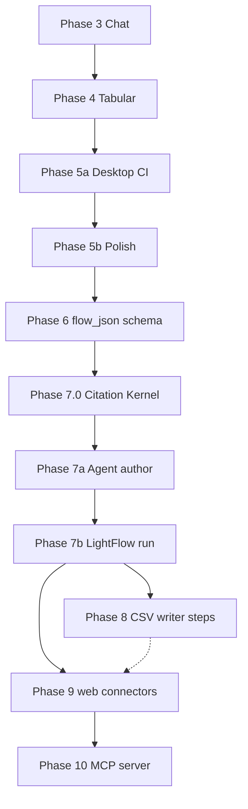

---

### Phase 0: Repository scaffolding (Week 1) — complete

**Goal:** Runnable monorepo skeleton with health checks.


| Task                      | Deliverable                         |
| ------------------------- | ----------------------------------- |
| Init monorepo             | `/frontend`, `/backend`, `/scripts` |
| FastAPI hello + CORS      | `GET /health`                       |
| Next.js hello             | Landing page                        |
| `start.sh`                | Single command boots both           |
| `.picard-data/` gitignore | Local data excluded                 |


**Acceptance:** `./scripts/start.sh` → frontend :3000, backend :8000, `/health` returns 200.

---

### Phase 1: Local foundation & core ingestion (Weeks 2–4) — complete

**Goal:** Upload PDF → parse → searchable chunks in SQLite.

#### 1.1 Database layer

- SQLAlchemy models for all tables in §6
- FTS5 virtual table + sync triggers
- Migration script (`alembic` or raw SQL init)
- WAL mode + foreign keys enabled

**Why first:** Every feature depends on chunks + FTS5. No shortcuts.

#### 1.2 Storage module

- Configurable `PICARD_DATA_DIR`
- PDF save/serve with path traversal protection
- Content-hash dedup

**From LegalDocX:** SHA-256 dedup prevents re-parsing identical uploads.

#### 1.3 liteparse integration

- Background job for parse
- Chunk insert with `heading_path` + `section_key` from document structure
- FTS5 sync
- Error handling + `parse_status` updates
- Progress polling endpoint

#### 1.4 Entity index (CARP foundation — EX-0/EX-1)

- Background job `entity_extract` after parse completes
- Date regex + `dateparser` normalization → `entities` + `entity_mentions`
- Party heuristics (defined terms, proper nouns in header chunks)
- Condition extraction from headings (`Condition [A-Z0-9]+`) + `section_key` propagation
- Materialize `page_entities` on upsert
- Shared regex/normalizers with `constraint_planner.py` (EX-1 recognizer parity)

**Why in Phase 1:** CARP in Phase 2 depends on entity index at ingest. v1 extraction is deterministic (no LLM required for baseline CARP).

**Acceptance criteria:**

- Upload 20-page NDA → `parse_status=done` within 60s
- `chunks` table has bbox + page + `heading_path` for every element
- `SELECT * FROM chunks_fts WHERE chunks_fts MATCH 'confidentiality'` returns results
- Duplicate upload returns existing document (hash dedup)
- Entity extract populates `page_entities` — dates and party names queryable per page

#### 1.5 Basic UI

- Workspace list/create
- Document upload dropzone
- Document list with parse status badge
- Monotone Shadcn shell (sidebar, header)

---

### Phase 2: Relevance engine + CARP (Weeks 5–8) — complete

**Goal:** Simple FTS5 for keyword queries **and** CARP for multi-constraint context queries. No chat yet.

#### 2.1 Search API (simple path)

- `POST /search` with `query`, `workspace_id`, optional `document_ids`
- BM25 ranking with `top_k`, `min_score`
- Return chunks with document metadata + bbox

#### 2.2 Query expansion

- Optional LLM expansion step (feature flag `ENABLE_QUERY_EXPANSION`)
- Fallback to raw query if LLM unavailable

#### 2.3 Metadata filtering (EX-2)

- Filter by `metadata_tags` (doc_type, party)
- `metadata_extractor.py` — filename rules + optional SLM per document
- Workspace scoping enforced server-side

#### 2.4 ConstraintQueryPlanner + CARP (§9.5)

- `constraint_planner.py` — classify SIMPLE vs MULTI_CONSTRAINT; extract party/date/condition
- `carp.py` — page set intersection, proximity escalation, context bundle assembly
- `entity_index.py` — query helpers over `page_entities`
- Bundle scoring: constraints matched + proximity tier + BM25 within page
- Refuse + partial disclosure responses with `retrieval_diagnostics`
- Section-aware condition matching via `section_key`

#### 2.5 Search UI (dev tool)

- Simple search page for engineers to tune queries
- Display BM25 score + matched snippet
- **CARP debug panel:** show constraint extraction, intersection page counts, bundles, proximity tier used

#### 2.6 Evaluation harness (Phase 2 deliverable)

- `backend/eval/metrics.py` — deterministic metric functions (R/C/F/P/S IDs in §15.2)
- `backend/eval/gold_labels.jsonl` — golden queries anchored to baseline corpus chunk IDs
- `backend/eval/runner.py` + `backend/scripts/eval_scorecard.py` — scorecard JSON for CI
- `backend/eval/baselines.py` — OR-BM25, chunk-AND, NEAR, full-corpus BM25 comparison
- `backend/scripts/export_test_corpus.py` — snapshot `.picard-data/picard.db` → `backend/test/fixtures/corpus/picard-corpus.db`
- `docs/phase2-eval.md` — manual Tier C checklist

**Acceptance criteria (mapped to §15.2 Tier A metrics):**

- **R-01/R-03:** `"liability"` / `"negligence"` retrieve gold Chester chunks; DRM = 100% on single-doc workspace
- **R-05:** Query expansion improves Recall@10 on ≥3/5 paraphrased queries in `gold_labels.jsonl`
- **S-01:** Scoped to workspace — no cross-workspace leakage
- **P-01:** p95 simple search latency < 100ms on **627-chunk Chester corpus**
- **C-02/C-03/C-04:** Multi-constraint query using co-occurring entities on Chester page 3 → bundles from intersecting pages only
- **C-09:** CARP beats naive OR-BM25 by ≥30pp on conjunctive gold set
- **P-02:** 100K page synthetic corpus — CARP intersection p95 < 500ms (`@pytest.mark.slow`)
- **F-01/F-04:** Non-intersecting constraints → refused with accurate `retrieval_diagnostics`
- **Scorecard:** `eval_scorecard.py` emits `tier_a_pass: true` on CI corpus run

**Why before chat:** Validate retrieval quality in isolation. Bad CARP tuning makes multi-entity citation chat legally unsafe.

---

### Phase 3: Citation-grade chat + listing (Weeks 9–12) — complete

**Goal:** Streaming Q&A with refuse gate, citation map, PDF highlight, session history, entity matter listing, and listing map-reduce for large portfolios.

**Shipped:** `chat.py` retrieval branches, `citations.py`, `entity_listing_retrieval.py`, `listing_map_reduce.py`, `PromptEditorDrawer`, chat history sidebar. **EX-3 NER** continues as quality improvement (§8.3.4), not a ship gate.

#### 3.0 Entity NER layer (EX-3 — ongoing quality)

**Architecture:** §8.3.3–8.3.4. Refactor ingest into `entity_extraction/` while keeping `entity_index.py` query helpers for CARP.

| Task | Deliverable |
|------|-------------|
| Recognizer modules | Move date/amount/condition/identifier/legal_actor from monolith; rules remain authoritative |
| Extraction profiles | `profiles.py` — route by `metadata_tags.doc_type` |
| GLiNER ONNX engine | `gliner_engine.py` — `urchade/gliner_small-v2.1`, batched, lazy-loaded from `${PICARD_DATA_DIR}/models/` |
| Contract profile | ContractNER for `contract`/`nda`/`msa`/`lease` doc types |
| Span merge | Rule-wins-on-overlap; NER fills gaps; store `confidence` + `source` |
| Config + fallback | `ENABLE_NER_ENTITY_EXTRACT`, `NER_THRESHOLD_*`; NER down → rules-only |
| Eval | `gold_entity_spans.jsonl` + E-01–E-04 in scorecard |

**Acceptance criteria (§15.2 EX-3 / E-* metrics):**

- **E-01:** Span F1 on party/identifier ≥ v1 regex baseline + 15pp on annotated Chester + `multi-entity.pdf` chunks
- **E-02:** Canonical collision rate does not increase vs EX-1 baseline
- **E-03:** C-02/C-05 CARP gold — no regression after backfill
- **E-04:** False identifier rate (prose → ID) ↓ vs EX-1 (`"agreement that"` class of errors)
- **E-06:** Ingest entity-job p95 within budget on Chester (627 chunks)
- **I-04:** `page_entities` still populated on all fixture PDFs

**Optional stretch (still EX-3):** eyecite for US citations; Blackstone behind `ENABLE_BLACKSTONE=false` for UK litigation.

#### 3.1 Citation pipeline (backend)

- `services/citations.py`:
  - `build_citation_map(chunks, bundles?) → map`
  - `refuse_gate(chunks, carp_diagnostics?) → bool`
  - `validate_response(answer, map, bundles?) → validated` — includes cross-bundle conflation check
- Wire chat to `ConstraintQueryPlanner` — auto-route to CARP when applicable
- Integrate with litellm streaming

#### 3.2 Chat API

- Session CRUD
- `POST /chat/stream` SSE
- Persist messages + references_json

#### 3.3 PDF viewer

- `MultiHighlightPDFViewer`:
  - pdf.js render
  - Normalized bbox → pixel overlay (monotone border)
  - Multi-highlight support (multiple `[N]` visible)
  - Page navigation API

**From LegalDocX:** bbox overlay rendering in `MultiHighlightPDFViewer.tsx`.

#### 3.4 Chat UI

- 50/50 split layout (thread + optional PDF panel)
- `MarkdownWithCitations` → `[N]` pills → `MultiHighlightPDFViewer`
- `RetrievalActivityPanel` for retrieval status during streaming
- Document attachment picker (workspace docs); scope persisted per session (`document_ids_json`)
- **Chat history sidebar** — lists workspace sessions (`GET /workspaces/{id}/chat/sessions`), resume via `/chat?session={id}`; latest thread opens by default
- REST: `GET/PATCH/DELETE /chat/sessions/{id}`, `GET /chat/sessions/{id}/messages`

#### 3.5 Refuse UX

- Distinct UI for refused responses (no pills, suggestions list)
- Never show empty citation panel

**Acceptance criteria (§15.2 Phase 3 metrics — CT/FG/AB):**

- **CT-01:** 100% of `[N]` in test answers resolve to valid chunk + bbox
- **CT-02:** Pinpoint citation accuracy ≥ 90% on sampled claims (manual Tier C)
- **FG-01:** Faithfulness ≥ 0.90 on claim-level eval (RAGAS or RefChecker-style; regression only)
- **FG-02:** Cross-bundle conflation rate (CBCR) = **0%** after Layer 3 validator
- **AB-01:** Zero-evidence question → refused, no LLM tokens in logs (**F-01** at retrieval layer)
- **AB-02:** Missed refusal rate ≤ 2% on unanswerable golden set
- Click `[1]` → PDF scrolls to page, bbox visible
- Streaming works with Ollama local model
- Chat persists across page refresh
- Multi-constraint query on Chester CARP gold routes to CARP and cites bundle chunks only
- `PreResponseWrapper` shows bundle count + intersection diagnostics

---

### Phase 4: Structured tabular extraction (Weeks 13–16)

**Goal:** Mike-grade tabular review with column presets, flags, export.

#### 4.1 Tabular backend

- Review CRUD
- Column preset library (port Mike presets, OSS-licensed rewrite)
- Cell generation with FTS5 + LLM JSON extraction
- SSE batch stream
- Single-cell regenerate

#### 4.2 Tabular frontend

- `TRTable` — sticky doc column, flags, selection
- `TabularCell` — preview + expand
- `TRSidePanel` — DocPanel + reasoning
- `AddColumnModal` — presets + format picker
- `AddNewTRModal` — pick docs from workspace
- Drag-and-drop upload onto table

**From Mike:** Table layout, cell lifecycle, citation pills, side panel pattern.

#### 4.3 Export

- Excel export (strip internal citation markers)

#### 4.4 Tabular chat (stretch)

- `TRChatPanel` with cell-linking citations
- URL `?chat=` deep link

**Acceptance criteria (§15.2 Phase 4 metrics — TB):**

- **TB-01:** Cell accuracy ≥ 85% on 3-doc pilot with bbox citation alignment
- Create review: 5 columns × 10 docs → all cells reach `done`
- Each cell citation opens correct PDF bbox
- Flag colors render correctly
- Excel export opens in LibreOffice/Excel with readable columns
- Regenerate single cell without re-running full batch
- **TB-04:** `TRChatPanel` + main chat resolve citations consistently

---

### Phase 5a: Desktop, CI, and release (Weeks 17–18) — complete

**Goal:** Shippable native installers, automated release pipeline, runtime settings.

| Task | Deliverable |
| ---- | ----------- |
| Tauri desktop | `desktop/src-tauri/`, sidecar PyInstaller backend, port cleanup |
| Settings + secrets | `settings_store.py`, settings page, onboarding wizard |
| Prompt overrides | `prompt_registry.py`, `/prompts`, `PromptEditorDrawer` |
| Updates | `/updates/check`, `releases/manifest.json`, Tauri updater pubkey |
| CI | `.github/workflows/ci.yml` — backend import, frontend build, compose smoke |
| Release | `.github/workflows/release.yml` — GHCR images, Tauri bundles, gh-pages manifest |
| Docs | [`RELEASE.md`](RELEASE.md), [`MACOS_INSTALL.md`](MACOS_INSTALL.md) |
| Dependency split | `requirements-core.txt` vs full ML stack for smaller desktop bundle |

---

### Phase 5b: OSS polish remainder — in progress

| Task | Detail |
| ---- | ------ |
| `start.sh` + README | Quickstart; desktop path documented |
| CONTRIBUTING.md | Dev setup, phase map |
| Sample corpus | Redacted demo NDAs |
| Full corpus pytest in CI | **Gap** — local/nightly only today (§15.3.1) |

**Optional:** WebSocket parse progress; EX-4 party linker; citation judge flag.

**Acceptance:** Fresh clone → running app &lt; 15 min; Docker Compose works; no secrets in repo.

---

### Phase 6: Workflow library + LightFlow schema (Weeks 19–22) — complete

**Goal:** Store validated `flow_json`; builtins as LightFlow graphs; library UI + DAG preview — **no** `LightFlow.run` yet (§11.5–11.6).

| Task | Deliverable |
| ---- | ----------- |
| Schema | `workflows.flow_json`, `flow_version`, `input_schema_json`; role registry (§6.3) |
| Built-ins | `backend/app/workflows/builtins.py` — ~15–20 graphs as `flow_json` |
| API | `GET/POST /workflows`, `POST /workflows/{id}/validate`, hide/export |
| UI | `WorkflowLibrary`, read-only `FlowDAGPanel` |
| Tabular seed | `AddNewTRModal` + `columns_config` from tabular workflows |
| Profiles | Firm + court built-in sets; `evidence_profile` + role denylist |

**Acceptance (§15.2 WF-*, WF-05):** WF-01–WF-04; agent-authored flow validates before save.

---

### Phase 7.0: Citation Kernel extraction (Weeks 22–23) — planned

**Goal:** Extract the shipped chat citation pipeline into `citation_kernel.py` so Chat, Agent tools, and LightFlow steps share one implementation (§7.6). No new user-facing features — refactor only.

| Task | Deliverable |
| ---- | ----------- |
| `citation_kernel.py` | `run_corpus_evidence_step`, `EvidenceStepResult` |
| `merge_evidence_maps` | Port merge/renumber from `listing_map_reduce.py` |
| `enforce_cite_from_maps` | Writer/coordinator guard for LightFlow |
| `chat.py` refactor | Thin wrapper calling kernel — behavior unchanged |
| Tests | `test_citation_kernel.py` — CK-01–CK-04 |

**Acceptance:** CK-01–CK-04; CT-01 on kernel path; all existing chat/tabular tests pass.

---

### Phase 7a: Agent authoring (LightAgent + mem0, Weeks 24–26) — planned

**Goal:** Conversational workflow design + ad-hoc cited Q&A — `propose_flow` → DAG; full tool registry (§4.2.10); mem0 recalls patterns; **no** LightFlow execution (§10.5, §10.8).

| Task | Deliverable |
| ---- | ----------- |
| `lightagent_runtime.py` | `mode=agent` on `/chat/stream`; StreamEvent → SSE |
| `agent_memory.py` | mem0 under `${PICARD_DATA_DIR}/mem0/` |
| `tools/registry.py` + adapters | Full registry (§4.2.10); all corpus tools use kernel |
| Tools | `answer_from_corpus`, `search_corpus`, vault/upload/scope, workflow author tools |
| HITL | HITL-SCOPE, HITL-URL, HITL-PLAN SSE + UI (§4.3, §12.6) |
| UI | `ModeToggle`, `AgentPlanPanel`, `FlowDAGPanel`, `ScopeConfirmBar`, `ToolTimeline` |
| Schema | `agent_runs` (§6.3) |

**Acceptance:** AG-01–AG-05, UC-02, UC-04, WF-05, US-05, US-10.

---

### Phase 7b: LightFlow execution (Weeks 27–29) — planned

**Goal:** Deterministic runs after approval — `picard_flow_runner.py`, trace SSE, per-step kernel, `workflow_runs` (§10.7, §5.2.2).

| Task | Deliverable |
| ---- | ----------- |
| `picard_flow_runner.py` | Wrap `LightFlow.run(trace=True)`; step kernel wrapper |
| `flow_agent_factory.py` | Role → LightAgent + Picard tools (§4.2.6) |
| API | `POST /workflows/{id}/run` + SSE trace |
| UI | `FlowRunDialog`, `FlowRunTimeline`, `WorkflowApprovalBar` (HITL-RUN) |
| Tools | Tabular read, `run_workflow` (optional in agent) |
| Builtins | UC-2 contracts Q&A flow stub |
| Compliance | `/compliance/ai-register`, export-run |

**Explicitly NOT in 7b:** connector ingest (9), DOCX generation, mid-flow approval nodes.

**Acceptance:** LF-01–LF-05, UC-02, WF-03, US-04, US-08, US-09, CP-01/CP-02.

---

### Phase 8: Template drafting + CSV step packs (Weeks 29–34) — planned

**Goal:** `writer` role + Jinja; `csv_bind` deterministic step; multi-draft flows in `flow_json` (§8.6).

| Task | Deliverable |
| ---- | ----------- |
| CSV ingest | stdlib `csv` → `workspace_data_*` |
| Templates | Jinja2 sandbox in `~/.picard-data/templates/` |
| LightFlow steps | `writer` role tool `draft_from_template`; `csv_bind` step |
| Entity join | `csv_entity_join.py` |
| Builtin flows | DD memo + UC-3: `csv_bind` → `research` → `writer`; UC-1 web playbook (Phase 9) |
| Output | `draft_documents` + section `sources_json` |
| UI | Draft viewer with provenance |

**Picard vs Mike:** Mike's `generate_docx` is free-form generation. Picard drafts are **template-bound, section-provenanced, gap-marked**.

**Acceptance criteria (§15.2 DR-* / CSV-*):**

- **CSV-01:** 1000-row CSV ingests locally; cell citation resolves to row
- **DR-01:** Template draft fills ≥90% of evidence-backed placeholders; unfilled slots listed
- **DR-02:** Cross-source workflow (CSV party → CARP → draft section) cites both tiers correctly

---

### Phase 9: Connectors + web LightFlow steps (Weeks 35–40) — planned

**Goal:** `web` role step in LightFlow; connector config in step `config`; Tier C (`[ext:N]`), off by default.

| Task | Deliverable |
| ---- | ----------- |
| `connector_configs` | Settings UI; per-workspace enable (§6.3) |
| `web` role | `web_fetch` / MCP proxy in `flow_agent_factory` |
| MCP client | Proxy MCP tools into step agents with allowlist |
| Email (IMAP) | Ingest attachments → vault (no send without approval) |
| Cloud watch | Sync folder → parse pipeline |
| URL fetch (9b) | `web_fetch` + trafilatura when `ENABLE_WEB_RESEARCH=true` |
| Court profile | Connectors disabled by default; local vault only |

**Explicitly NOT in Phase 9:** DuckDuckGo/search APIs, Playwright, Crawl4AI, surveillance tooling.

**Acceptance (§15.2 WEB-*, CP-*):** WEB-01–03; zero outbound HTTP when connectors off (WEB-02).

---

### Phase 10: MCP server export (optional) — planned

Expose `search_corpus` / tabular read via stdio MCP for external clients (air-gapped firms integrating with their own UIs).

---

## 15. Testing & acceptance criteria

Generic RAG metrics (average faithfulness, single Recall@K) are **insufficient** for picard-oss. Legal retrieval fails in ways IR benchmarks miss: wrong-agreement boilerplate, OR-retrieval conflation on multi-entity queries, answering when intersection is empty, and citation correctness without citation faithfulness. Evaluation is organized in **three tiers**:

| Tier | When | Role |
|------|------|------|
| **A — CI gates** | Every PR | Deterministic metrics on committed corpus snapshot; blocks merge |
| **B — Regression** | Weekly | RAGAS context metrics, baseline comparisons, LegalBench-RAG-mini sweep |
| **C — Legal review** | Pre-release + monthly | Attorney review on fixed golden query set |

Report all metrics **by query mode**: `SIMPLE` | `MULTI_CONSTRAINT` | `UNANSWERABLE`.

---

### 15.1 Baseline corpus (Chester)

Phase 2+ evaluation runs against **pre-parsed chunks in the database**, not PDFs generated at test runtime.

**Primary baseline (dev + eval source of truth):**

| Field | Value |
|-------|-------|
| Database | `.picard-data/picard.db` |
| Workspace | `Local` (`eca7aebb-0b4d-433d-8e73-9144c04eb0d7`) |
| Document | `Chester v Municipality of Waverly .pdf` |
| Scale | 48 pages, **627 chunks**, entity index populated |
| Domain | UK negligence / mental shock case law (public judgment text) |

**Entity index snapshot (ingest output):**

| Entity type | Count | Notes |
|-------------|-------|-------|
| `party` | 17 | e.g. `janet chester` (page 2), `supreme court`, `stokes brothers` |
| `identifier` | 15 | Case references, e.g. `refused`, `high court` |
| `condition` | 4 | Heading-derived fragments (`condition of`, etc.) |
| `date` | 0 | No dates extracted by EX-0 regex on this corpus — EX-3 NER + rule tuning target |

**Known co-occurrence (CARP):** Page **3** has both `party` and `identifier` entities (`stokes brothers`, `supreme court`, `high court`, `refused`, etc.) — use for intersection tests. Page **2** has `janet chester` (party only).

**Corpus resolution for tests** (first match wins):

1. `PICARD_TEST_DATABASE_URL` env (CI override)
2. `backend/test/fixtures/corpus/picard-corpus.db` — committed snapshot (`export_test_corpus.py`)
3. `.picard-data/picard.db` — local dev fallback

**Two-tier pytest layout:**

| Tier | Fixture | Used for |
|------|---------|----------|
| **Unit** | `db_engine` / `db_session` (tmp_path, empty DB) | FTS5 sync, storage, dedup, hand-inserted CARP rows, mocked litellm |
| **Corpus** | `corpus_db` / `corpus_client` (read-only) | Search API, FTS, CARP, eval gates on Chester chunks |

**Supplementary fixtures** (unit tests only; optional corpus enrichment before export):

- `backend/test/fixtures/sample-nda-20p.pdf`, `multi-entity.pdf` — synthetic ReportLab PDFs for ingest/entity unit tests
- `backend/test/fixtures/multi-entity.pdf` — ABC + date + Condition C patterns; ingest once before export if tighter CARP coverage needed
- **Scale fixture:** `generate_scale_fixture.py` — 100K-page synthetic corpus for P-02 perf only (not mixed with Chester gates)

**Initial SIMPLE gold queries (Chester):**

| query_id | Query | Expected hit pages (approx.) | Focus |
|----------|-------|------------------------------|-------|
| `chester_001` | `"liability"` | 9, 21, 22, 34, 43 | Duty of care / liability discussion |
| `chester_002` | `"negligence"` | 21, 22 | Negligence standard |
| `chester_003` | `"Hambrook v Stokes Brothers"` | 3, 4, 8 | Case citation passages |
| `chester_004` | `"mental or nervous shock"` | (pages with shock discussion) | Remote damage / shock |
| `chester_005` | `"trespasser"` | (argument passages) | Trespasser liability argument |

**Initial CARP gold queries (Chester):**

| query_id | Constraints | Gold | Expected |
|----------|-------------|------|----------|
| `chester_carp_001` | party + identifier co-occurring | Page 3 | Bundles from page 3 only (`SAME_PAGE`) |
| `chester_carp_002` | Entities that exist but never share a page | ∅ intersection | `refused: true` + per-entity page counts |
| `chester_carp_003` | party `janet chester` + identifier on different pages | Partial overlap | Refuse in strict mode; partial disclosure rubric in manual eval |

**Primary benchmark line (page 3):** *"The plaintiff claimed damages in the sum of £1,000."*

| Field | Value |
|-------|-------|
| Chunk ID | `d4ae199c-81ce-4dd8-82ab-3932898a5576` (refresh via `export_test_corpus.py`) |
| Extracted entities | `amount:1000_gbp`, `party:the plaintiff` on page 3 |
| Gold query IDs | `chester_bench_001` (exact), `chester_bench_002` (complex NL), `chester_bench_003` (paraphrase), `chester_bench_carp` (multi-constraint) |

Used across R-01/R-03/R-05 (SIMPLE), C-02/C-05 (CARP), and L-01 manual review. Re-run `python backend/scripts/backfill_entities.py` after entity rule changes, then `export_test_corpus.py`.

Gold chunk IDs are stored in `backend/eval/gold_labels.jsonl` after human annotation on exported corpus.

---

### 15.2 Evaluation matrix by phase

Metric IDs are stable across phases. Thresholds calibrate on first baseline run; CI tracks **regression deltas** plus minimum floors.

#### Phase 1 — Ingestion (complete)

| ID | Metric | Gate |
|----|--------|------|
| I-01 | Parse success rate | 100% on text-native PDF uploads |
| I-02 | Chunk bbox coverage | 100% of chunks have `bbox_json` |
| I-03 | FTS5 sync | Insert → searchable within same transaction |
| I-04 | Entity extract | `page_entities` populated for dates/parties/conditions on fixture PDFs |
| I-05 | Upload dedup | Same hash → same document id |

#### Phase 2 — Retrieval + CARP (Tier A CI gates)

**R — Snippet retrieval (SIMPLE path)**

| ID | Metric | Definition | Initial gate |
|----|--------|------------|--------------|
| R-01 | Chunk Recall@10 | `# relevant in top-10 / # gold chunks` | ≥ 0.90 on 5 Chester gold queries |
| R-02 | Chunk Precision@10 | `# relevant in top-10 / 10` | ≥ 0.70 |
| R-03 | Document match rate (DRM) | Top hit `document_id` = gold document | 100% on Chester workspace |
| R-04 | Wrong-doc trap rate | Decoy pages in top-10 when gold is unique | 0% |
| R-05 | Expansion lift | `Recall@10_expanded − Recall@10_raw` | ≥ +0.10 on ≥3/5 paraphrases |
| R-06 | Bbox present rate | Hits with valid `bbox_json` | 100% |
| R-07 | nDCG@10 / MRR | Ranking quality | No regression > 0.05 vs baseline |

**C — CARP bundles (MULTI_CONSTRAINT path)**

| ID | Metric | Definition | Initial gate |
|----|--------|------------|--------------|
| C-01 | Constraint extraction F1 | Macro-F1 on typed constraints | ≥ 0.90 Chester; ≥ 0.95 rule fixtures |
| C-02 | Page intersection recall | `\|P_gold ∩ P_returned\| / \|P_gold\|` | 1.0 on co-occurrence fixtures |
| C-03 | Page intersection precision | `\|P_gold ∩ P_returned\| / \|P_returned\|` | ≥ 0.95 |
| C-04 | Decoy rejection rate | Decoy pages excluded from top-5 bundles | 100% on labeled decoys |
| C-05 | Bundle completeness | All gold constraints in `constraints_matched` | 100% for full-match cases |
| C-06 | Bundle vs chunk lift | Recall gain bundles vs chunks at same token budget | ≥ +15pp on split-chunk unit fixture |
| C-07 | Proximity tier accuracy | `proximity_tier_used` = gold tier | ≥ 0.95 on tier fixtures |
| C-08 | Diagnostics fidelity | `retrieval_diagnostics` counts match SQL | 100% |
| C-09 | Baseline beat margin | CARP P@8 − naive OR-BM25 P@8 | ≥ +30pp on conjunctive set |

**F — Refuse / abstention (retrieval layer)**

| ID | Metric | Initial gate |
|----|--------|--------------|
| F-01 | Zero-evidence refuse rate | 100% — empty FTS or intersection → `refused: true` |
| F-02 | Refuse recall | ≥ 0.99 on true-empty gold set |
| F-03 | Refuse precision | ≥ 0.95 |
| F-04 | Diagnostics completeness | Per-constraint page counts on all CARP refuses |
| F-05 | False refuse rate | ≤ 5% on answerable SIMPLE queries |

**P — Performance**

| ID | Metric | Initial gate |
|----|--------|--------------|
| P-01 | p95 simple search latency | < 100ms on 627-chunk Chester corpus |
| P-02 | p95 CARP pre-LLM latency | < 500ms on 100K synthetic (`@pytest.mark.slow`) |
| P-03 | Full-corpus FTS scan guard | 0% full scan on MULTI_CONSTRAINT path |
| P-04 | Candidate set size p99 | < 200 pages after intersection |

**S — Scope safety**

| ID | Metric | Initial gate |
|----|--------|--------------|
| S-01 | Cross-workspace leakage | 0 hits from foreign workspace |
| S-02 | `document_ids` scope enforcement | 0 hits outside requested doc set |

**Phase 2 Tier B (weekly):** RAGAS context precision/recall on gold pairs; OR-BM25 / chunk-AND / NEAR / full-corpus BM25 baseline table; optional [LegalBench-RAG-mini](https://github.com/zeroentropy-ai/legalbenchrag) char-level P/R + DRM sweep.

#### Entity extraction — EX-3 (Phase 3 active)

Leading indicators for ingest quality; gate before citation chat ships to users.

| ID | Metric | Definition | Initial gate |
|----|--------|------------|--------------|
| E-01 | Span F1 per type | P/R vs `gold_entity_spans.jsonl` | ≥ EX-1 baseline; party ≥ 0.80 |
| E-02 | Canonical collision rate | Distinct surfaces → wrong shared canonical | No increase vs EX-1 |
| E-03 | CARP downstream | C-02/C-05 on `gold_labels.jsonl` after backfill | No regression |
| E-04 | False identifier rate | Prose matched as `identifier` | ↓ vs EX-1 |
| E-05 | Confidence calibration | NER score vs human accept (EX-5 prep) | τ_high validated on holdout |
| E-06 | Entity ingest latency p95 | Wall time per page on Chester | Within Phase 3 budget |

Re-run after every extractor change: `backfill_entities.py` → `export_test_corpus.py` → `eval_scorecard.py`.

#### Phase 3 — Citation-grade chat

| ID | Metric | Initial gate |
|----|--------|--------------|
| CT-01 | Marker resolution rate | 100% — every `[N]` → valid chunk + bbox |
| CT-02 | Pinpoint citation accuracy | ≥ 90% claims supported by cited chunk (manual sample) |
| FG-01 | Faithfulness (claim-level) | ≥ 0.90 regression target (RAGAS/RefChecker; not legal sign-off) |
| FG-02 | Cross-bundle conflation rate (CBCR) | 0% after Layer 3 validator |
| FG-03 | Entity grounding / relation preservation | ≥ 0.95 on golden answers |
| AB-01 | Missed refusal rate | ≤ 2% on unanswerable set |
| AB-02 | Misleading answer rate (MAR) | ≤ 1% (manual adjudication) |

#### Phase 4 — Tabular review

| ID | Metric | Initial gate |
|----|--------|--------------|
| TB-01 | Cell accuracy + bbox citation | ≥ 85% on 3-doc × 5-column pilot |
| TB-02 | Regenerate single cell | No full-batch re-run required |
| TB-03 | Excel export fidelity | Opens cleanly; citation markers stripped |
| TB-04 | Tabular ↔ chat citation parity | `TRChatPanel` + main chat resolve refs consistently |

#### Phase 6 — Workflow library

| ID | Metric | Initial gate |
|----|--------|--------------|
| WF-01 | Intent routing accuracy | Workflow selection triggers correct CARP/FTS5/intent path on golden set |
| WF-02 | Tabular workflow seed | One-click review creation with preset columns |
| WF-03 | Workflow re-run friction | ≤3 UI actions to re-run saved workflow (align LF-05) |
| WF-04 | Profile filter | Incompatible built-ins hidden per `agent_profile` |
| WF-05 | Schema validation | Agent-authored `flow_json` passes validate before save |

#### Phase 7.0 — Citation Kernel

| ID | Metric | Initial gate |
|----|--------|--------------|
| CK-01 | Kernel refuse | `run_corpus_evidence_step` with empty hits → `refused=True`, no synthesis call |
| CK-02 | Map integrity | All `[N]` in kernel output resolve via `chunk_id_to_index` |
| CK-03 | Merge renumber | Two step maps → merged global indices; markers rewritten correctly |
| CK-04 | Writer guard | Content citing `[N]` not in upstream map → stripped by `enforce_cite_from_maps` |

#### Phase 7a — Agent authoring

| ID | Metric | Initial gate |
|----|--------|--------------|
| AG-01 | Multi-step citation integrity | 100% corpus claims use valid `[N]` after agent run (via kernel — CK-02) |
| AG-02 | Per-step refuse rate | 100% empty retrieval tools emit `step_refused`, no filler (CK-01) |
| AG-03 | Agent loop latency p95 | ≤ 30s on Chester with Ollama 8B, 5-iteration cap |
| AG-04 | mem0 recall | Plan acceptance improves on 2nd-session golden scenario |
| AG-05 | Mode isolation | Chat ↔ Agent switch does not corrupt RAG citations |

#### Composite use-case gates (Phases 7a–9)

| ID | Use case | Initial gate |
|----|----------|--------------|
| UC-01 | Web → corpus | After ingest+parse, 0% vault-fact answers use `[ext:N]`; WEB-01 pass |
| UC-02 | Contracts agent Q&A | Golden queries: `answer_from_corpus` ≡ `stream_chat` refs (±scope) |
| UC-03 | Guideline + CSV draft | DR-01 + DR-02; writer never cites `[N]` outside `cite_from_steps` maps |
| UC-04 | Tool completeness | Every shipped API in §13 maps to §4.2.10 tool or documented exclusion |

#### Phase 7b — LightFlow execution

| ID | Metric | Initial gate |
|----|--------|--------------|
| LF-01 | Determinism | Same `flow_json` + input → identical step order |
| LF-02 | Dependency order | `depends_on` respected; no step before deps complete |
| LF-03 | Refuse on empty | Corpus step + zero evidence → flow stops or step failed per `refuse_on_empty` |
| LF-04 | Trace completeness | `trace` has `flow_start`, `step_end` per step, `flow_end` |
| LF-05 | Re-run friction | Re-run saved workflow ≤3 UI actions (WF-03) |

#### Phase 7+ — Compliance (court profile)

| ID | Metric | Initial gate |
|----|--------|--------------|
| CP-01 | AI Register export | Lists tools, versions, last 100 `agent_runs` |
| CP-02 | Tool denylist | Court profile blocks prohibited tool names (unit test) |

#### Phase 8 — Templates + CSV

| ID | Metric | Initial gate |
|----|--------|--------------|
| CSV-01 | CSV row citation resolve | 100% `[csv:...]` refs resolve to ingested row |
| DR-01 | Template fill rate | ≥ 90% evidence-backed placeholders filled; gaps listed |
| DR-02 | Cross-tier citation | CSV + corpus claims use correct tier markers |

#### Phase 9 — URL fetch

| ID | Metric | Initial gate |
|----|--------|--------------|
| WEB-01 | External tier separation | 0% external claims use bbox `[N]` |
| WEB-02 | Air-gap HTTP | 0 outbound requests when flag off |
| WEB-03 | Snapshot cache hit | Repeat URL serves cache within TTL |

**Why CARP metrics differ from generic RAG:** Conjunctive queries need **bundle-level** precision/recall and decoy rejection — chunk Recall@K inflates when OR-retrieval returns unrelated co-mentions. See §9.5.2.

**External references:** [LegalBench-RAG](https://arxiv.org/abs/2408.10343) (char P/R + DRM), [GaRAGe/RefusalBench](https://arxiv.org/abs/2506.07671) (refusal), [CiteEval](https://aclanthology.org/2025.acl-long.1574/) (citation QA), [TREC Legal Track](https://trec-legal.umiacs.umd.edu/) (Boolean/proximity eval culture).

---

### 15.3 Eval harness & gold labels

```
backend/eval/
├── metrics.py          # R/C/F/P/S/E/CT/FG/AB/TB/WF/CK/AG/LF/UC/DR/CSV/WEB metric functions
├── runner.py           # gold_labels.jsonl → scorecard JSON
├── baselines.py        # OR-BM25, chunk-AND, NEAR, full-corpus BM25
├── gold_labels.jsonl   # One JSON object per line (committed)
└── gold_entity_spans.jsonl   # EX-3: annotated chunk spans for E-01 (committed when ready)

backend/scripts/
├── export_test_corpus.py   # .picard-data → test/fixtures/corpus/
├── eval_scorecard.py       # CLI: Tier A scorecard for CI
└── benchmark_search.py     # P-01 latency on Chester corpus

docs/phase2-eval.md         # Tier C manual checklist (L-01–L-06)
scripts/eval-search.sh        # pytest -m corpus + scorecard + benchmark
```

**Gold label schema** (each line in `gold_labels.jsonl`):

```json
{
  "query_id": "chester_001",
  "query": "liability",
  "mode": "SIMPLE",
  "workspace_id": "eca7aebb-0b4d-433d-8e73-9144c04eb0d7",
  "document_id": "b65e3196-7199-446e-a910-6476d23b7bc8",
  "gold_chunk_ids": ["..."],
  "gold_pages": [9, 21, 22],
  "decoy_chunk_ids": [],
  "must_refuse": false,
  "constraints": null,
  "gold_tier": null
}
```

CARP refuse example:

```json
{
  "query_id": "chester_carp_002",
  "mode": "MULTI_CONSTRAINT",
  "constraints": [{"type": "party", "canonical": "..."}, {"type": "identifier", "canonical": "..."}],
  "gold_pages": [],
  "must_refuse": true,
  "gold_diagnostics": {"intersection_pages": 0}
}
```

**CI split:**

```bash
pytest -m "not corpus and not slow"    # unit-only (fast)
pytest -m corpus                       # Chester snapshot + Tier A gates
pytest -m slow                         # P-02 scale only (nightly)
```

Corpus tests are **read-only**. LLM steps are mocked in CI for determinism.

### 15.3.1 CI gates (shipped)

[`.github/workflows/ci.yml`](../.github/workflows/ci.yml) on `main` / PRs:

| Job | Checks |
|-----|--------|
| `backend` | `pip install -r requirements-core.txt`; import `app.main` |
| `frontend` | `npm ci && npm run build` |
| `compose-smoke` | `docker compose up`; `/health`, `/version`, `/settings/onboarding-status` |

[`.github/workflows/release.yml`](../.github/workflows/release.yml) on version tags: Docker GHCR push, Tauri bundles, `releases/manifest.json` — see [`RELEASE.md`](RELEASE.md).

**Gap:** `pytest -m corpus` Tier A gates are **not** required on every PR — run locally via `scripts/eval-search.sh` or nightly. Target: add corpus job once Chester snapshot is stable in CI runners.

---

### 15.4 Automated tests

| Area | Test file | DB tier | Metrics |
|------|-----------|---------|---------|
| FTS5 sync | `test_fts5_sync.py` | unit | I-03 |
| Entity extract | `test_entity_index.py` | unit | I-04, E-01–E-04 (EX-3) |
| Upload dedup | `test_ingestion.py` | unit | I-05 |
| Storage | `test_storage.py` | unit | I-01 |
| Eval metric math | `test_eval_metrics.py` | unit | R/C/F/P formulas |
| Tier A gates | `test_eval_gates.py` | **corpus** | R-01, R-03, R-06, S-01 |
| FTS search | `test_fts_search.py` | **corpus** | R-01–R-04, R-06 |
| Query expansion | `test_query_expansion.py` | unit | R-05 (mocked litellm) |
| Constraint planner | `test_constraint_planner.py` | unit | C-01 |
| CARP intersection | `test_carp_intersection.py` | **corpus** | C-02, C-03, C-04 |
| CARP refuse | `test_carp_refuse.py` | **corpus** | F-01–F-04, C-08 |
| CARP baselines | `test_carp_baselines.py` | **corpus** | C-09 |
| CARP section tier | `test_carp_section_tier.py` | unit | C-07 |
| Search API | `test_search_api.py` | **corpus** | R + C integration |
| Workspace isolation | `test_search_workspace_isolation.py` | unit | S-01 |
| CARP scale | `test_carp_scale.py` | synthetic | P-02 |
| Citation map | `test_citations.py` | unit | CT-01 (Phase 3) |
| Cross-bundle validation | `test_citations.py` | unit | FG-02 (Phase 3) |
| Citation Kernel | `test_citation_kernel.py` | unit | CK-01–CK-04 (Phase 7.0) |
| Agent tool citations | `test_agent_tools_citations.py` | unit | AG-01, AG-02, UC-02 (Phase 7a) |
| LightFlow step citations | `test_lightflow_citations.py` | unit | LF-03, UC-03 (Phase 7b) |
| Chat stream | `test_chat_stream.py` | integration | CT-01, AB-01 (Phase 3) |
| Tabular cell | `test_tabular_cell.py` | integration | TB-01 (Phase 4) |

---

### 15.5 Manual legal review (Tier C)

Run before Phase 2 tag and monthly when golden set changes. Document results in `docs/phase2-eval.md`.

| ID | Review item | Pass criterion |
|----|-------------|----------------|
| L-01 | Pinpoint citation accuracy | ≥ 90% of sampled hits contain query-relevant language |
| L-02 | Bundle = same legal event | Mean ≥ 4.0/5 on CARP bundles (Chester CARP gold) |
| L-03 | Partial disclosure adequacy | Uncertainty explicit; no implied cross-bundle links |
| L-04 | "Similar clause elsewhere" trap | 0 wrong-agreement hits in 10 trap queries |
| L-05 | Bbox visual alignment | 5/5 sampled hits align with PDF text (Phase 3 prep) |
| L-06 | "Would you rely on this?" | Attorney sign-off on 20-query golden set |

**Chester-specific manual checks:**

- `"liability"` / `"negligence"` — hits discuss duty of care, not unrelated "liability" mentions in footnotes only
- `"Hambrook v Stokes Brothers"` — citations reference the case discussion, not passing mentions
- CARP page 3 — returned bundles are same-page party+identifier context, not random high-BM25 pages
- Refuse query — diagnostics page counts match attorney's mental model of where entities appear

---

## 16. Future extensions (post-v1)


| Extension                 | Source inspiration                    | Complexity | Notes |
| ------------------------- | ------------------------------------- | ---------- | ----- |
| DOCX viewing + highlights | Mike `DocxView.tsx`                   | Medium     | Markdown drafts ship Phase 8 first |
| Multi-user + auth         | LegalDocX Supabase JWT                | High       | |
| MCP server (export)       | LegalDocX MCP bridge pattern          | Medium     | Phase 10 — stdio server for external clients |
| MCP client (import)       | User-configured servers               | Medium     | Phase 9 — tools proxied into LightAgent |
| Vector hybrid search | sqlite-vec or LanceDB | Medium | |
| Entity alias / coreference ("ABC" = "ABC Ltd") | EX-4 party linker + optional alias table | Medium | |
| GraphRAG optional module | LegalDocX Neo4j path | Very high | |
| Tracked change editing    | Mike EditCards                        | High       | |
| On-prem deployment guide  | LegalDocX Tier A doc                  | Medium     | |
| Web search discovery      | duckduckgo-search, Argus-style routers | Medium   | Deferred — Phase 9b URL-only optional |
| Workflow email sharing    | Mike `ShareWorkflowModal`             | Medium     | Deferred — JSON export/import instead |

**Promoted to concrete phases (§14):** workflow library + `flow_json` (6), Agent authoring (7a), LightFlow execution (7b), templates+CSV step packs (8), connectors + `web` role (9), MCP server export (10).


---

## Appendix A: Pattern mapping cheat sheet


| Capability         | LegalDocX source                   | Mike source         | picard-oss implementation      |
| ------------------ | ---------------------------------- | ------------------- | ------------------------------ |
| Refuse gate        | `simple_agentic_query_engine.py`   | —                   | `citations.refuse_gate()`      |
| Citation map       | `deterministic_citation_engine.py` | —                   | `citations.build_map()`        |
| Bbox PDF highlight | `MultiHighlightPDFViewer.tsx`      | `highlightQuote.ts` | `MultiHighlightPDFViewer`      |
| Content hash dedup | Vault upload                       | —                   | `documents.content_hash`       |
| Tabular columns    | Template extraction                | `columnPresets.ts`  | `tabular/presets.py` + TS port |
| Cell flags         | —                                  | `TabularCell.tsx`   | `tabular_cells.flag`           |
| DocPanel tabs      | —                                  | `DocPanel.tsx`      | Shared component               |
| Query progress     | WebSocket                          | SSE tabular         | SSE chat + poll parse          |
| Async long jobs | Celery + Redis | SSE generation | BackgroundTasks + jobs table |
| Multi-constraint context | LegalDocX graph aggregation | — | CARP (§9.5) |
| Page/entity intersection | LegalDocX `_database_level_entity_filter` | — | `page_entities` + ConstraintQueryPlanner |
| Context bundles | LegalDocX `document_references[]` | Compliance heading_path groups | `ContextBundle` in `carp.py` |
| Tiered model routing | LegalDocX SLM/LLM role split | — | `model_router.py` (§4.1) |
| Hybrid entity extract | LegalDocX SLM-at-ingest (GraphRAG scale) | — | EX-1–EX-5 (§8.3); rules + GLiNER ONNX |
| Eval harness + gold labels | Harvey BigLaw Bench, LegalBench-RAG | — | `backend/eval/` (§15.3) |
| Assistant Agent authoring | — | Tool-loop UX patterns | `lightagent_runtime.py` + mem0 (§10.5) |
| Workflow execution | — | — | `picard_flow_runner.py` + LightFlow (§10.7) |
| Workflow library | — | `builtinWorkflows.ts` | `flow_json` builtins + evidence profiles (§11.5–11.6) |
| Workflow attach marker | — | `[Workflow: title (id)]` in ChatInput | Optional Chat marker Phase 6 |
| Template doc generation | — | `generate_docx` tool | **Rejected** → `writer` role + `draft_from_template` Phase 8 |
| CSV data sheets | — | Excel export only | `csv_bind` step + entity join Phase 8 |
| URL web context | — | Not implemented | `web` LightFlow step + `[ext:N]` Phase 9 |
| MCP client / server | — | — | Phase 9 client; Phase 10 server export |


---

## Appendix B: Environment variables

```bash
# Backend
PICARD_DATA_DIR=~/.picard-data
DATABASE_URL=sqlite:///${PICARD_DATA_DIR}/picard.db

# --- Model configuration (pick one pattern) ---

# Pattern A: Single model — OpenAI default (Ollama: set LLM_PROVIDER=ollama, LLM_MODEL=llama3.2)
LLM_PROVIDER=openai                       # openai | ollama | anthropic | openrouter
LLM_MODEL=gpt-4o-mini
OPENAI_API_KEY=                           # required for OpenAI; omit for Ollama-only
ENABLE_TIERED_MODELS=false

# Pattern B: Tiered — same provider (no OpenRouter needed)
# ENABLE_TIERED_MODELS=true
# LLM_MODEL=gpt-4o                          # synthesis (Phase 3)
# SLM_MODEL=gpt-4o-mini                     # planner, expansion, citation judge

# Pattern C: Tiered — OpenRouter (one key, many models)
# ENABLE_TIERED_MODELS=true
# OPENROUTER_API_KEY=sk-or-...
# SLM_MODEL=openrouter/meta-llama/llama-3.2-3b-instruct:free
# LLM_MODEL=openrouter/anthropic/claude-sonnet-4

OLLAMA_BASE_URL=http://localhost:11434    # only when LLM_PROVIDER=ollama
ANTHROPIC_API_KEY=                          # optional

# SLM step thresholds (only apply when ENABLE_TIERED_MODELS=true)
PLANNER_RULE_CONFIDENCE=0.9              # skip SLM planner above this
BUNDLE_RERANK_MIN_BUNDLES=15               # skip SLM re-rank below this
CITATION_JUDGE_MAX_CHUNKS=3              # skip judge if synthesis used ≤N citations

ENABLE_QUERY_EXPANSION=true
ENABLE_CARP=true
ENABLE_METADATA_LLM=false                 # optional per-doc metadata pass (EX-2)
CARP_MAX_PROXIMITY_TIER=SAME_SECTION
CARP_ALLOW_PARTIAL_DISCLOSURE=false
ENABLE_CITATION_JUDGE=false               # set true when SLM_MODEL configured (Phase 3 chat)

# Entity matter listing (multi-document party portfolio)
CHAT_LISTING_POOL_K=48
CHAT_LISTING_TOP_K=24
CHAT_LISTING_MIN_CHUNKS_PER_DOC=2
CHAT_LISTING_CHUNKS_PER_DOC=4
CHAT_LISTING_MAX_DOCS=12

# Entity extraction EX-3 (Phase 3 — hybrid NER)
ENABLE_NER_ENTITY_EXTRACT=false           # set true when GLiNER model cached
NER_ENGINE=gliner_small_onnx              # urchade/gliner_small-v2.1
NER_THRESHOLD_HIGH=0.85
NER_THRESHOLD_LOW=0.65
NER_BATCH_SIZE=8
CONTRACT_NER_MODEL=lucasorrentino/Contractner
ENABLE_BLACKSTONE=false                   # UK litigation optional
ENABLE_EYECITE=true                       # US citation spans → identifier
ENTITY_NER_MAX_PAGES=0                    # 0 = all pages; e.g. 10 for defer mode

# Assistant modes + LightFlow (Phase 7, post-v1)
CHAT_MODE_DEFAULT=rag                       # rag | agent
AGENT_PROFILE=firm                          # firm | court
ENABLE_AGENT_MODE=false
ENABLE_LIGHTFLOW=false                      # Phase 7b — workflow run endpoint
LIGHTAGENT_VERSION=0.8                      # minimum for LightFlow
AGENT_MAX_ITERATIONS=5
AGENT_SCOPE_CONFIRM_MIN_DOCS=10           # HITL-SCOPE threshold (§4.3)
MEM0_DATA_DIR=${PICARD_DATA_DIR}/mem0
ENABLE_CONNECTORS=false                     # Phase 9
COMPLIANCE_SANDBOX=false                    # disables all external tiers

# CSV + templates (Phase 8, post-v1)
ENABLE_CSV_INGEST=false

# URL fetch (Phase 9b — user-supplied URLs only, no search)
ENABLE_WEB_RESEARCH=false
WEB_FETCH_TIMEOUT_SECONDS=15
WEB_SNAPSHOT_MAX_BYTES=524288             # 512KB text cap per URL

# Optional structured extraction retry (Phase 4/8 tabular + draft JSON)
# ENABLE_INSTRUCTOR=false

# Eval / test corpus (Phase 2)
# PICARD_TEST_DATABASE_URL=sqlite:///...  # override for CI; default: test/fixtures/corpus/picard-corpus.db

# Frontend
NEXT_PUBLIC_API_URL=http://localhost:8000
```

---

*Last updated: Jun 2026 (Phases 0–4 and 5a complete; agentic Phases 6–10 planned with Citation Kernel baseline §7.6, full Tool Registry §4.2.10, HITL §4.3, composite playbooks §10.8). Reference sibling project docs when available for deeper dives into inherited patterns.*