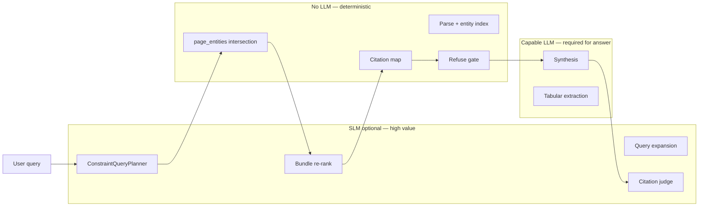
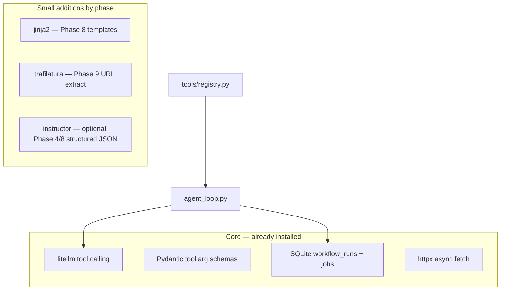
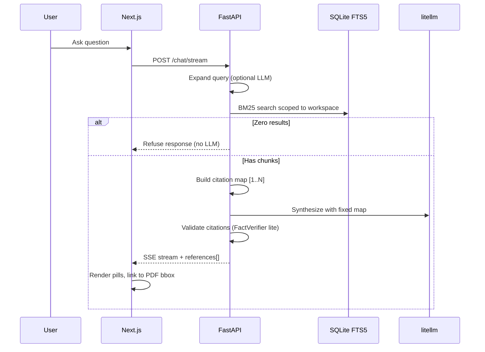
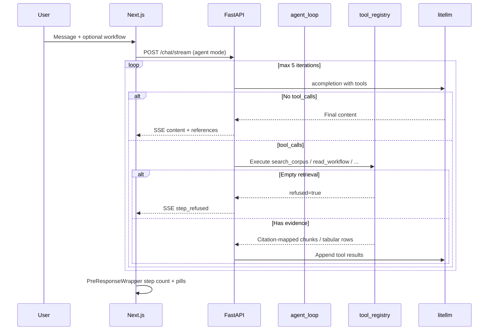
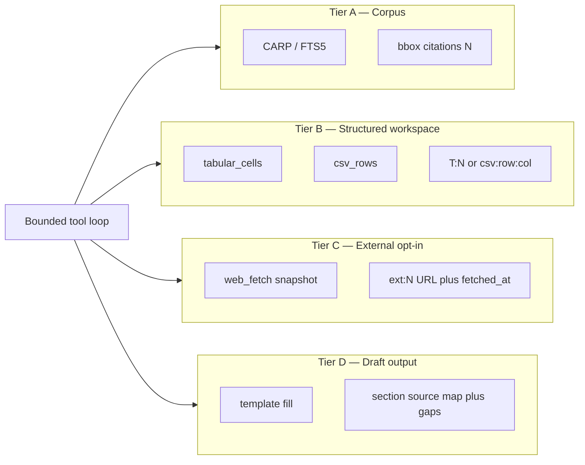
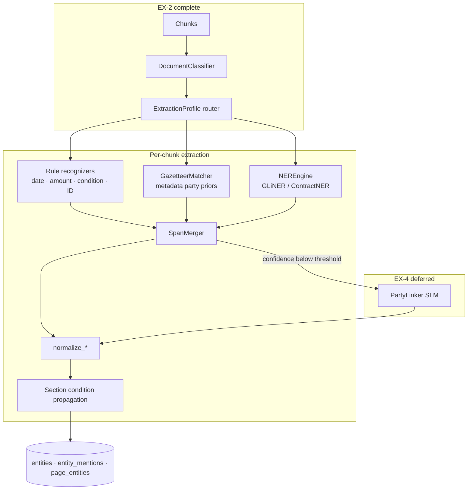
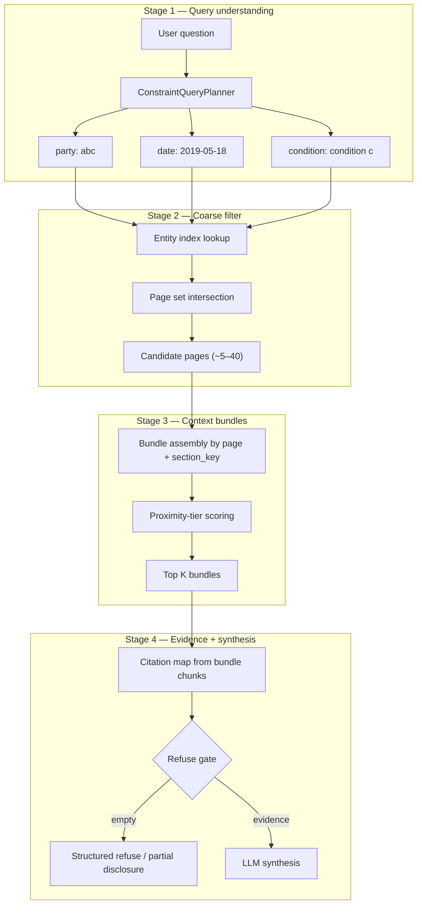
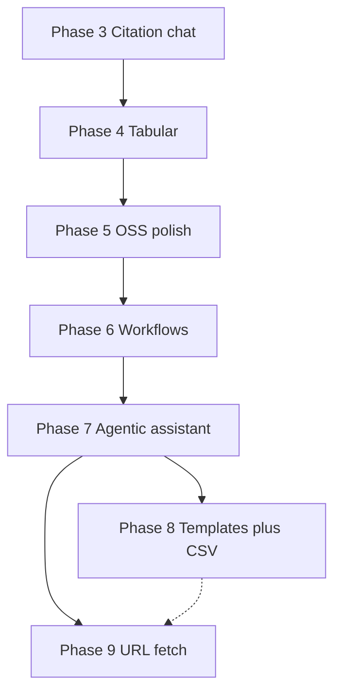

# Picard-OSS v1 Architecture & Implementation Plan

This document is the authoritative blueprint for **picard-oss**: an open-source, **local-first** legal document assistant. It synthesizes production patterns from two sibling projects:


| Source project             | Reference doc                                                                                                                   | What we inherit                                                                                              |
| -------------------------- | ------------------------------------------------------------------------------------------------------------------------------- | ------------------------------------------------------------------------------------------------------------ |
| **LegalDocX / Picard.law** | `[legaldocx/Platform/06-evidence-first-production-legal-ai.md](../legaldocx/Platform/06-evidence-first-production-legal-ai.md)` | Evidence contract, refuse-or-anchor, citation-before-synthesis, layered validation, bbox-grounded provenance |
| **Mike**                   | `[mike/docs/PRODUCT-STRENGTHS.md](../mike/docs/PRODUCT-STRENGTHS.md)`                                                           | Tabular review UX, citation-linked PDF viewer, column intelligence, DocPanel patterns, streaming chat UX     |


**What picard-oss deliberately is not:** a fork of LegalDocX's Neo4j GraphRAG stack, Supabase SaaS control plane, or Mike's cloud deployment model. picard-oss trades graph complexity and managed infra for **SQLite + FTS5 + local filesystem** — optimized for a single machine, zero cloud dependency, and fast time-to-first-query.

---

## Table of contents

1. [Strategic positioning](#1-strategic-positioning)
2. [Core philosophy & differentiators](#2-core-philosophy--differentiators)
3. [Design decisions & rationale](#3-design-decisions--rationale)
4. [Technology stack](#4-technology-stack)
   - [4.1 Tiered model routing (optional SLM orchestration)](#41-tiered-model-routing-optional-slm-orchestration)
   - [4.2 Tool integration stack (post-v1)](#42-tool-integration-stack-post-v1)
5. [System architecture](#5-system-architecture)
6. [Data model (SQLite)](#6-data-model-sqlite)
   - [6.3 Post-v1 tables (workflows, drafts, CSV, web snapshots)](#63-post-v1-tables-workflows-drafts-csv-web-snapshots)
7. [Evidence contract (adapted from Picard.law)](#7-evidence-contract-adapted-from-picardlaw)
   - [7.4 Multi-tier evidence (post-v1)](#74-multi-tier-evidence-post-v1)
   - [7.5 Per-step refuse in agent loop (post-v1)](#75-per-step-refuse-in-agent-loop-post-v1)
8. [Ingestion pipeline](#8-ingestion-pipeline)
   - [8.3 Entity extraction at ingest (CARP foundation)](#83-entity-extraction-at-ingest-carp-foundation)
   - [8.3.4 Entity extraction evolution (EX-1–EX-5)](#834-entity-extraction-evolution-ex-1ex-5)
   - [8.6 CSV & structured data ingest (Phase 8)](#86-csv--structured-data-ingest-phase-8)
9. [Relevance engine (FTS5)](#9-relevance-engine-fts5)
  - [9.5 Multi-constraint contextual retrieval (CARP)](#95-multi-constraint-contextual-retrieval-carp)
10. [Citation-grade chat](#10-citation-grade-chat)
   - [10.5 Evidence-tiered agent mode (Phase 7+)](#105-evidence-tiered-agent-mode-phase-7)
11. [Structured tabular review (adapted from Mike)](#11-structured-tabular-review-adapted-from-mike)
   - [11.5 Workflow library (Phase 6+)](#115-workflow-library-phase-6)
12. [Frontend architecture](#12-frontend-architecture)
13. [API surface](#13-api-surface)
14. [Development plan (phased)](#14-development-plan-phased)
15. [Testing & acceptance criteria](#15-testing--acceptance-criteria)
  - [15.1 Baseline corpus (Chester)](#151-baseline-corpus-chester)
  - [15.2 Evaluation matrix by phase](#152-evaluation-matrix-by-phase)
  - [15.3 Eval harness & gold labels](#153-eval-harness--gold-labels)
  - [15.4 Automated tests](#154-automated-tests)
  - [15.5 Manual legal review (Tier C)](#155-manual-legal-review-tier-c)
16. [Future extensions (post-v1)](#16-future-extensions-post-v1)

---

## 1. Strategic positioning

### Problem statement

Legal professionals need AI assistance that:

1. Runs **locally** (privilege, air-gap, no document egress)
2. Returns **verifiable** answers with page-level citations
3. Supports **bulk structured review** (tabular extraction across many contracts)
4. Starts quickly without Neo4j clusters, Celery workers, or cloud OCR bills
5. *(Post-v1)* Runs **evidence-aware playbooks** — dynamic workflows bound to CARP query intents, not generic chat
6. *(Post-v1)* Drafts documents from **templates + tabular/CSV data + corpus evidence** with section-level provenance
7. *(Post-v1)* Optionally fetches **user-supplied URLs** (cached snapshots) without breaking the local citation contract

### Position in the ecosystem

```
┌─────────────────────────────────────────────────────────────────────┐
│  Picard.law (LegalDocX)     Production SaaS · GraphRAG · Neo4j      │
│  ─────────────────────      Enterprise tiers · Landing AI · Credits │
└─────────────────────────────────────────────────────────────────────┘
                                    │
                    evidence contract + citation discipline
                                    ▼
┌─────────────────────────────────────────────────────────────────────┐
│  picard-oss (this repo)     Local-first OSS · FTS5 · SQLite         │
│  ─────────────────────      Single-machine · liteparse · Ollama     │
└─────────────────────────────────────────────────────────────────────┘
                                    │
                    tabular UX + DocPanel + column intelligence
                                    ▼
┌─────────────────────────────────────────────────────────────────────┐
│  Mike                       Cloud legal assistant · Supabase · R2     │
│  ─────                      Workflows · DOCX edits · collaboration  │
└─────────────────────────────────────────────────────────────────────┘
```

### v1 success criteria


| Criterion                      | Measure                                                                                     |
| ------------------------------ | ------------------------------------------------------------------------------------------- |
| Local-only operation           | No network calls required except optional LLM API                                           |
| First query latency            | < 5s retrieval + synthesis on 50-page NDA (local Ollama)                                    |
| Citation accuracy              | 100% of inline `[N]` markers resolve to valid chunk + bbox (CT-01, §15.2)                   |
| Refuse behavior                | Zero-evidence queries never invoke LLM (F-01 / AB-01, §15.2)                                |
| Tabular extraction             | User defines 5 columns × 10 documents; each cell links to source (TB-01)                   |
| Multi-constraint context query | Party + date + condition → co-occurring bundles, not keyword soup (C-02–C-04, §15.2)        |
| Single-command startup         | One script boots backend + frontend                                                         |


### Post-v1 success criteria (Phases 6–9)

| Criterion | Measure | Phase |
| --------- | ------- | ----- |
| Workflow intent routing | Selecting a playbook triggers correct CARP/FTS5 intent (WF-01) | 6 |
| Agent citation integrity | Multi-step agent answers: 100% corpus claims use valid `[N]` (AG-01) | 7 |
| Per-step refuse | Empty retrieval tool call → `step_refused`, no hallucinated filler (AG-02) | 7 |
| CSV provenance | Row/column citation resolves to ingested CSV cell (CSV-01) | 8 |
| Template draft gaps | Unfilled placeholders listed explicitly; ≥90% evidence-backed slots filled (DR-01) | 8 |
| External tier separation | Web claims use `[ext:N]` only; never bbox `[N]` (WEB-01) | 9 |
| Air-gap default | With `ENABLE_WEB_RESEARCH=false`, zero outbound HTTP during chat (WEB-02) | 9 |


---

## 2. Core philosophy & differentiators

### 2.1 Local first

All documents, parsed chunks, metadata, chat history, and tabular results live under a user-local data directory (default: `~/.picard-data/` or `.picard-data/` in project root).

**Why:** Legal documents are privileged. Firms evaluating OSS need a credible "documents never leave this machine" story without standing up Supabase, R2, or Neo4j Aura.

**What we skip from LegalDocX/Mike:** Supabase Auth/Storage, Cloudflare R2, Azure Container Apps, Redis pub/sub (v1 uses in-process or SQLite-backed job state).

**Post-v1 external access (Phase 9):** Optional URL fetch stores **cached text snapshots** under `~/.picard-data/snapshots/` — not live browsing, not search discovery, not document egress. Disabled by default (`ENABLE_WEB_RESEARCH=false`) for air-gap deployments.

### 2.2 Relevance over similarity (FTS5, not vectors)

Legal retrieval fails when vector search returns **semantically similar but legally irrelevant** text — e.g., a limitation-of-liability clause from the wrong agreement because the embedding space clusters "boilerplate legalese."

picard-oss uses **SQLite FTS5 (BM25)** plus **metadata filters** (document type, parties, dates) for retrieval.

**Why FTS5 for v1:**


| Factor                  | FTS5                                              | Vector embeddings                       |
| ----------------------- | ------------------------------------------------- | --------------------------------------- |
| Setup                   | Built into SQLite, zero extra services            | Requires embedding model + vector store |
| Legal keyword precision | Exact phrase matching ("limitation of liability") | Fuzzy semantic neighbors                |
| Explainability          | BM25 score + matched terms                        | Opaque cosine distance                  |
| Local perf              | Sub-millisecond on 10K chunks                     | GPU/model load for embed + search       |
| Index time              | Instant on insert                                 | Batch embed every chunk                 |


**Tradeoff we accept:** FTS5 misses conceptual paraphrases ("cap on damages" vs "limitation of liability"). Mitigation: **query expansion** via LLM (Phase 2) and optional metadata tags (Phase 1).

**Critical gap at scale:** A single BM25 query cannot answer **multi-constraint contextual questions** — e.g. "case context for party ABC, date 18/05/2019, with condition C" across 100,000 pages where each entity appears on hundreds of pages independently. Section [§9.5](#95-multi-constraint-contextual-retrieval-carp) defines **Constraint-Aware Retrieval (CARP)**: a lightweight entity + page-co-occurrence layer that preserves legal integrity without Neo4j.

**What we skip from LegalDocX:** Neo4j graph traversal, entity communities, multi-hop obligation chains. CARP replaces the *need* for graph traversal on conjunctive context queries — not the full GraphRAG feature set.

### 2.3 Zero-hallucination citation UX

Every extracted or generated fact maps to a **spatial bounding box** on the source PDF. The UI highlights the exact region when the user clicks a citation.

Inherited from Picard.law's evidence contract (see [LegalDocX citation discipline](../legaldocx/Platform/03-citation-discipline.md)):

- Citations assigned **before** LLM synthesis
- **Refuse gate** on empty retrieval
- Post-generation validation (slimmed for OSS — see §7)

**Why bbox, not page-only:** Lawyers verify specific language. Page-level citation forces manual scanning; bbox overlay is one-click verification.

### 2.4 Professional monotone aesthetics

Shadcn UI + Tailwind, restrained gray palette, serif accents for headings (inspired by Mike's EB Garamond usage). Optimized for **high-density legal workflows** — sticky columns, compact tables, minimal chrome.

---

## 3. Design decisions & rationale


| Decision          | Choice                                     | Rationale                                              | Rejected alternative                                      |
| ----------------- | ------------------------------------------ | ------------------------------------------------------ | --------------------------------------------------------- |
| Database          | SQLite + FTS5                              | Single file, portable, no server process               | Postgres/Supabase (cloud dep)                             |
| Backend language  | Python (FastAPI)                           | liteparse, litellm, legal NLP libs are Python-native   | Express-only (Mike's stack; weaker PDF parsing ecosystem) |
| PDF parser        | liteparse                                  | OSS layout-aware chunks + bbox; LlamaParse alternative | Landing AI (cloud egress, cost)                           |
| Job queue (v1)    | FastAPI BackgroundTasks + SQLite job table | No Redis/Celery for single-user local                  | Celery + Redis (LegalDocX complexity)                     |
| Auth (v1)         | None (single-user local)                   | Reduces scope; local machine = trust boundary          | Supabase JWT (Mike/LegalDocX)                             |
| LLM routing       | litellm + optional tiered roles            | One interface; SLM/LLM split when configured           | Hard-coded OpenAI SDK; mandatory OpenRouter              |
| Tabular UI        | Custom table + Shadcn (Mike-inspired)      | Full control, monotone styling                         | Ag-Grid (heavier, license considerations)                 |
| DOCX support      | PDF-only v1; markdown drafts Phase 8       | Simpler viewer pipeline                                | Mike's DOCX + tracked changes (post-v1)                  |
| Workflows library | Phase 6 — evidence-aware local playbooks   | Binds to CARP intents; ~20 built-ins, not 1200-line clone | Mike's builtinWorkflows.ts day one |
| Agent orchestration | Custom litellm loop + Pydantic schemas (Phase 7) | Zero framework RAM; refuse gate per tool call | LangGraph, Pydantic AI, smolagents |
| Structured extraction | Pydantic + litellm JSON; Instructor optional | Already Pydantic-native FastAPI stack | LangChain `.with_structured_output()` |
| CSV ingest        | stdlib `csv` → SQLite (Phase 8)            | No dataframe memory spike                              | pandas, polars |
| Templates         | Jinja2 sandbox (Phase 8)                   | Local file templates with provenance-bound fill        | Mike free-form `generate_docx` |
| Web research      | httpx + trafilatura; URL-only (Phase 9)    | User-controlled egress; cached snapshots               | duckduckgo-search, Playwright, Crawl4AI |
| Composite workflows | SQLite-backed Python step runner (Phase 8) | Reuses existing job patterns                           | Burr, Temporal, llm-nano-vm |
| Multi-constraint retrieval | CARP (entity index + page intersection) | Party+date+condition at 100K pages without Neo4j | Full GraphRAG (LegalDocX) |
| Entity extraction | Hybrid rules → doc-type routing → NER (EX-1–EX-5) | CARP needs auditable spans + canonicals; regex alone misses parties/IDs on real corpora | Pure regex (v1 baseline); per-chunk LLM at ingest scale |


---

## 4. Technology stack


| Layer           | Technology                              | Version target                 |
| --------------- | --------------------------------------- | ------------------------------ |
| Frontend        | Next.js (App Router), React, TypeScript | Next 15+, React 19             |
| UI              | Tailwind CSS, Shadcn UI, Lucide Icons   | Monotone theme                 |
| Backend         | Python, FastAPI, Uvicorn                | Python 3.11+                   |
| ORM             | SQLAlchemy 2.x                          | Async optional in v1           |
| Database        | SQLite + FTS5                           | WAL mode enabled               |
| PDF parsing     | liteparse                               | Layout chunks + bbox           |
| LLM             | litellm                                 | Ollama default, cloud optional |
| Entity NER (EX-3+) | GLiNER small ONNX (+ ContractNER for contracts) | Apache-2.0; CPU-first; optional |
| Citation parsing (EX-3+) | eyecite (US), Blackstone (UK litigation, optional) | BSD-2-Clause / Apache-2.0 |
| PDF viewer      | react-pdf (pdf.js)                      | Custom bbox overlay layer      |
| Export          | openpyxl or ExcelJS (frontend)          | Tabular Excel export           |
| Monorepo layout | `/frontend`, `/backend`, `/scripts`     | Single repo                    |


### 4.1 Tiered model routing (optional SLM orchestration)

LegalDocX runs **volume work on SLMs, synthesis on LLMs** (see [LegalDocX deployment tiers](../legaldocx/Platform/02-on-prem-deployment.md): entity extraction and citation validation on 3B, synthesis on 70B/cloud). picard-oss adopts the same **role split** — but keeps it **optional**. Default mode uses one model for everything; tiered mode activates only when a cheap model is configured.

**OpenRouter is not a separate logic layer.** litellm already routes to OpenRouter via model strings (`openrouter/meta-llama/llama-3.2-3b-instruct:free`). OpenRouter is useful when one API key unlocks many cheap SLMs + one capable LLM. It is **not required** — native OpenAI, Anthropic, or Ollama support the same tiered pattern natively.

---

#### 4.1.1 Where SLM helps vs where rules/SQL are enough



| Pipeline step | Rules/SQL sufficient? | SLM adds value? | Priority | Why |
|---------------|----------------------|-----------------|----------|-----|
| Parse + entity index (§8.3) | **Partial** — rules authoritative for date/amount/condition; NER augments party/ID (EX-3) | Low for bulk; **Medium** for party linker (EX-4) | **EX-3 active** | Rule-first + ONNX NER keeps ingest local and auditable; SLM per-chunk still too expensive |
| **ConstraintQueryPlanner** (§9.5) | Partial — regex catches obvious party/date/condition | **High** | **P1** | *"case context for the ABC side letter re 18 May warranties"* needs NL → structured constraints |
| Query expansion (§9.2, simple path) | Partial — raw keywords often work | **High** | **P1** | Cheap, frequent; bridges lexical gaps without vectors |
| CARP page intersection | **Yes** — SQL on `page_entities` | None | Skip | Set logic must stay deterministic and auditable |
| Bundle scoring (BM25 + proximity) | **Yes** for most queries | Medium | P2 | SLM re-rank helps when intersection returns 20–200 pages and BM25 tie-breaks poorly |
| Refuse gate + citation map | **Yes** | None | Skip | Legal integrity requires deterministic numbering |
| **Synthesis** (chat answer) | No | N/A — needs **capable LLM**, not SLM | Required | Quality-critical; do not downgrade |
| **Citation judge** (§7, post-synthesis) | Partial — FactVerifier lite is regex | **High** | **P2** | LegalDocX layer 5; cheap validation pass catches wrong `[N]` assignments |
| Tabular column prompt gen | Templates cover presets | Medium | P3 | SLM fine for expanding column labels to prompts |
| Tabular cell extraction | FTS5 + JSON schema often enough | Medium | P3 | Complex legal columns may need capable LLM; simple yes/no/date → SLM |
| Agent tool loop (post-v1) | Per-step refuse + citation map deterministic | Capable LLM for tool selection | P2 | Phase 7 — extends synthesis path; see §4.2 |
| Dynamic workflow generation | No | **High** | P3 | Phase 7 stretch — SLM drafts WorkflowStep[] from workspace inventory |

**Bottom line:** The highest-ROI SLM insertion points are **before retrieval** (ConstraintQueryPlanner, query expansion) and **after synthesis** (citation judge). The CARP core (intersection, refuse gate, citation map) should stay deterministic.

---

#### 4.1.2 Operating modes

| Mode | When | Behavior |
|------|------|----------|
| **Single model (default)** | User sets only `LLM_MODEL`; no `SLM_MODEL` | All optional LLM steps use the same model or fall back to rules. **No OpenRouter needed.** Simplest setup. |
| **Tiered (same provider)** | User has OpenAI only: `SLM_MODEL=gpt-4o-mini`, `LLM_MODEL=gpt-4o` | Pre/synthesis/post steps routed by role. **Skip OpenRouter** — one API key, two model IDs. |
| **Tiered (OpenRouter)** | User sets `OPENROUTER_API_KEY` + role models | One key routes SLM tasks to cheap models (Llama 3.2 3B, Gemini Flash) and synthesis to capable models (Claude, GPT-4o). Best cost/latency when user wants multi-vendor without multiple keys. |
| **Tiered (Ollama local)** | `SLM_MODEL=ollama/llama3.2:3b`, `LLM_MODEL=ollama/llama3.3:70b` | Air-gapped friendly; SLM runs locally for planner/expansion/judge; heavy model for synthesis. |

**Skip tiered routing entirely when:**

- User configures a single provider with one model (OpenAI-only with `gpt-4o`, Anthropic-only with `claude-sonnet-4`, etc.) **and** does not set `SLM_MODEL`
- `ENABLE_TIERED_MODELS=false` (default)
- No API key / Ollama unavailable → all SLM steps fall back to rules; synthesis refuses gracefully

This is **logical and recommended**: tiered routing is an optimization, not a correctness requirement. CARP, refuse gate, and citation maps work without any SLM.

---

#### 4.1.3 ModelRouter service (backend)

Single module — not a separate OpenRouter integration:

```python
# backend/app/services/model_router.py

class ModelRole(str, Enum):
    SLM = "slm"       # planner, expansion, judge, simple tabular
    LLM = "llm"       # synthesis, complex tabular

def resolve_model(role: ModelRole) -> str:
    if not settings.enable_tiered_models:
        return settings.llm_model                    # single-model mode
    if role == ModelRole.SLM and settings.slm_model:
        return settings.slm_model                    # e.g. gpt-4o-mini or openrouter/...
    return settings.llm_model

def should_use_slm(step: str) -> bool:
    """Skip SLM call if tiered disabled or step has rule-based fallback."""
    if not settings.enable_tiered_models:
        return False
    return step in {"constraint_planner", "query_expansion", "bundle_rerank", "citation_judge"}
```

All litellm calls go through `model_router.completion(role=..., ...)`. OpenRouter, OpenAI, Anthropic, and Ollama are selected via litellm env vars — same code path.

---

#### 4.1.4 Per-step routing (optimized flow)

```
User query
  │
  ├─ [SLM if tiered] ConstraintQueryPlanner
  │     Rule pass first → if confidence ≥ threshold, skip SLM
  │     SLM only for: ambiguous constraints, implicit dates, pronoun resolution
  │
  ├─ [SQL] CARP intersection / FTS5 search          ← never SLM
  │
  ├─ [SLM if tiered + >15 bundles] Bundle re-rank
  │     "Which bundles describe the same legal event?"
  │     Skip if ≤15 bundles (BM25 + proximity sufficient)
  │
  ├─ [SQL/rules] Refuse gate + citation map        ← never SLM
  │
  ├─ [LLM] Synthesis                                ← always capable model
  │
  └─ [SLM if tiered] Citation judge                 ← post-synthesis validation
        Skip if synthesis cited ≤3 chunks (overhead not worth it)
```

**SLM-primary, token+catalog fallback** is the ConstraintQueryPlanner pattern (cloud hybrid v1):

1. One SLM JSON call per query (`query_understanding.py`) — intent, `target_entity`, constraints, `search_passes`
2. If SLM unavailable → tokenize query + `resolve_party_canonicals` against workspace catalog (no regex intent classifiers)
3. Legacy regex NLP (`ENABLE_REGEX_NLP=true`) is an emergency kill-switch only — off by default
4. CARP / FTS / refuse gate remain deterministic SQL

---

#### 4.1.5 Cost/latency impact (100K-page query example)

| Step | Single gpt-4o | Tiered (mini + 4o) | Tiered + rule-first planner |
|------|----------------|---------------------|-----------------------------|
| ConstraintQueryPlanner | ~$0.001, ~300ms | ~$0.00003, ~150ms | **$0** (rules hit), ~5ms |
| Query expansion | skipped or same | ~$0.00003 | N/A (CARP path) |
| CARP intersection | — | — | ~50ms SQL |
| Synthesis (8 bundles) | ~$0.02, ~3s | ~$0.02 | ~$0.02 |
| Citation judge | skipped | ~$0.0001 | ~$0.0001 |
| **Total** | ~$0.021 | ~$0.020 | **~$0.020** |

SLM savings are modest per query but compound at volume. The bigger win is **latency on the pre-LLM path** — rule-first planner keeps CARP under 500ms without sacrificing accuracy on structured queries.

---

#### 4.1.6 Settings UI mapping

| User has | Recommended config | OpenRouter? |
|----------|-------------------|-------------|
| OpenAI only | `SLM_MODEL=gpt-4o-mini`, `LLM_MODEL=gpt-4o`, `ENABLE_TIERED_MODELS=true` | No |
| Anthropic only | `SLM_MODEL=claude-3-5-haiku-...`, `LLM_MODEL=claude-sonnet-4-...` | No |
| Ollama only | `SLM_MODEL=ollama/llama3.2:3b`, `LLM_MODEL=ollama/llama3.3:70b` | No |
| OpenRouter key | `SLM_MODEL=openrouter/...3b...`, `LLM_MODEL=openrouter/...sonnet...` | Yes (optional convenience) |
| One model, keep it simple | `LLM_MODEL=...` only, `ENABLE_TIERED_MODELS=false` | No |

---

#### 4.1.7 What we explicitly do not do

| Anti-pattern | Why avoided |
|--------------|-------------|
| SLM for refuse gate decisions | Must be deterministic — "no evidence" cannot be model-judged |
| SLM for page intersection | SQL set logic is auditable; model inference is not |
| SLM for synthesis by default | Legal answer quality requires capable model |
| Mandatory OpenRouter | Adds vendor dependency; litellm abstracts providers |
| SLM on every query unconditionally | Rule-first with confidence threshold; SLM only on fallback |

---

### 4.2 Tool integration stack (post-v1)

Phases 6–9 add agentic workflows without heavyweight agent frameworks. Picard's dominant RAM cost is already **GLiNER/torch** at ingest (§8.3); agent tooling must add negligible process overhead.

**Selected orchestration:** custom **litellm tool loop** (~100 lines) in `backend/app/services/agent_loop.py`, extending [`model_router.py`](backend/app/services/model_router.py) with `acompletion(tools=..., stream=True)`. Tool argument schemas are **Pydantic models** → OpenAI function JSON via `model_json_schema()`. No LangGraph, LangChain, CrewAI, or smolagents.

**Reference:** Mike implements the same pattern in [`mike/backend/src/lib/chatTools.ts`](../mike/backend/src/lib/chatTools.ts) — single LLM, up to 10 tool iterations, SSE event array persistence. Picard caps at **5 iterations** (configurable) for local Ollama budgets and applies **per-step refuse gates** Mike does not have.

#### 4.2.1 Modular stack by layer



| Layer | Phase | Technology | New dependency? |
| ----- | ----- | ---------- | --------------- |
| Agent loop | 7 | Custom litellm loop + Pydantic-validated tool args | No |
| Tool registry | 7 | `backend/app/tools/` — one module per domain; tier-gated registration | No |
| Structured extraction | 4, 8 | litellm `response_format` + Pydantic parse (see `query_understanding.py`) | No |
| Structured extraction retry | 4, 8 | **Instructor** on litellm — only if schema retry needed | Optional |
| CSV ingest | 8 | stdlib `csv` → SQLite rows | No |
| Templates | 8 | **Jinja2** sandbox in `~/.picard-data/templates/` | Yes (small) |
| URL fetch | 9 | **httpx** + **trafilatura**; lazy-import when flag on | trafilatura only |
| Composite workflows | 8 | `workflow_runner.py` — plain Python step executor + SQLite persistence | No |
| External extensibility | 10+ | MCP stdio server (§16) | Deferred |

#### 4.2.2 Agent loop pattern (Phase 7)

```python
# Conceptual — backend/app/services/agent_loop.py
for step in range(settings.agent_max_iterations):  # default 5
    response = await litellm.acompletion(model=..., messages=..., tools=active_tools)
    if not response.tool_calls:
        yield final_content
        break
    for call in response.tool_calls:
        args = ToolArgsModel.model_validate_json(call.function.arguments)
        result = await tool_registry.execute(call.function.name, args, ctx)
        if result.refused:
            yield StepRefusedEvent(step=step, tool=call.function.name)
            continue
        messages.append(tool_result_message(call.id, result))
```

- **Tool registry:** `backend/app/tools/registry.py` registers tools by evidence tier; optional deps lazy-imported (trafilatura only when `ENABLE_WEB_RESEARCH=true`)
- **Streaming:** extend §10.1 SSE events; reuse `sse-starlette`
- **Persistence:** assistant messages as JSON event arrays (Mike pattern); composite state in `workflow_runs.steps_json`

#### 4.2.3 Structured extraction (tabular + drafts)

| Use case | Approach |
| -------- | -------- |
| Tabular cell JSON (`summary`, `reasoning`, `chunk_ids`) | litellm JSON mode + Pydantic parse (§11.2) |
| Schema retry on failure | Optional `instructor[litellm]` behind `ENABLE_INSTRUCTOR` |
| Template placeholder bindings | Pydantic `DraftBindings` model (Phase 8) |

**Avoid pandas/polars** for CSV — stdlib `csv` → SQLite. Sufficient for legal data sheets (typically &lt;50k rows); keeps memory flat.

#### 4.2.4 Web fetch (Phase 9, URL-only)

| Component | Choice |
| --------- | ------ |
| HTTP | httpx (already installed) |
| HTML → text | trafilatura (lazy-imported) |
| Search / discovery | **None** — user or workflow supplies URLs explicitly |
| JS-rendered sites | Deferred (Playwright/Crawl4AI too heavy for default) |
| Storage | `research_snapshots` table + `~/.picard-data/snapshots/` files |

When `ENABLE_WEB_RESEARCH=false`, the `web_fetch` tool is **not registered** — zero outbound HTTP.

#### 4.2.5 Composite workflow runner (Phase 8)

Not a framework — plain Python executor in `backend/app/services/workflow_runner.py`:

```python
async def run_composite_workflow(workflow: PicardWorkflow, ctx: RunContext):
    for step in workflow.steps:
        result = await STEP_HANDLERS[step.kind](step.config, ctx)
        if step.refuse_on_empty and result.is_empty:
            ctx.mark_refused(step.id)
            continue
        ctx.record(step.id, result)
    return ctx.build_draft_or_answer()
```

State persisted to `workflow_runs.steps_json`. Agent loop can invoke composite workflows via `run_workflow(workflow_id)` tool.

#### 4.2.6 SLM routing for agent steps (extends §4.1)

| Pipeline step | Rules/SQL sufficient? | SLM adds value? | Phase |
|---------------|----------------------|-----------------|-------|
| Agent tool selection | No — needs capable LLM | N/A | 7 |
| Dynamic workflow generation | No | **High** — SLM drafts `WorkflowStep[]` from user requirement + workspace inventory | 7 stretch |
| `search_corpus` / CARP inside tools | **Yes** — deterministic | None | 7 |
| Per-step refuse gate | **Yes** | None | 7 |
| Tabular cell extraction (tool) | Partial | Medium | 7 |
| Template section fill | No | Capable LLM with fixed bindings | 8 |

#### 4.2.7 Explicitly rejected

| Option | Why rejected |
| ------ | ------------ |
| LangGraph / LangChain / CrewAI | Heavy deps + checkpoint RAM alongside torch/GLiNER |
| Pydantic AI | Extra abstraction over custom litellm loop |
| smolagents | Code-execution agents — security risk for legal docs |
| Burr / Temporal / llm-nano-vm | SQLite job + workflow_runs tables sufficient |
| Playwright / Crawl4AI (default) | Browser RAM; document as Phase 9 limitation |
| pandas / polars (default CSV) | Unnecessary memory for typical legal CSVs |
| duckduckgo-search / search APIs | User decision: URL-only fetch (Phase 9) |

---

## 5. System architecture

### 5.1 High-level topology

```
┌──────────────────────────────────────────────────────────────────────────┐
│  frontend/  Next.js                                                       │
│  ├── Workspaces & document upload                                         │
│  ├── Assistant (50/50 chat + MultiHighlightPDFViewer)                   │
│  ├── Workflows library (Phase 6) + workflow picker in ChatInput          │
│  ├── Draft viewer with section provenance (Phase 8)                       │
│  ├── Tabular Review (TRTable, TRSidePanel, TRChatPanel)                  │
│  └── Shared: DocPanel, citation pills, PreResponseWrapper               │
└───────────────────────────────┬──────────────────────────────────────────┘
                                │ REST + SSE
                                ▼
┌──────────────────────────────────────────────────────────────────────────┐
│  backend/  FastAPI                                                        │
│  ├── /documents   upload, list, serve PDF bytes                           │
│  ├── /parse       trigger liteparse, store chunks                         │
│  ├── /search      FTS5 query + query expansion                            │
│  ├── /chat        streaming Q&A; agent mode when ENABLE_AGENT_MODE (Ph 7)│
│  ├── /workflows   CRUD, hide, built-ins (Phase 6)                         │
│  ├── /drafts      template drafts + provenance (Phase 8)                  │
│  ├── /data/csv    CSV ingest + row queries (Phase 8)                      │
│  ├── /tabular     column CRUD, batch extraction, regenerate cell          │
│  └── /workspaces  workspace + metadata management                         │
│  Services: agent_loop.py, tools/registry.py, workflow_runner.py (post-v1)│
└───────────────────────────────┬──────────────────────────────────────────┘
                                │
          ┌─────────────────────┼─────────────────────┬─────────────────┐
          ▼                     ▼                     ▼                 ▼
   ┌─────────────┐      ┌─────────────┐      ┌─────────────┐   ┌──────────────┐
   │  SQLite     │      │  FTS5       │      │  ~/.picard- │   │ ~/.picard-   │
   │  metadata   │      │  virtual    │      │  data/pdfs/ │   │ data/templates│
   │  + jobs     │      │  table      │      │  local PDFs │   │ + snapshots/ │
   │  + workflows│      │             │      │             │   │ (Phase 8–9)  │
   └─────────────┘      └─────────────┘      └─────────────┘   └──────────────┘
```

### 5.2 Request flow: chat with citations




### 5.2.1 Request flow: agent mode (Phase 7+, when `ENABLE_AGENT_MODE=true`)

Extends §5.2 with a bounded litellm tool loop. Each retrieval tool call runs the same refuse gate + citation map as single-shot chat (§7).



Single-shot chat (Phase 3) remains the default when `ENABLE_AGENT_MODE=false`.

### 5.3 Directory layout (target)

```
picard-oss/
├── frontend/
│   ├── app/
│   │   ├── workspaces/
│   │   ├── assistant/
│   │   ├── workflows/      Phase 6 — library UI
│   │   ├── drafts/         Phase 8 — provenance viewer
│   │   └── tabular/
│   └── components/
│       ├── pdf/          MultiHighlightPDFViewer
│       ├── chat/         CitationParser, ChatPanel, workflow picker
│       └── tabular/      TRTable, TRSidePanel (Mike-inspired)
├── backend/
│   ├── app/
│   │   ├── main.py
│   │   ├── models/       SQLAlchemy models
│   │   ├── services/
│   │   │   ├── ingestion.py
│   │   │   ├── search.py
│   │   │   ├── citations.py
│   │   │   ├── tabular.py
│   │   │   ├── agent_loop.py      Phase 7
│   │   │   └── workflow_runner.py Phase 8
│   │   ├── tools/        Phase 7 — registry + tier modules
│   │   └── workflows/  Phase 6 — builtins.py
│   │   └── routers/
│   └── requirements.txt
├── scripts/
│   └── start.sh          Boot backend + frontend
└── ARCHITECTURE.md
```

---

## 6. Data model (SQLite)

### 6.1 Core tables

```sql
-- Workspaces (matters / projects)
CREATE TABLE workspaces (
  id TEXT PRIMARY KEY,
  name TEXT NOT NULL,
  matter_ref TEXT,              -- optional CM-style reference (from Mike)
  created_at TEXT NOT NULL,
  updated_at TEXT NOT NULL
);

-- Documents
CREATE TABLE documents (
  id TEXT PRIMARY KEY,
  workspace_id TEXT NOT NULL REFERENCES workspaces(id),
  file_name TEXT NOT NULL,
  local_path TEXT NOT NULL,     -- relative path under .picard-data/
  content_hash TEXT,            -- SHA-256 dedup (from LegalDocX)
  page_count INTEGER,
  parse_status TEXT DEFAULT 'pending',  -- pending | parsing | done | error
  parse_error TEXT,
  created_at TEXT NOT NULL,
  FOREIGN KEY (workspace_id) REFERENCES workspaces(id)
);

-- Layout-aware chunks from liteparse
CREATE TABLE chunks (
  id TEXT PRIMARY KEY,
  document_id TEXT NOT NULL REFERENCES documents(id),
  page_number INTEGER NOT NULL,
  chunk_type TEXT NOT NULL,     -- heading | paragraph | table | list
  bbox_json TEXT NOT NULL,      -- {"x0":0,"y0":0,"x1":100,"y1":20} normalized 0-1
  text_content TEXT NOT NULL,
  token_count INTEGER,
  FOREIGN KEY (document_id) REFERENCES documents(id)
);

-- FTS5 virtual table (mirrors chunks.text_content)
CREATE VIRTUAL TABLE chunks_fts USING fts5(
  text_content,
  content='chunks',
  content_rowid='rowid',
  tokenize='porter unicode61'
);

-- Extracted metadata for filtering
CREATE TABLE metadata_tags (
  id TEXT PRIMARY KEY,
  document_id TEXT NOT NULL,
  tag_key TEXT NOT NULL,        -- e.g. party_a, governing_law, doc_type
  tag_value TEXT NOT NULL,
  source_chunk_id TEXT,
  FOREIGN KEY (document_id) REFERENCES documents(id)
);

-- Entity catalog (parties, dates, conditions, identifiers) — powers CARP (§9.5)
CREATE TABLE entities (
  id TEXT PRIMARY KEY,
  workspace_id TEXT NOT NULL REFERENCES workspaces(id),
  entity_type TEXT NOT NULL,    -- party | date | condition | identifier | amount
  canonical_value TEXT NOT NULL, -- normalized: "abc", "2019-05-18", "condition c"
  display_value TEXT NOT NULL,   -- preferred UI label
  UNIQUE(workspace_id, entity_type, canonical_value)
);

-- Every detected mention of an entity in a chunk
CREATE TABLE entity_mentions (
  id TEXT PRIMARY KEY,
  entity_id TEXT NOT NULL REFERENCES entities(id),
  document_id TEXT NOT NULL REFERENCES documents(id),
  chunk_id TEXT NOT NULL REFERENCES chunks(id),
  page_number INTEGER NOT NULL,
  char_start INTEGER,
  char_end INTEGER,
  surface_text TEXT NOT NULL,   -- literal text in document, e.g. "18/05/2019"
  confidence REAL DEFAULT 1.0,
  FOREIGN KEY (entity_id) REFERENCES entities(id)
);

-- Materialized page ↔ entity index for fast set intersection
CREATE TABLE page_entities (
  document_id TEXT NOT NULL,
  page_number INTEGER NOT NULL,
  entity_id TEXT NOT NULL REFERENCES entities(id),
  mention_count INTEGER DEFAULT 1,
  PRIMARY KEY (document_id, page_number, entity_id)
);

-- Chat
CREATE TABLE chat_sessions (
  id TEXT PRIMARY KEY,
  workspace_id TEXT,
  title TEXT,
  created_at TEXT NOT NULL
);

CREATE TABLE chat_messages (
  id TEXT PRIMARY KEY,
  session_id TEXT NOT NULL,
  role TEXT NOT NULL,           -- user | assistant
  content TEXT NOT NULL,
  references_json TEXT,         -- serialized references[] from evidence contract
  created_at TEXT NOT NULL,
  FOREIGN KEY (session_id) REFERENCES chat_sessions(id)
);

-- Tabular review (Mike-inspired)
CREATE TABLE tabular_reviews (
  id TEXT PRIMARY KEY,
  workspace_id TEXT NOT NULL,
  title TEXT NOT NULL,
  columns_config_json TEXT NOT NULL,
  document_ids_json TEXT NOT NULL,
  created_at TEXT NOT NULL
);

CREATE TABLE tabular_cells (
  id TEXT PRIMARY KEY,
  review_id TEXT NOT NULL,
  document_id TEXT NOT NULL,
  column_key TEXT NOT NULL,
  summary TEXT,
  reasoning TEXT,
  flag TEXT,                    -- green | grey | yellow | red
  status TEXT DEFAULT 'pending',
  source_chunk_ids_json TEXT,
  UNIQUE(review_id, document_id, column_key)
);

-- Background jobs (replaces Redis/Celery for v1)
CREATE TABLE jobs (
  id TEXT PRIMARY KEY,
  job_type TEXT NOT NULL,       -- parse | entity_extract | tabular_batch | metadata_extract | csv_ingest | workflow_run
  payload_json TEXT NOT NULL,
  status TEXT DEFAULT 'pending',
  progress REAL DEFAULT 0,
  result_json TEXT,
  error TEXT,
  created_at TEXT NOT NULL,
  updated_at TEXT NOT NULL
);
```

### 6.2 Indexing strategy


| Index | Purpose |
| ------------------------------------- | ------------------------- |
| `chunks(document_id, page_number)` | Page-scoped retrieval |
| `chunks(document_id, section_key)` | Section-scoped bundle assembly |
| `metadata_tags(document_id, tag_key)` | Filter by party, doc type |
| `documents(content_hash)` | Dedup on upload |
| `entity_mentions(entity_id, document_id, page_number)` | Entity → pages lookup |
| `entity_mentions(document_id, page_number)` | Page → entities lookup |
| `page_entities(entity_id, document_id, page_number)` | CARP set intersection |
| `entities(workspace_id, entity_type, canonical_value)` | Canonical entity lookup |
| FTS5 `chunks_fts` | BM25 full-text search |


**FTS5 sync:** SQLAlchemy event listeners or explicit triggers keep `chunks_fts` in sync on chunk insert/update/delete.

### 6.3 Post-v1 tables (workflows, drafts, CSV, web snapshots)

Added in Phases 6–9. All local SQLite — no cloud sharing tables.

```sql
-- Workflow library (Phase 6)
CREATE TABLE workflows (
  id TEXT PRIMARY KEY,
  workspace_id TEXT,              -- NULL = global built-in
  type TEXT NOT NULL,             -- assistant | tabular | composite
  title TEXT NOT NULL,
  practice_area TEXT,
  prompt_md TEXT,
  columns_config_json TEXT,       -- tabular seed
  steps_json TEXT,                -- composite WorkflowStep[]
  evidence_profile_json TEXT NOT NULL,  -- requires_corpus, allowed_intents, allows_*
  is_builtin INTEGER DEFAULT 0,
  created_at TEXT NOT NULL,
  updated_at TEXT NOT NULL
);

CREATE TABLE hidden_workflows (
  workflow_id TEXT NOT NULL,
  created_at TEXT NOT NULL,
  PRIMARY KEY (workflow_id)
);

CREATE TABLE workflow_runs (
  id TEXT PRIMARY KEY,
  workflow_id TEXT NOT NULL REFERENCES workflows(id),
  workspace_id TEXT NOT NULL,
  session_id TEXT,                -- optional link to chat session
  status TEXT DEFAULT 'running', -- running | done | refused | error
  steps_json TEXT,                -- per-step results + refuse markers
  result_json TEXT,
  created_at TEXT NOT NULL,
  updated_at TEXT NOT NULL
);

-- CSV / structured data (Phase 8)
CREATE TABLE workspace_data_files (
  id TEXT PRIMARY KEY,
  workspace_id TEXT NOT NULL REFERENCES workspaces(id),
  file_name TEXT NOT NULL,
  local_path TEXT NOT NULL,
  row_count INTEGER,
  columns_json TEXT NOT NULL,     -- column names + types
  created_at TEXT NOT NULL
);

CREATE TABLE workspace_data_rows (
  id TEXT PRIMARY KEY,
  file_id TEXT NOT NULL REFERENCES workspace_data_files(id),
  row_index INTEGER NOT NULL,
  cells_json TEXT NOT NULL,       -- {col_name: value}
  UNIQUE(file_id, row_index)
);

-- Template drafts (Phase 8)
CREATE TABLE draft_documents (
  id TEXT PRIMARY KEY,
  workspace_id TEXT NOT NULL,
  template_id TEXT NOT NULL,
  title TEXT NOT NULL,
  content_md TEXT NOT NULL,
  sources_json TEXT NOT NULL,     -- per-section provenance + missing_evidence[]
  workflow_run_id TEXT,
  created_at TEXT NOT NULL
);

-- URL fetch snapshots (Phase 9)
CREATE TABLE research_snapshots (
  id TEXT PRIMARY KEY,
  workspace_id TEXT NOT NULL,
  url TEXT NOT NULL,
  url_hash TEXT NOT NULL,         -- dedup key
  fetched_at TEXT NOT NULL,
  text_path TEXT NOT NULL,        -- under ~/.picard-data/snapshots/
  byte_size INTEGER,
  UNIQUE(workspace_id, url_hash)
);
```

**Indexing (post-v1):**

| Index | Purpose |
| ----- | ------- |
| `workflows(workspace_id, type)` | Library filter |
| `workflow_runs(workflow_id, status)` | Run history |
| `workspace_data_rows(file_id, row_index)` | Row lookup for `[csv:row:col]` |
| `research_snapshots(workspace_id, url_hash)` | Snapshot dedup |

**Picard-unique join (Phase 8):** CSV party columns matched to `page_entities` via CARP canonical resolution in `csv_entity_join.py` — cross-source workflows Mike cannot do.

---

## 7. Evidence contract (adapted from Picard.law)

picard-oss adopts the **refuse-or-anchor** principle from LegalDocX without the full five-layer Neo4j pipeline. v1 implements a **three-layer OSS citation pipeline**:

### Layer 1: Pre-synthesis citation map

Before any LLM token is generated:

1. Retrieve evidence via **simple FTS5** or **CARP bundles** (§9.5)
2. Flatten bundles to chunks; deduplicate by `chunk_id`
3. Assign `[1]..[N]` deterministically (one number per chunk; bundle metadata preserved for diagnostics)
4. Inject map into system prompt: "You may ONLY cite these references"

**Why:** Prevents the model from inventing citation numbers (LegalDocX `deterministic_citation_engine.py` pattern).

### Layer 2: Refuse gate

If retrieval returns **zero evidence** (empty FTS5 above threshold **or** CARP intersection empty at max proximity tier):

- Do **not** call the LLM
- Return structured response:

```json
{
  "answer": "No relevant information was found in the selected documents.",
  "references": [],
  "refused": true,
  "suggestions": ["Check documents are parsed", "Try different keywords", "Broaden workspace scope"]
}
```

**Why:** Strongest anti-hallucination control (LegalDocX refuse gate at `simple_agentic_query_engine.py`).

### Layer 3: Post-generation validation (OSS-slim)


| Pass              | Implementation                                               | LegalDocX equivalent          |
| ----------------- | ------------------------------------------------------------ | ----------------------------- |
| Marker existence  | Strip `[N]` not in map                                       | Same                          |
| FactVerifier lite | Regex extract amounts/dates; verify substring in cited chunk | Full FactVerifier             |
| BM25 reassignment | If claim text better matches different chunk, reassign `[N]` | `validate_and_fix_response()` |


**Deferred to post-v1 (enable via `ENABLE_CITATION_JUDGE` when tiered SLM configured):** SLM citation judge (LegalDocX layer 5).

### API response shape

```typescript
interface ChatResponse {
  answer: string;                    // Markdown with [N] markers
  references: Array<{
    index: number;
    chunk_id: string;
    document_id: string;
    page: number;
    bbox: { x0: number; y0: number; x1: number; y1: number };
    preview: string;
  }>;
  refused?: boolean;
  citation_validation?: {
    markers_valid: boolean;
    facts_stripped: number;
    markers_reassigned: number;
  };
}
```

### 7.4 Multi-tier evidence (post-v1)

Phases 7–9 extend the three-layer pipeline with **evidence tiers**. Each tier has its own citation namespace — never silently blended.



| Tier | Source | Citation form | Rules |
| ---- | ------ | ------------- | ----- |
| **A** | PDF corpus via CARP/FTS5 | `[N]` → chunk + bbox | Pre-assigned citation map (Layer 1); no free-form full-doc reads |
| **B** | Tabular cells, CSV rows | `[T:N]`, `[csv:file:row:col]` | Never substitutes for Tier A on legal-fact claims about PDF content |
| **C** | User-supplied URL snapshots | `[ext:N]` → URL + `fetched_at` | Disabled unless `ENABLE_WEB_RESEARCH=true`; distinct UI styling |
| **D** | Template-filled drafts | Section `sources[]` + `missing_evidence[]` | Outputs carry `draft: true`; not final legal documents |

### 7.5 Per-step refuse in agent loop (post-v1)

Phase 3 refuse gate (Layer 2) applies at **conversation start** for single-shot chat. Phase 7 agent mode applies the same logic **inside each retrieval tool call**:

1. Tool `search_corpus` runs CARP/FTS5/intent routing (§9.5.9)
2. If zero evidence → return `{ refused: true }` to the agent loop; emit SSE `step_refused`
3. LLM may continue with other tools or summarize the refusal — it must **not** invent corpus facts for that step
4. Synthesis steps that follow a refused retrieval must not cite chunks from that failed call

**Why per-step refuse:** Mike's tool loop re-reads documents every turn without a refuse gate per call. Picard's agent can multi-step (retrieve → compare tabular → summarize) while keeping each corpus claim anchored to a valid citation map.

**Max tool iterations:** 5 (default, `AGENT_MAX_ITERATIONS`) — lower than Mike's 10 for local Ollama latency budgets.

---

## 8. Ingestion pipeline

### 8.1 Upload flow

1. User uploads PDF via frontend multipart form
2. Backend saves to `{data_dir}/pdfs/{workspace_id}/{document_id}.pdf`
3. Compute SHA-256 `content_hash`; skip if duplicate in workspace
4. Insert `documents` row with `parse_status=pending`
5. Enqueue parse job (BackgroundTasks)

**From LegalDocX:** content-hash dedup on upload (`vault/page.tsx` pattern).  
**From Mike:** drag-and-drop upload on tabular view (Phase 4).

### 8.2 Parse flow (liteparse)

1. Worker loads PDF from local path
2. liteparse emits structured elements with:
  - `page_number`
  - `chunk_type` (heading, paragraph, table, list)
  - `bbox` (normalized coordinates)
  - `text_content`
3. Insert rows into `chunks`; sync FTS5 index
4. Update `documents.parse_status=done`, set `page_count`
5. Optional: fast metadata extraction (see 8.3)

**Chunk filtering (from LegalDocX):** Skip logos, marginalia, empty elements. Store tables as single chunks (preserve structure for "payment terms" table queries).

### 8.3 Entity extraction at ingest (CARP foundation)

After chunk insert, a background job extracts **typed entity mentions** and builds the page-co-occurrence index. This is not GraphRAG — it is a **canonical entity index** that makes multi-constraint queries possible at 100K+ page scale.

**Design invariant:** CARP intersection logic in `carp.py` stays deterministic SQL. Extraction only changes what gets indexed. Ingest and `constraint_planner.py` must agree on `(entity_type, canonical_value)` and use the same normalizers.

#### 8.3.1 v1 baseline pipeline (EX-0 — complete)

Shipped in product Phase 1; powers CARP in Phase 2:

```
For each chunk:
  1. Extract dates     → regex + dateparser → canonical ISO + surface forms
  2. Extract parties   → capitalization heuristics + known party list from doc header
  3. Extract conditions → section headings + "Condition X" / "Clause X" patterns
  4. Upsert entities   → entities table (workspace-scoped, deduped by canonical_value)
  5. Insert mentions   → entity_mentions (chunk_id, page, char span, surface_text)
  6. Upsert page_entities → increment mention_count per (document, page, entity)
```

| Entity type | Extraction method | Normalization example |
|-------------|-------------------|------------------------|
| `date` | Regex + `dateparser` | `18/05/2019`, `18 May 2019`, `2019-05-18` → `2019-05-18` |
| `party` | Proper-noun spans, "Party A/B", legal roles, courts | `"ABC Ltd"` → `abc ltd` (casefold) |
| `condition` | Heading path + `Condition [A-Z0-9]+` regex | `"Condition C"` → `condition c` |
| `identifier` | Case numbers, contract IDs | `"CV-2019-1234"` → exact match |
| `amount` | `£` / `$` patterns | `£1,000` → `1000_gbp` |

**Known v1 limits:** false identifier matches on prose; missed defined-term parties; Chester corpus extracts 0 dates via regex alone. These motivate EX-1–EX-5 below.

#### 8.3.2 Document-level metadata (fast path — EX-2)

Runs before or alongside entity extract; feeds doc-type routing and party gazetteers:

- Document type (NDA, MSA, lease, agreement) — **`extract_document_semantics`** SLM on first 5 pages (`slm_document.py`); `metadata_extractor.py` indexes tags from entity index when SLM is off
- Primary party names (feeds party extraction priors)
- Effective date, governing law

Stored in `metadata_tags` for coarse pre-filtering (`filter_documents_by_metadata` in `carp.py`).

**Why both entity_mentions and metadata_tags:** Tags are document-level summaries; mentions are page-level evidence. CARP uses mentions; vault filters use tags.

#### 8.3.3 Hybrid extraction architecture (target state)

Production ingest (cloud hybrid v1) is **one bounded SLM call per document** (`ENABLE_SLM_ENTITY_EXTRACT`) writing `metadata_tags` + `entities` + `page_entities`. Rule/GLiNER layers remain behind `ENABLE_RULE_ENTITY_EXTRACT` / `ENABLE_NER_ENTITY_EXTRACT` for local-first phases — not the default hot path.



**Merge policy (non-negotiable):**

1. Rule match on span overlap → rule wins (`confidence=1.0`, `source=rule`)
2. NER fills unmatched spans if score ≥ `NER_THRESHOLD_HIGH` (default 0.85)
3. Scores in `NER_THRESHOLD_LOW`–`HIGH` → index but flag for review (EX-5)
4. SLM linker (EX-4) only for party canonical disambiguation on pages 1–3 — never bulk per-chunk

**Document-type profiles** (same five SQL types; different label sets and recognizers):

| `doc_type` | NER model | Emphasis |
|------------|-----------|----------|
| `contract` | ContractNER (`gliner-contractner-multi-v2.1`) | parties, effective date, amounts |
| `litigation` | GLiNER small + optional Blackstone | courts, parties, case numbers |
| `regulatory` | GLiNER + eyecite | citations, instruments, provisions |
| `unknown` | GLiNER small (general legal labels) | party, date, case number |

**Default OSS bundle:** `urchade/gliner_small-v2.1` via ONNX Runtime (Apache-2.0, CPU-first). Models cached under `${PICARD_DATA_DIR}/models/`. NER unavailable → rules-only fallback (current behavior).

#### 8.3.4 Entity extraction evolution (EX-1–EX-5)

Entity work is tracked separately from product phases (§14) because CARP depends on ingest quality before citation chat is legally safe.

| Sub-phase | Scope | Status | Deliverables |
|-----------|-------|--------|--------------|
| **EX-0** | v1 regex baseline + eval corpus | **Complete** | `entity_index.py`, Chester corpus, I-04 gate |
| **EX-1** | Recognizer registry; shared patterns ingest ↔ planner | **Complete** | Patterns in `entity_index.py` + `constraint_planner.py`; section-key condition propagation; `backfill_entities.py` |
| **EX-2** | Document-type routing + metadata priors | **Complete** | `metadata_extractor.py`, `metadata_tags`, `filter_documents_by_metadata`, filename `doc_type` rules |
| **EX-3** | NER layer (GLiNER ONNX + profiles) | **In progress — current** | `entity_extraction/` module, merge policy, `enable_ner_entity_extract` flag, E-01–E-04 gates |
| **EX-4** | Bounded SLM party linker | Planned | Outlines/Instructor JSON; `entities.aliases_json`; aligns with §4.1 tiered SLM |
| **EX-5** | HITL + active learning | Planned | Low-confidence mention review UI; gold span relabeling |

**EX-3 implementation target** (Phase 3 deliverable — see §14.3.0):

```
backend/app/services/entity_extraction/
├── recognizers/          # date, amount, condition, identifier, legal_actor
├── profiles.py           # doc_type → label set + recognizer list
├── ner/
│   ├── gliner_engine.py  # ONNX runtime, batched inference
│   └── contractner.py    # contract profile
├── merge.py              # span overlap, confidence, source tagging
└── __init__.py           # extract_entities_for_document (replaces monolith entry)
```

**Mention provenance** (EX-3 adds):

| Field | Values |
|-------|--------|
| `entity_mentions.confidence` | Rule: `1.0`; NER: model score |
| `entity_mentions.source` | `rule` \| `ner` \| `gazetteer` \| `slm` (EX-4) |
| Job payload | `extractor_version` e.g. `hybrid_v2.1.0` |

**Performance budget:** regex-only ≪ 1 ms/chunk; GLiNER small ONNX ≈ 80–200 ms/chunk CPU. For large matters, batch inference (size 8–16) and optional defer mode (`ENTITY_NER_MAX_PAGES`) index headings + early pages first.

**What we deliberately skip:** LexGLUE/LEDGAR clause classifiers (wrong task — clause *type*, not CARP spans); per-chunk 70B LLM extraction; full FOLIO ontology; Neo4j entity graphs.

### 8.4 Progress UX

Poll `GET /documents/{id}/status` → `{ parse_status, progress }`.

**Why not WebSockets in v1:** Mike and LegalDocX use SSE/WebSocket for multi-user cloud scale. Single-user local polling every 1s is sufficient; WebSocket in Phase 5 polish.

### 8.6 CSV & structured data ingest (Phase 8)

When `ENABLE_CSV_INGEST=true`:

1. User uploads CSV via multipart form (XLSX deferred post-v1)
2. Parse with stdlib `csv` — **no pandas/polars** (§4.2)
3. Insert `workspace_data_files` + `workspace_data_rows` with row-indexed `cells_json`
4. Column metadata stored for citation refs: `[csv:{file_id}:row:{index}:col:{name}]`

**Entity join:** `csv_entity_join.py` matches party/org columns to `entities.canonical_value` via the same normalizers as CARP — enables composite workflows that combine CSV rows with PDF corpus retrieval.

**Job type:** `csv_ingest` in `jobs` table (BackgroundTasks).

---

## 9. Relevance engine (FTS5)

### 9.1 Query pipeline

```
User question
    → ConstraintQueryPlanner (classify SIMPLE vs MULTI_CONSTRAINT)
    → [SIMPLE path]
        → [Optional] LLM query expansion
        → FTS5 MATCH with BM25 ranking
        → Top N chunks (default N=12)
    → [MULTI_CONSTRAINT path]  — see §9.5 CARP
        → Entity index intersection → context bundles → top K bundles
    → [Optional] metadata filter (workspace, doc_ids, tags)
    → Citation map construction
```

**Routing rule:** If the planner extracts ≥2 typed constraints with intent `case_context`, `timeline`, or `obligations` → **CARP**. Otherwise → simple FTS5. User can force mode via API.

### 9.2 Query expansion

LLM prompt (cheap SLM if tiered — see §4.1 — else same as synthesis model or skip):

> Convert this legal question into a FTS5 query using phrases in quotes and OR for synonyms. Question: "{user_query}"

Example:

- Input: "What is the liability cap?"
- Output: `"limitation of liability" OR "liability cap" OR "cap on damages"`

**Why:** Bridges FTS5 lexical gap without vector embeddings.

### 9.3 Ranking & truncation


| Parameter            | Default | Rationale                                   |
| -------------------- | ------- | ------------------------------------------- |
| `top_k`              | 12      | Fits ~8K context tokens with chunk previews |
| `min_bm25_rank`      | -10.0   | Filter noise (tune on legal corpus)         |
| `max_chunks_per_doc` | 4       | Prevent one long doc dominating results     |


### 9.4 Scoped search

Always filter by `workspace_id`. Optional `document_ids[]` from UI selection (Mike's attach-docs pattern).

### 9.5 Multi-constraint contextual retrieval (CARP)

**CARP** = **C**onstraint-**A**ware **R**etrieval **P**ipeline. It answers questions where the user expects **co-occurring legal context** across multiple entities — party + date + condition — not independent keyword hits.

This is the production-grade pattern picard-oss uses instead of LegalDocX's Neo4j multi-hop traversal for conjunctive context queries. It is deliberately **simple and auditable**: set intersection on indexed entities, proximity-tier scoring, context bundles — no graph database.

---

#### 9.5.1 Reference use case (100K pages)

| Corpus fact | Scale |
|-------------|-------|
| Total pages ingested | **100,000** (~500K–2M chunks) |
| Party **ABC** mentioned | ~**100 pages** (many unrelated contexts) |
| Date **18/05/2019** mentioned | ~**hundreds of pages** (multiple parties, events) |
| **Condition C** referenced | **many pages** (often by section heading, not body text) |

**User query:** *"What is the case context for party ABC, date 18/05/2019, with condition C?"*

**What the user actually wants:** Excerpts where these constraints describe the **same legal event or transaction** — not a union of every ABC mention, every date mention, and every Condition C clause in the matter.

---

#### 9.5.2 How naive FTS5 fails (and why OR/AND alone is insufficient)

| Approach | Query shape | Result on this use case | Legal integrity problem |
|----------|-------------|-------------------------|-------------------------|
| **Naive BM25** | `"ABC" OR "18/05/2019" OR "condition c"` | Top-12 chunks from **union** of ~500+ pages | Answer conflates unrelated ABC deals with unrelated dates |
| **Strict chunk AND** | `"ABC" AND "18/05/2019" AND "condition c"` in one chunk | **Misses valid context** — party in paragraph 1, date in table footer, condition in section heading |
| **FTS5 NEAR only** | `NEAR("ABC" "18/05/2019", 50) AND "condition c"` | Fails when condition appears in **heading_path** but not adjacent tokens | Condition C often lives in section title, body references it indirectly |
| **Top-K without coarse filter** | BM25 over 2M chunks | Slow + dominated by high-frequency "condition c" boilerplate | Cannot scale to 100K pages within chat latency |

**LegalDocX avoids this** via entity discovery → graph traversal → content aggregation into `document_references[]` with bbox cascade (`simple_agentic_query_engine.py`). **picard-oss achieves the same user outcome** via entity index intersection + page/section proximity — without Neo4j.

---

#### 9.5.3 CARP architecture (four stages)



##### Stage 1: ConstraintQueryPlanner

Classify every query into a retrieval mode:

| Mode | Trigger | Pipeline |
|------|---------|----------|
| `SIMPLE` | Single topic, no entity conjunction | §9.1 FTS5 + expansion |
| `MULTI_CONSTRAINT` | ≥2 typed constraints (party, date, condition, identifier) | CARP |
| `TABULAR` | Column extraction prompt | Per-doc scoped FTS5 (§11) |

**Constraint extraction** (hybrid — **rules first, SLM fallback if tiered** — see §4.1):

```python
# Example output of ConstraintQueryPlanner
{
  "mode": "MULTI_CONSTRAINT",
  "constraints": [
    {"type": "party",      "canonical": "abc",           "surfaces": ["ABC", "ABC Ltd"]},
    {"type": "date",       "canonical": "2019-05-18",    "surfaces": ["18/05/2019", "18 May 2019"]},
    {"type": "condition",  "canonical": "condition c",   "surfaces": ["Condition C", "condition c"]}
  ],
  "intent": "case_context"   # vs "obligations" | "timeline" | "comparison"
}
```

**Date normalization is mandatory.** All surface forms map to one `canonical_value` at ingest and query time. Without this, `18/05/2019` and `May 18, 2019` never intersect.

##### Stage 2: Page set intersection (coarse filter)

For each constraint, lookup candidate pages from `page_entities`:

```sql
-- Pages mentioning party abc
SELECT document_id, page_number FROM page_entities pe
JOIN entities e ON pe.entity_id = e.id
WHERE e.workspace_id = :ws AND e.entity_type = 'party' AND e.canonical_value = 'abc';

-- Intersect with date and condition similarly
-- Result: pages where ALL constraints co-occur (same page)
```

**Intersection order:** Process **smallest entity set first** (party ~100 pages) → intersect with date → intersect with condition. At 100K pages this completes in milliseconds with proper indexes.

| Outcome | Page count | Next action |
|---------|------------|-------------|
| **Non-empty intersection** | e.g. 8 pages | Proceed to bundle assembly |
| **Empty intersection** | 0 pages | Escalate proximity tiers (§9.5.4) or refuse |
| **Too large intersection** | >200 pages | Tighten with section_key or BM25 within set |

**Why page-level, not chunk-level, intersection:** In legal PDFs, party name, date, and condition frequently appear in **different chunks on the same page** (header table + body + footnote). Chunk-level AND is too strict; page-level AND matches lawyer mental model ("what happened on this page of the record?").

##### Stage 3: Context bundle assembly

A **context bundle** is the unit of retrieval — not a single chunk. Inspired by LegalDocX `document_references[]` grouping and Mike's heading-path grouping in compliance matching.

```typescript
interface ContextBundle {
  bundle_id: string;
  document_id: string;
  page_start: number;
  page_end: number;           // usually same page; ±1 for adjacent-page tier
  section_key: string | null;
  heading_path: string | null;
  chunk_ids: string[];       // all chunks on page(s) in section
  constraints_matched: string[]; // ["party:abc", "date:2019-05-18", "condition:condition c"]
  proximity_tier: 'SAME_CHUNK' | 'SAME_PAGE' | 'SAME_SECTION' | 'ADJACENT_PAGE';
  bm25_score: number;
  coherence_score: number;   // section + heading boost
}
```

**Assembly algorithm:**

1. For each candidate page from Stage 2, collect all chunks on that page (and optionally ±1 page for adjacent tier).
2. Group by `section_key` if heading_path differs within page (e.g. footer date vs body condition).
3. Score each bundle:

```
bundle_score = (
  w1 * constraints_matched_count +      # 3/3 beats 2/3
  w2 * proximity_tier_score +         # SAME_CHUNK > SAME_PAGE > SAME_SECTION > ADJACENT
  w3 * bm25(query, bundle_text) +     # within-page relevance to "case context"
  w4 * coherence_score                # same section_key for all constraints
)
```

4. Return top **K bundles** (default K=8), expanding each to 2–6 chunks max for LLM context.

**Scale math at 100K pages:**

| Step | Input size | Expected output | Target latency |
|------|------------|-----------------|----------------|
| Entity lookup (party) | 100K pages | ~100 pages | <50ms |
| Intersect date | ~100 pages | ~15 pages | <10ms |
| Intersect condition | ~15 pages | ~5–8 pages | <5ms |
| Bundle assembly + BM25 | ~8 pages × ~5 chunks | 8 bundles, ~40 chunks | <200ms |
| **Total pre-LLM** | | | **<500ms** |

FTS5 never scans all 2M chunks — only chunks on the intersected page set.

##### Stage 4: Evidence contract + legal integrity

**Refuse gate (strict mode — default):** If no bundle matches all constraints at `SAME_PAGE` tier or better → **no LLM call**. Return structured refuse with diagnostic counts:

```json
{
  "refused": true,
  "answer": "No single page in this workspace contains party ABC, date 18/05/2019, and Condition C together.",
  "retrieval_diagnostics": {
    "party_abc_pages": 98,
    "date_2019_05_18_pages": 412,
    "condition_c_pages": 1203,
    "intersection_pages": 0,
    "closest_partial": {
      "party_and_date_pages": 12,
      "party_and_condition_pages": 3
    }
  },
  "suggestions": [
    "Try adjacent-page proximity (widens to ±1 page)",
    "Confirm date format — 18/05/2019 vs 2019-05-18",
    "Condition C may appear only in section headings — check heading_path index"
  ]
}
```

**Partial disclosure mode (optional, user-triggered):** When intersection is empty but partial overlaps exist, return bundles with explicit **integrity warnings**:

> "Party ABC and date 18/05/2019 co-occur on 12 pages, but Condition C appears on different pages in those documents. The following excerpts show the closest co-located context — verify whether they describe the same transaction."

Every partial bundle carries `constraints_matched` and `constraints_missing` arrays. The LLM prompt **forbids inferring** missing constraint links:

```
Do NOT state that Condition C applies to party ABC on 18/05/2019 unless
all three appear in the same bundle's source text. If constraints are split
across bundles, describe each separately with distinct citations.
```

**Post-generation validation (extends §7 Layer 3):**

| Check | Purpose |
|-------|---------|
| Date-in-citation | Every date in answer must match a cited chunk's extracted date entity |
| Party-in-citation | Party name claims require party entity mention in cited chunk |
| Cross-bundle conflation | Reject sentences citing `[1]` and `[2]` that imply a link when bundles have disjoint `constraints_matched` |

---

#### 9.5.4 Proximity escalation ladder

When strict page intersection returns 0 pages, escalate automatically (configurable):

| Tier | Scope | When to use | Legal risk |
|------|-------|-------------|------------|
| **T0 — SAME_CHUNK** | FTS5 `NEAR(party, date, 30)` | Entities in dense paragraphs | Lowest — strongest co-occurrence |
| **T1 — SAME_PAGE** | `page_entities` intersection | Default for CARP | Low — standard eDiscovery page view |
| **T2 — SAME_SECTION** | Same `section_key` within document | Condition C in heading, body references party+date | Medium — requires section_key from liteparse |
| **T3 — ADJACENT_PAGE** | page N ± 1 | Date in table on page 5, condition body on page 6 | Medium-high — disclose tier in UI |
| **T4 — REFUSE** | Stop | No escalation result | Safest — no synthesis |

Default auto-escalation: **T1 → T2 → T4**. T3 only when user enables " widen proximity" or query intent is `timeline`.

**UI transparency:** `PreResponseWrapper` shows: *"Retrieved 6 context bundles (same-page match) from 8 candidate pages out of 100,000."*

---

#### 9.5.5 Condition C and heading_path (structural retrieval)

Conditions in legal documents often appear as **section headings** with different body text. CARP handles this by indexing `heading_path` on chunks at parse time:

1. When liteparse emits a heading chunk `"Condition C — Warranties"`, extract entity `condition c` from heading.
2. Associate that entity with **all chunks sharing the same `section_key`** until the next heading at same level.
3. Page intersection treats section-linked condition as satisfied if the condition entity is in the heading chunk **and** party/date appear in any chunk with matching `section_key` on the same page.

This is the OSS equivalent of LegalDocX structural boost ("sections whose heading_path contains 'Condition'") without a knowledge graph.

---

#### 9.5.6 Comparison: CARP vs LegalDocX GraphRAG vs naive FTS5

| Dimension | Naive FTS5 | CARP (picard-oss) | LegalDocX GraphRAG |
|-----------|------------|-------------------|---------------------|
| Multi-entity conjunctive query | Poor (OR noise / AND too strict) | **Purpose-built** | Excellent |
| 100K page scale | Requires full scan | Indexed intersection → small candidate set | Neo4j indexed traversal |
| Infrastructure | SQLite only | SQLite + entity tables | Neo4j + Celery + Redis |
| Counterparty disambiguation | None | Canonical entity + workspace scope | Typed graph entities |
| Section-aware conditions | No | `heading_path` + `section_key` | Ontology + graph |
| Auditability | BM25 score | Constraint match diagnostics + bundle provenance | Citation validation metadata |
| Empty evidence | Hallucination risk | Refuse + partial disclosure | Refuse gate |

---

#### 9.5.7 API changes for CARP

**Search endpoint** — extended request:

```typescript
POST /search
{
  "query": "case context for party abc, date 18/05/2019, with condition c",
  "workspace_id": "...",
  "retrieval_mode": "auto",     // auto | simple | multi_constraint
  "proximity_max_tier": "SAME_SECTION",
  "allow_partial_disclosure": false
}
```

**Response** — adds retrieval diagnostics:

```typescript
{
  "mode": "MULTI_CONSTRAINT",
  "bundles": ContextBundle[],
  "chunks": Chunk[],              // flattened from bundles for citation map
  "retrieval_diagnostics": { ... },
  "proximity_tier_used": "SAME_PAGE"
}
```

**Chat stream** — extended `retrieval` event:

```typescript
{ "event": "retrieval", "chunk_count": 24, "bundle_count": 6,
  "refused": false, "mode": "MULTI_CONSTRAINT",
  "diagnostics": { "intersection_pages": 8, "total_pages": 100000 } }
```

---

#### 9.5.8 Implementation files (backend)

```
backend/app/services/
├── constraint_planner.py    # Query → constraints + mode (shares normalizers with entity extract)
├── entity_index.py          # CARP query helpers; ingest entry until EX-3 module lands
├── entity_extraction/       # EX-3: hybrid ingest pipeline (recognizers, NER, merge)
├── metadata_extractor.py    # EX-2: doc_type + optional SLM metadata
├── carp.py                  # Intersection, bundle assembly, scoring
├── search.py                # Routes SIMPLE → FTS5, MULTI_CONSTRAINT → CARP
└── citations.py             # Bundle-aware citation map + cross-bundle validation
```

---

#### 9.5.9 Entity matter listing (multi-document party portfolio)

For queries like *"list all cases against Google LLC"* across many PDFs in a workspace, CARP and `case_overview` are the wrong tools:

| Mode | Use when |
|------|----------|
| `case_overview` | One named matter (`X v Y`, list all **case details** for that dispute) |
| `entity_matter_listing` | One named **party** across **many documents** — enumerate each source file separately |
| CARP | Party + date + condition on the **same page** (same legal event) |

**Pipeline (`entity_matter_listing`):**

1. **ConstraintQueryPlanner** — intent `entity_matter_listing`; extract org party (`Google LLC`, `… Pvt. Ltd.`) via `ORG_PARTY_PATTERN` + entity catalog resolution (`resolve_party_canonicals`).
2. **Document discovery** — `lookup_documents_for_party` over `page_entities` (distinct `document_id`, sorted by mention count).
3. **Per-document retrieval** — `fts_search_on_pages` on entity pages + optional caption pass (`informant`, `commission`); quotas `min_chunks_per_doc` / `max_chunks_per_doc`.
4. **Ranking** — `listing` rank mode with document-floor guardrails (≥1 chunk per discovered doc when possible).
5. **Synthesis** — one `## [filename]` section per document; citations must not cross documents.

**Implementation:** `entity_listing_retrieval.py`, `query_understanding.py` (`TargetEntity`), `context_ranker.py` (`_listing_document_guardrails`), `citations.py` (listing prompt). Config: `CHAT_LISTING_*` env vars (see Appendix B).

---

#### 9.5.10 What we deliberately do NOT build (and why)

| Feature | Why deferred |
|---------|--------------|
| Full knowledge graph | CARP solves conjunctive context; graph adds ops cost without v1 benefit |
| Vector hybrid for CARP | Entity intersection is precise for named party/date/condition; vectors add ambiguity |
| Automatic "same transaction" inference | Legal integrity — user must verify; system surfaces co-occurrence, not legal conclusions |
| Cross-document entity coreference ("ABC" = "ABC Ltd" across docs) | v2: optional alias table; v1 uses canonical normalization only |

---

## 10. Citation-grade chat

### 10.1 Backend: streaming endpoint

`POST /chat/stream` — Server-Sent Events

Events (Mike-inspired rich types; Phase 3 baseline + Phase 7 agent extensions):


| Event | Phase | Payload |
| ----- | ----- | ------- |
| `retrieval` | 3 | `{ chunk_count, bundle_count, refused, mode, diagnostics }` |
| `reasoning` | 3 | `{ text }` (optional, if model supports) |
| `content` | 3 | `{ delta }` |
| `references` | 3 | `{ references[], citation_validation }` |
| `done` | 3 | `{}` |
| `tool_call_start` | 7 | `{ name, args_preview }` |
| `workflow_applied` | 6–7 | `{ workflow_id, title }` |
| `step_refused` | 7 | `{ tool, step, diagnostics }` |
| `tabular_read` | 7 | `{ review_id, cell_count }` |
| `draft_section` | 8 | `{ section_id, sources[], missing_evidence[] }` |
| `ext_reference` | 9 | `{ index, url, fetched_at, preview }` |


**Mike reference:** [`useAssistantChat.ts`](../mike/frontend/src/app/hooks/useAssistantChat.ts) parses `AssistantEvent` types (`doc_read`, `workflow_applied`, `tool_call_start`, etc.) and persists assistant turns as JSON event arrays in `chat_messages`. Picard adopts event-array persistence in Phase 7 but **replaces** Mike's unconstrained `read_document` with citation-mapped `search_corpus` (§7.4 Tier A).
### 10.2 System prompt (core)

```
You are a legal document assistant. Answer ONLY using the provided source excerpts.
Every factual claim MUST include an inline citation [N] matching the source list.
If the sources do not contain the answer, say so — do not use outside knowledge.
Do not invent citation numbers.

Sources:
[1] (doc: {name}, page: {p}): {preview}
...
```

### 10.3 Frontend: Assistant view

**Layout (from LegalDocX + Mike):** 50/50 split — chat left, PDF right.


| Component                 | Responsibility                        | Inspiration                             |
| ------------------------- | ------------------------------------- | --------------------------------------- |
| `CitationParser`          | Parse `[N]` → clickable pills         | LegalDocX `CitationParser.tsx`          |
| `MultiHighlightPDFViewer` | pdf.js + bbox overlay layer           | LegalDocX `MultiHighlightPDFViewer.tsx` |
| `DocPanel`                | One tab per document; preserve scroll | Mike `DocPanel.tsx`                     |
| `PreResponseWrapper`      | Collapsible retrieval status          | Mike `PreResponseWrapper.tsx`           |
| `ChatInput`               | Attach workspace documents            | Mike `ChatInput.tsx`                    |


**Citation click flow:**

1. User clicks `[2]`
2. Frontend looks up `references[2]`
3. PDF viewer navigates to `page`, draws monotone border on `bbox`
4. If different document → swap DocPanel tab (preserve other tabs)

### 10.5 Evidence-tiered agent mode (Phase 7+)

When `ENABLE_AGENT_MODE=true`, `POST /chat/stream` runs the custom litellm tool loop (§4.2) instead of single-shot retrieve→synthesize. Phase 3 single-shot remains available when the flag is off.

**Mike reference architecture:** [`chatTools.ts`](../mike/backend/src/lib/chatTools.ts) — `runLLMStream()` with up to 10 iterations, `buildWorkflowStore()`, workflow marker prefix on user messages. Picard differences:

| Mike pattern | Picard adaptation |
| ------------ | ----------------- |
| `read_workflow` tool | Same; workflow includes `evidence_profile` + CARP intent bindings (§11.5) |
| `read_document` every turn | **Rejected** → `search_corpus` returns citation-mapped chunks only |
| `generate_docx` | **Rejected** → `draft_from_template` with section provenance (Phase 8) |
| 10 max iterations | 5 default (`AGENT_MAX_ITERATIONS`) |
| No per-tool refuse gate | `step_refused` on empty retrieval (§7.5) |

**Registered tools (Phase 7 baseline):**

| Tool | Tier | Purpose |
| ---- | ---- | ------- |
| `search_corpus` | A | Routes to CARP/FTS5/query intents; builds citation map |
| `read_chunks` | A | Fetch chunk text by `chunk_id` from current map |
| `read_tabular_cells` | B | Read cells from a tabular review |
| `list_tabular_reviews` | B | List reviews in workspace |
| `list_workflows` | — | Discover playbooks |
| `read_workflow` | — | Load workflow `prompt_md` / steps |
| `run_workflow` | — | Execute composite workflow (Phase 8) |
| `draft_from_template` | D | Fill template sections (Phase 8) |
| `web_fetch` | C | User-supplied URL only (Phase 9) |

Workflow attachment (Mike pattern): user selects playbook in `ChatInput` → message prefixed with `[Workflow: {title} (id: {id})]` → system prompt instructs immediate `read_workflow` call ([`ChatInput.tsx`](../mike/frontend/src/app/components/assistant/ChatInput.tsx)).

**Dynamic workflows (Phase 7 stretch):** SLM generates `WorkflowStep[]` from user requirement + workspace inventory (doc count, tabular reviews, CSV files) → user approves in UI → saved to local SQLite. Mike workflows are static prompts only.

---

## 11. Structured tabular review (adapted from Mike)

Tabular review is a **v1 flagship feature** — not Phase 4 afterthought. Mike's `[PRODUCT-STRENGTHS.md](../mike/docs/PRODUCT-STRENGTHS.md)` demonstrates this is where legal users spend bulk review time.

### 11.1 Column model

```typescript
interface TabularColumn {
  key: string;
  label: string;
  format: 'text' | 'bulleted_list' | 'number' | 'currency' |
          'yes_no' | 'date' | 'tag' | 'percentage' | 'monetary_amount';
  prompt: string;              // extraction instruction
  tag_options?: string[];      // for format=tag
}
```

**Presets (from Mike `columnPresets.ts`):** Parties, Governing Law, Effective Date, Term, Termination, Change of Control, Confidentiality, Assignment.

**Prompt generation:** `POST /tabular/generate-column-prompt` — LLM expands preset label into extraction prompt.

### 11.2 Cell extraction flow

For each (document × column):

1. Build FTS5 query from column prompt keywords
2. Retrieve top 3 chunks for that document
3. LLM extract with strict JSON schema:

```json
{
  "summary": "extracted value",
  "reasoning": "brief justification",
  "chunk_ids": ["chunk-uuid-1"],
  "flag": "green"
}
```

1. Store in `tabular_cells`; emit SSE progress event

**Batch:** `POST /tabular/{review_id}/generate/stream` — process cells sequentially or with concurrency limit (2) to avoid Ollama overload.

### 11.3 Cell UI (Mike patterns)


| Feature                | Implementation                                    |
| ---------------------- | ------------------------------------------------- |
| Sticky doc column      | CSS sticky + horizontal scroll                    |
| Flag dots              | green/yellow/red/grey                             |
| Citation pills in cell | Parse `[[page:N||quote:...]]` or chunk_id refs    |
| Side panel             | `TRSidePanel` — summary, reasoning, PDF highlight |
| Regenerate cell        | `POST /tabular/cells/{id}/regenerate`             |
| Excel export           | Strip citation markers; frontend ExcelJS          |


### 11.4 Tabular chat (Phase 4)

Dedicated chat panel inside review (`TRChatPanel`) with citations that scroll to table cells — adopt Mike's `TRCitationAnnotation` pattern in Phase 4. Enhanced in Phase 7 with agent tools (`read_tabular_cells`) for cross-table Q&A.

### 11.5 Workflow library (Phase 6+)

**Mike reference:** dual workflow types in [`builtinWorkflows.ts`](../mike/frontend/src/app/components/workflows/builtinWorkflows.ts) — `assistant` (`prompt_md`) and `tabular` (`columns_config`). Workflows attach to chat messages and seed tabular review columns on creation ([`PRODUCT-STRENGTHS.md`](../mike/docs/PRODUCT-STRENGTHS.md) §4).

Picard extends Mike's model with **evidence profiles** and **CARP intent bindings**:

```typescript
interface PicardWorkflow {
  id: string;
  type: 'assistant' | 'tabular' | 'composite';
  title: string;
  practice_area?: string;
  prompt_md: string;
  columns_config?: TabularColumn[];
  steps?: WorkflowStep[];
  evidence_profile: {
    requires_corpus: boolean;
    allowed_intents?: QueryIntent[];  // case_overview, entity_matter_listing, ...
    allows_tabular: boolean;
    allows_csv: boolean;
    allows_web: boolean;              // default false
  };
  is_builtin: boolean;
}

interface WorkflowStep {
  id: string;
  kind: 'retrieve' | 'tabular_extract' | 'csv_query' | 'web_research' | 'draft_section';
  config: Record<string, unknown>;
  refuse_on_empty: boolean;
}
```

**Built-in library (~15–20 playbooks, not Mike's 1200-line clone):**

- Case overview memo → binds `case_overview` intent
- Party portfolio listing → `entity_matter_listing`
- Multi-constraint context brief → CARP bundle export
- Due diligence column preset pack → tabular workflow
- Clause comparison checklist → assistant + tabular hybrid

**Storage:** local SQLite `workflows` + `hidden_workflows` (§6.3). No email sharing in v2 — export/import JSON instead of Mike's `workflow_shares`.

**Tabular seed:** `AddNewTRModal` accepts `workflow_id` → copies `columns_config` (Mike `AddNewTRModal` pattern).

**CSV-as-column-source (Phase 8):** composite workflows can pull column values from `workspace_data_rows` in addition to PDF tabular extraction.

---

## 12. Frontend architecture

### 12.1 Route structure

```
/                          → redirect to /workspaces
/workspaces                → list + create
/workspaces/[id]           → documents tab + link to assistant/tabular
/workspaces/[id]/assistant → chat + PDF split view; workflow picker (Phase 6)
/workspaces/[id]/workflows → workflow library (Phase 6)
/workspaces/[id]/drafts/[draftId] → template draft viewer with section provenance (Phase 8)
/workspaces/[id]/tabular   → list of reviews
/workspaces/[id]/tabular/[reviewId] → TRTable + TRSidePanel
/settings                  → LLM provider, data directory, model selection, agent/web flags
```

### 12.2 Shared component library


| Component         | Used in                           |
| ----------------- | --------------------------------- |
| `AppSidebar`      | Global nav (workspaces, settings) |
| `FileDirectory`   | Document picker for chat/tabular  |
| `ToolbarTabs`     | Workspace sub-nav                 |
| `RowActions`      | Bulk delete, export               |
| `RenameableTitle` | Inline rename reviews, workspaces |


### 12.3 State management

- **Server state:** TanStack Query for documents, reviews, cells
- **URL state:** `?chat=` for deep links (Mike pattern)
- **Local persistence:** sidebar collapse, panel widths in localStorage

### 12.4 Design tokens

```css
/* Monotone legal theme */
--background: oklch(0.98 0 0);
--foreground: oklch(0.15 0 0);
--accent: oklch(0.45 0.05 250);      /* restrained blue for citations */
--highlight: oklch(0.85 0.02 250);   /* bbox overlay fill */
--font-serif: 'EB Garamond', serif;  /* headings */
--font-sans: 'Inter', sans-serif;
```

---

## 13. API surface

### Documents


| Method | Path                         | Description             |
| ------ | ---------------------------- | ----------------------- |
| POST   | `/workspaces/{id}/documents` | Upload PDF              |
| GET    | `/workspaces/{id}/documents` | List documents          |
| GET    | `/documents/{id}`            | Metadata + parse status |
| GET    | `/documents/{id}/file`       | Serve PDF bytes         |
| DELETE | `/documents/{id}`            | Remove doc + chunks     |


### Search


| Method | Path | Description |
| ------ | --------- | -------------------------- |
| POST | `/search` | Auto-routed FTS5 or CARP → chunks + optional bundles + diagnostics |


### Chat


| Method | Path                           | Description                  |
| ------ | ------------------------------ | ---------------------------- |
| POST   | `/chat/sessions`               | Create session               |
| POST   | `/chat/stream`                 | Streaming Q&A with citations |
| GET    | `/chat/sessions/{id}/messages` | History                      |
| POST   | `/chat/stream`                 | Streaming Q&A; agent mode when `ENABLE_AGENT_MODE` |


### Workflows (Phase 6+)


| Method | Path | Description |
| ------ | ---- | ----------- |
| GET | `/workflows` | List built-ins + custom (filter by practice area, type) |
| POST | `/workflows` | Create custom workflow |
| GET | `/workflows/{id}` | Workflow detail |
| PATCH | `/workflows/{id}` | Update custom workflow |
| POST | `/workflows/{id}/hide` | Hide built-in |
| POST | `/workflows/{id}/export` | Export JSON (local sharing) |


### Drafts & CSV (Phase 8+)


| Method | Path | Description |
| ------ | ---- | ----------- |
| POST | `/workspaces/{id}/data/csv` | Upload CSV → `workspace_data_*` |
| GET | `/workspaces/{id}/data/files` | List structured data files |
| POST | `/drafts` | Generate draft from template + bindings |
| GET | `/drafts/{id}` | Draft + section provenance |


### Tabular


| Method | Path                                    | Description          |
| ------ | --------------------------------------- | -------------------- |
| POST   | `/tabular/reviews`                      | Create review        |
| GET    | `/tabular/reviews/{id}`                 | Review + cells       |
| POST   | `/tabular/reviews/{id}/generate/stream` | Batch extraction SSE |
| POST   | `/tabular/cells/{id}/regenerate`        | Single cell          |
| POST   | `/tabular/generate-column-prompt`       | LLM column prompt    |
| GET    | `/tabular/reviews/{id}/export.xlsx`     | Excel download       |


### Workspaces


| Method | Path          | Description          |
| ------ | ------------- | -------------------- |
| CRUD   | `/workspaces` | Workspace management |


---

## 14. Development plan (phased)

**Current status (May 2026):**

| Product phase | Status |
|---------------|--------|
| Phase 0 — Scaffolding | Complete |
| Phase 1 — Ingestion + entity v1 | Complete |
| Phase 2 — FTS5 + CARP + eval harness | Complete |
| **Phase 3 — Entity NER (EX-3) + citation chat** | **In progress** (EX-3 first, then §14.3.1–3.5) |
| Phase 4 — Tabular review | Planned |
| Phase 5 — OSS polish | Planned |
| Phase 6 — Evidence-aware workflow library | Planned (post-v1) |
| Phase 7 — Bounded agentic assistant | Planned (post-v1) |
| Phase 8 — Template drafting + CSV | Planned (post-v1) |
| Phase 9 — Controlled URL fetch | Planned (post-v1, optional) |

Entity extraction sub-phases EX-0–EX-2 are complete (§8.3.4). **EX-3 (NER layer) is the active workstream** and gates citation chat quality — better party/identifier recall reduces CARP false refuses before users rely on `[N]` citations.

**Post-v1 dependency note:** Phase 4 tabular must ship before Phase 6 tabular workflows. Phase 7 agent loop depends on Phase 6 workflow tools. Phase 8 composite workflows depend on Phase 7. Phase 9 shares agent infrastructure from Phase 7 but can ship independently of Phase 8.



---

### Phase 0: Repository scaffolding (Week 1) — complete

**Goal:** Runnable monorepo skeleton with health checks.


| Task                      | Deliverable                         |
| ------------------------- | ----------------------------------- |
| Init monorepo             | `/frontend`, `/backend`, `/scripts` |
| FastAPI hello + CORS      | `GET /health`                       |
| Next.js hello             | Landing page                        |
| `start.sh`                | Single command boots both           |
| `.picard-data/` gitignore | Local data excluded                 |


**Acceptance:** `./scripts/start.sh` → frontend :3000, backend :8000, `/health` returns 200.

---

### Phase 1: Local foundation & core ingestion (Weeks 2–4) — complete

**Goal:** Upload PDF → parse → searchable chunks in SQLite.

#### 1.1 Database layer

- SQLAlchemy models for all tables in §6
- FTS5 virtual table + sync triggers
- Migration script (`alembic` or raw SQL init)
- WAL mode + foreign keys enabled

**Why first:** Every feature depends on chunks + FTS5. No shortcuts.

#### 1.2 Storage module

- Configurable `PICARD_DATA_DIR`
- PDF save/serve with path traversal protection
- Content-hash dedup

**From LegalDocX:** SHA-256 dedup prevents re-parsing identical uploads.

#### 1.3 liteparse integration

- Background job for parse
- Chunk insert with `heading_path` + `section_key` from document structure
- FTS5 sync
- Error handling + `parse_status` updates
- Progress polling endpoint

#### 1.4 Entity index (CARP foundation — EX-0/EX-1)

- Background job `entity_extract` after parse completes
- Date regex + `dateparser` normalization → `entities` + `entity_mentions`
- Party heuristics (defined terms, proper nouns in header chunks)
- Condition extraction from headings (`Condition [A-Z0-9]+`) + `section_key` propagation
- Materialize `page_entities` on upsert
- Shared regex/normalizers with `constraint_planner.py` (EX-1 recognizer parity)

**Why in Phase 1:** CARP in Phase 2 depends on entity index at ingest. v1 extraction is deterministic (no LLM required for baseline CARP).

**Acceptance criteria:**

- Upload 20-page NDA → `parse_status=done` within 60s
- `chunks` table has bbox + page + `heading_path` for every element
- `SELECT * FROM chunks_fts WHERE chunks_fts MATCH 'confidentiality'` returns results
- Duplicate upload returns existing document (hash dedup)
- Entity extract populates `page_entities` — dates and party names queryable per page

#### 1.5 Basic UI

- Workspace list/create
- Document upload dropzone
- Document list with parse status badge
- Monotone Shadcn shell (sidebar, header)

---

### Phase 2: Relevance engine + CARP (Weeks 5–8) — complete

**Goal:** Simple FTS5 for keyword queries **and** CARP for multi-constraint context queries. No chat yet.

#### 2.1 Search API (simple path)

- `POST /search` with `query`, `workspace_id`, optional `document_ids`
- BM25 ranking with `top_k`, `min_score`
- Return chunks with document metadata + bbox

#### 2.2 Query expansion

- Optional LLM expansion step (feature flag `ENABLE_QUERY_EXPANSION`)
- Fallback to raw query if LLM unavailable

#### 2.3 Metadata filtering (EX-2)

- Filter by `metadata_tags` (doc_type, party)
- `metadata_extractor.py` — filename rules + optional SLM per document
- Workspace scoping enforced server-side

#### 2.4 ConstraintQueryPlanner + CARP (§9.5)

- `constraint_planner.py` — classify SIMPLE vs MULTI_CONSTRAINT; extract party/date/condition
- `carp.py` — page set intersection, proximity escalation, context bundle assembly
- `entity_index.py` — query helpers over `page_entities`
- Bundle scoring: constraints matched + proximity tier + BM25 within page
- Refuse + partial disclosure responses with `retrieval_diagnostics`
- Section-aware condition matching via `section_key`

#### 2.5 Search UI (dev tool)

- Simple search page for engineers to tune queries
- Display BM25 score + matched snippet
- **CARP debug panel:** show constraint extraction, intersection page counts, bundles, proximity tier used

#### 2.6 Evaluation harness (Phase 2 deliverable)

- `backend/eval/metrics.py` — deterministic metric functions (R/C/F/P/S IDs in §15.2)
- `backend/eval/gold_labels.jsonl` — golden queries anchored to baseline corpus chunk IDs
- `backend/eval/runner.py` + `backend/scripts/eval_scorecard.py` — scorecard JSON for CI
- `backend/eval/baselines.py` — OR-BM25, chunk-AND, NEAR, full-corpus BM25 comparison
- `backend/scripts/export_test_corpus.py` — snapshot `.picard-data/picard.db` → `backend/test/fixtures/corpus/picard-corpus.db`
- `docs/phase2-eval.md` — manual Tier C checklist

**Acceptance criteria (mapped to §15.2 Tier A metrics):**

- **R-01/R-03:** `"liability"` / `"negligence"` retrieve gold Chester chunks; DRM = 100% on single-doc workspace
- **R-05:** Query expansion improves Recall@10 on ≥3/5 paraphrased queries in `gold_labels.jsonl`
- **S-01:** Scoped to workspace — no cross-workspace leakage
- **P-01:** p95 simple search latency < 100ms on **627-chunk Chester corpus**
- **C-02/C-03/C-04:** Multi-constraint query using co-occurring entities on Chester page 3 → bundles from intersecting pages only
- **C-09:** CARP beats naive OR-BM25 by ≥30pp on conjunctive gold set
- **P-02:** 100K page synthetic corpus — CARP intersection p95 < 500ms (`@pytest.mark.slow`)
- **F-01/F-04:** Non-intersecting constraints → refused with accurate `retrieval_diagnostics`
- **Scorecard:** `eval_scorecard.py` emits `tier_a_pass: true` on CI corpus run

**Why before chat:** Validate retrieval quality in isolation. Bad CARP tuning makes multi-entity citation chat legally unsafe.

---

### Phase 3: Entity NER (EX-3) + citation-grade chat (Weeks 9–12) — in progress

**Goal:** Hybrid entity extraction at ingest (EX-3), then streaming Q&A with refuse gate, citation map, and PDF highlight.

**Sequencing:** Ship EX-3 before or in parallel with chat backend. Citation chat on weak entity recall produces legally unsafe CARP routing (false refuses, missed intersections). Re-run `backfill_entities.py` → `export_test_corpus.py` after EX-3 lands; C-02/C-05 must not regress.

#### 3.0 Entity NER layer (EX-3 — active)

**Architecture:** §8.3.3–8.3.4. Refactor ingest into `entity_extraction/` while keeping `entity_index.py` query helpers for CARP.

| Task | Deliverable |
|------|-------------|
| Recognizer modules | Move date/amount/condition/identifier/legal_actor from monolith; rules remain authoritative |
| Extraction profiles | `profiles.py` — route by `metadata_tags.doc_type` |
| GLiNER ONNX engine | `gliner_engine.py` — `urchade/gliner_small-v2.1`, batched, lazy-loaded from `${PICARD_DATA_DIR}/models/` |
| Contract profile | ContractNER for `contract`/`nda`/`msa`/`lease` doc types |
| Span merge | Rule-wins-on-overlap; NER fills gaps; store `confidence` + `source` |
| Config + fallback | `ENABLE_NER_ENTITY_EXTRACT`, `NER_THRESHOLD_*`; NER down → rules-only |
| Eval | `gold_entity_spans.jsonl` + E-01–E-04 in scorecard |

**Acceptance criteria (§15.2 EX-3 / E-* metrics):**

- **E-01:** Span F1 on party/identifier ≥ v1 regex baseline + 15pp on annotated Chester + `multi-entity.pdf` chunks
- **E-02:** Canonical collision rate does not increase vs EX-1 baseline
- **E-03:** C-02/C-05 CARP gold — no regression after backfill
- **E-04:** False identifier rate (prose → ID) ↓ vs EX-1 (`"agreement that"` class of errors)
- **E-06:** Ingest entity-job p95 within budget on Chester (627 chunks)
- **I-04:** `page_entities` still populated on all fixture PDFs

**Optional stretch (still EX-3):** eyecite for US citations; Blackstone behind `ENABLE_BLACKSTONE=false` for UK litigation.

#### 3.1 Citation pipeline (backend)

- `services/citations.py`:
  - `build_citation_map(chunks, bundles?) → map`
  - `refuse_gate(chunks, carp_diagnostics?) → bool`
  - `validate_response(answer, map, bundles?) → validated` — includes cross-bundle conflation check
- Wire chat to `ConstraintQueryPlanner` — auto-route to CARP when applicable
- Integrate with litellm streaming

#### 3.2 Chat API

- Session CRUD
- `POST /chat/stream` SSE
- Persist messages + references_json

#### 3.3 PDF viewer

- `MultiHighlightPDFViewer`:
  - pdf.js render
  - Normalized bbox → pixel overlay (monotone border)
  - Multi-highlight support (multiple `[N]` visible)
  - Page navigation API

**From LegalDocX:** bbox overlay rendering in `MultiHighlightPDFViewer.tsx`.

#### 3.4 Chat UI

- 50/50 split layout
- `CitationParser` → pills
- `PreResponseWrapper` for retrieval status
- Document attachment picker (workspace docs)
- Chat history sidebar

#### 3.5 Refuse UX

- Distinct UI for refused responses (no pills, suggestions list)
- Never show empty citation panel

**Acceptance criteria (§15.2 Phase 3 metrics — CT/FG/AB):**

- **CT-01:** 100% of `[N]` in test answers resolve to valid chunk + bbox
- **CT-02:** Pinpoint citation accuracy ≥ 90% on sampled claims (manual Tier C)
- **FG-01:** Faithfulness ≥ 0.90 on claim-level eval (RAGAS or RefChecker-style; regression only)
- **FG-02:** Cross-bundle conflation rate (CBCR) = **0%** after Layer 3 validator
- **AB-01:** Zero-evidence question → refused, no LLM tokens in logs (**F-01** at retrieval layer)
- **AB-02:** Missed refusal rate ≤ 2% on unanswerable golden set
- Click `[1]` → PDF scrolls to page, bbox visible
- Streaming works with Ollama local model
- Chat persists across page refresh
- Multi-constraint query on Chester CARP gold routes to CARP and cites bundle chunks only
- `PreResponseWrapper` shows bundle count + intersection diagnostics

---

### Phase 4: Structured tabular extraction (Weeks 13–16)

**Goal:** Mike-grade tabular review with column presets, flags, export.

#### 4.1 Tabular backend

- Review CRUD
- Column preset library (port Mike presets, OSS-licensed rewrite)
- Cell generation with FTS5 + LLM JSON extraction
- SSE batch stream
- Single-cell regenerate

#### 4.2 Tabular frontend

- `TRTable` — sticky doc column, flags, selection
- `TabularCell` — preview + expand
- `TRSidePanel` — DocPanel + reasoning
- `AddColumnModal` — presets + format picker
- `AddNewTRModal` — pick docs from workspace
- Drag-and-drop upload onto table

**From Mike:** Table layout, cell lifecycle, citation pills, side panel pattern.

#### 4.3 Export

- Excel export (strip internal citation markers)

#### 4.4 Tabular chat (stretch)

- `TRChatPanel` with cell-linking citations
- URL `?chat=` deep link

**Acceptance criteria (§15.2 Phase 4 metrics — TB):**

- **TB-01:** Cell accuracy ≥ 85% on 3-doc pilot with bbox citation alignment
- Create review: 5 columns × 10 docs → all cells reach `done`
- Each cell citation opens correct PDF bbox
- Flag colors render correctly
- Excel export opens in LibreOffice/Excel with readable columns
- Regenerate single cell without re-running full batch

---

### Phase 5: Polish & open-source distribution (Weeks 17–18)

**Goal:** Shippable OSS release.


| Task                      | Detail                                                     |
| ------------------------- | ---------------------------------------------------------- |
| `start.sh` + README       | Quickstart: install deps, Ollama pull, first upload        |
| Settings page             | LLM provider, model, data dir                              |
| Docker Compose (optional) | Backend + frontend containers; mount `.picard-data` volume |
| Error boundaries          | Graceful LLM-unavailable state                             |
| CONTRIBUTING.md           | Dev setup, phase map, code style                           |
| LICENSE                   | Apache 2.0 or MIT (TBD)                                    |
| Sample corpus             | 3 redacted sample NDAs for demo                            |


**Optional polish:**

- WebSocket for parse progress (replace polling)
- EX-4 bounded SLM party linker (§8.3.4)
- SLM citation judge (LegalDocX layer 5) behind feature flag

**Acceptance criteria:**

- Fresh clone → running app in < 15 minutes (README timed)
- Docker Compose works on macOS/Linux
- No secrets in repo; `.env.example` provided

---

### Phase 6: Evidence-aware workflow library (Weeks 19–22) — planned

**Goal:** Mike-grade workflow UX without cloud deps; workflows bind to Picard query intents (§11.5).

| Task | Deliverable |
| ---- | ----------- |
| Schema | `workflows`, `hidden_workflows` (§6.3) |
| Built-ins | `backend/app/workflows/builtins.py` — ~15–20 CARP/tabular playbooks |
| API | `GET/POST /workflows`, `POST /workflows/{id}/hide` |
| Assistant attach | Workflow picker in `ChatInput`; `[Workflow: title (id)]` marker like Mike |
| Tabular seed | `AddNewTRModal` accepts `workflow_id` → copies `columns_config` |
| UI | `/workspaces/[id]/workflows` — practice-area filter; markdown editor for custom |

**Acceptance criteria (§15.2 WF-*):**

- **WF-01:** Selecting workflow triggers correct query intent routing (`case_overview` vs CARP vs `entity_matter_listing`)
- **WF-02:** Tabular workflow creates review with preset columns in one click
- Built-in library ships without network dependency

---

### Phase 7: Bounded agentic assistant (Weeks 23–28) — planned

**Goal:** Evolve Phase 3 single-shot chat into Mike-style tool loop with Picard guardrails (§10.5, §4.2).

| Task | Deliverable |
| ---- | ----------- |
| `agent_loop.py` | Custom litellm tool loop (~100 lines); max 5 iterations; Pydantic-validated tool args |
| `tools/registry.py` | Modular tool registry; tier-gated registration; lazy-import optional deps |
| Tools (Tier A) | `search_corpus`, `read_chunks` |
| Tools (Tier B) | `read_tabular_cells`, `list_tabular_reviews` |
| Tools (workflows) | `list_workflows`, `read_workflow` |
| `model_router.py` | Extend with `acompletion(tools=..., stream=True)` |
| SSE events | `tool_call_start`, `workflow_applied`, `step_refused` (§10.1) |
| Persistence | Assistant messages as JSON event array (Mike pattern) |
| UI | `PreResponseWrapper` step count; tool status labels |

**Explicitly NOT in Phase 7:** web fetch, DOCX generation, document editing.

**Acceptance criteria (§15.2 AG-*):**

- **AG-01:** Multi-step question (retrieve → summarize → compare tabular column) completes with valid `[N]` on all corpus claims
- **AG-02:** Empty retrieval step triggers `step_refused` — no hallucinated filler
- **AG-03:** Tool loop p95 ≤ 30s on Chester corpus with Ollama 8B (5-iteration cap)

---

### Phase 8: Template drafting + CSV data sheets (Weeks 29–34) — planned

**Goal:** Draft documents from templates + tabular/CSV data + corpus evidence (§8.6).

| Task | Deliverable |
| ---- | ----------- |
| CSV ingest | stdlib `csv` → SQLite `workspace_data_*`; row/column citation refs |
| Templates | Jinja2 sandbox in `~/.picard-data/templates/` |
| Composite runner | `workflow_runner.py` — SQLite-persisted step executor |
| Tool | `draft_from_template(template_id, bindings)` |
| Entity join | `csv_entity_join.py` — match CSV party columns to `page_entities` |
| Composite workflows | `type: composite` — e.g. DD memo: tabular → CARP → draft sections |
| Output | Markdown draft + `draft_documents` + section-level `sources_json` |
| UI | Draft viewer: section sidebar with provenance; highlight gaps |

**Picard vs Mike:** Mike's `generate_docx` is free-form generation. Picard drafts are **template-bound, section-provenanced, gap-marked**.

**Acceptance criteria (§15.2 DR-* / CSV-*):**

- **CSV-01:** 1000-row CSV ingests locally; cell citation resolves to row
- **DR-01:** Template draft fills ≥90% of evidence-backed placeholders; unfilled slots listed
- **DR-02:** Cross-source workflow (CSV party → CARP → draft section) cites both tiers correctly

---

### Phase 9: Controlled URL fetch (Weeks 35–38, optional) — planned

**Goal:** Fetch **user-supplied URLs** without breaking the local evidence contract (§7.4 Tier C). **No search/discovery.**

| Task | Deliverable |
| ---- | ----------- |
| Feature flag | `ENABLE_WEB_RESEARCH=false` default |
| Dep | `trafilatura` (lazy-imported when flag on) |
| Tool | `web_fetch(url)` — httpx GET → trafilatura → `research_snapshots` + file cache |
| URL validation | Allowlist/blocklist; `WEB_SNAPSHOT_MAX_BYTES` cap; timeout |
| Citations | `[ext:N]` namespace; distinct UI styling |
| Workflows | `evidence_profile.allows_web: true` + pre-seeded URL list |
| Air-gap | When disabled, `web_fetch` not registered; zero outbound HTTP |

**Explicitly NOT in Phase 9:** DuckDuckGo/search APIs, Playwright, Crawl4AI, sitemap crawlers.

**Acceptance criteria (§15.2 WEB-*):**

- **WEB-01:** External claims never appear with `[N]` bbox citations
- **WEB-02:** With flag off, zero outbound HTTP during chat
- **WEB-03:** Repeat fetch serves local cache unless stale TTL exceeded

---

## 15. Testing & acceptance criteria

Generic RAG metrics (average faithfulness, single Recall@K) are **insufficient** for picard-oss. Legal retrieval fails in ways IR benchmarks miss: wrong-agreement boilerplate, OR-retrieval conflation on multi-entity queries, answering when intersection is empty, and citation correctness without citation faithfulness. Evaluation is organized in **three tiers**:

| Tier | When | Role |
|------|------|------|
| **A — CI gates** | Every PR | Deterministic metrics on committed corpus snapshot; blocks merge |
| **B — Regression** | Weekly | RAGAS context metrics, baseline comparisons, LegalBench-RAG-mini sweep |
| **C — Legal review** | Pre-release + monthly | Attorney review on fixed golden query set |

Report all metrics **by query mode**: `SIMPLE` | `MULTI_CONSTRAINT` | `UNANSWERABLE`.

---

### 15.1 Baseline corpus (Chester)

Phase 2+ evaluation runs against **pre-parsed chunks in the database**, not PDFs generated at test runtime.

**Primary baseline (dev + eval source of truth):**

| Field | Value |
|-------|-------|
| Database | `.picard-data/picard.db` |
| Workspace | `Local` (`eca7aebb-0b4d-433d-8e73-9144c04eb0d7`) |
| Document | `Chester v Municipality of Waverly .pdf` |
| Scale | 48 pages, **627 chunks**, entity index populated |
| Domain | UK negligence / mental shock case law (public judgment text) |

**Entity index snapshot (ingest output):**

| Entity type | Count | Notes |
|-------------|-------|-------|
| `party` | 17 | e.g. `janet chester` (page 2), `supreme court`, `stokes brothers` |
| `identifier` | 15 | Case references, e.g. `refused`, `high court` |
| `condition` | 4 | Heading-derived fragments (`condition of`, etc.) |
| `date` | 0 | No dates extracted by EX-0 regex on this corpus — EX-3 NER + rule tuning target |

**Known co-occurrence (CARP):** Page **3** has both `party` and `identifier` entities (`stokes brothers`, `supreme court`, `high court`, `refused`, etc.) — use for intersection tests. Page **2** has `janet chester` (party only).

**Corpus resolution for tests** (first match wins):

1. `PICARD_TEST_DATABASE_URL` env (CI override)
2. `backend/test/fixtures/corpus/picard-corpus.db` — committed snapshot (`export_test_corpus.py`)
3. `.picard-data/picard.db` — local dev fallback

**Two-tier pytest layout:**

| Tier | Fixture | Used for |
|------|---------|----------|
| **Unit** | `db_engine` / `db_session` (tmp_path, empty DB) | FTS5 sync, storage, dedup, hand-inserted CARP rows, mocked litellm |
| **Corpus** | `corpus_db` / `corpus_client` (read-only) | Search API, FTS, CARP, eval gates on Chester chunks |

**Supplementary fixtures** (unit tests only; optional corpus enrichment before export):

- `backend/test/fixtures/sample-nda-20p.pdf`, `multi-entity.pdf` — synthetic ReportLab PDFs for ingest/entity unit tests
- `backend/test/fixtures/multi-entity.pdf` — ABC + date + Condition C patterns; ingest once before export if tighter CARP coverage needed
- **Scale fixture:** `generate_scale_fixture.py` — 100K-page synthetic corpus for P-02 perf only (not mixed with Chester gates)

**Initial SIMPLE gold queries (Chester):**

| query_id | Query | Expected hit pages (approx.) | Focus |
|----------|-------|------------------------------|-------|
| `chester_001` | `"liability"` | 9, 21, 22, 34, 43 | Duty of care / liability discussion |
| `chester_002` | `"negligence"` | 21, 22 | Negligence standard |
| `chester_003` | `"Hambrook v Stokes Brothers"` | 3, 4, 8 | Case citation passages |
| `chester_004` | `"mental or nervous shock"` | (pages with shock discussion) | Remote damage / shock |
| `chester_005` | `"trespasser"` | (argument passages) | Trespasser liability argument |

**Initial CARP gold queries (Chester):**

| query_id | Constraints | Gold | Expected |
|----------|-------------|------|----------|
| `chester_carp_001` | party + identifier co-occurring | Page 3 | Bundles from page 3 only (`SAME_PAGE`) |
| `chester_carp_002` | Entities that exist but never share a page | ∅ intersection | `refused: true` + per-entity page counts |
| `chester_carp_003` | party `janet chester` + identifier on different pages | Partial overlap | Refuse in strict mode; partial disclosure rubric in manual eval |

**Primary benchmark line (page 3):** *"The plaintiff claimed damages in the sum of £1,000."*

| Field | Value |
|-------|-------|
| Chunk ID | `d4ae199c-81ce-4dd8-82ab-3932898a5576` (refresh via `export_test_corpus.py`) |
| Extracted entities | `amount:1000_gbp`, `party:the plaintiff` on page 3 |
| Gold query IDs | `chester_bench_001` (exact), `chester_bench_002` (complex NL), `chester_bench_003` (paraphrase), `chester_bench_carp` (multi-constraint) |

Used across R-01/R-03/R-05 (SIMPLE), C-02/C-05 (CARP), and L-01 manual review. Re-run `python backend/scripts/backfill_entities.py` after entity rule changes, then `export_test_corpus.py`.

Gold chunk IDs are stored in `backend/eval/gold_labels.jsonl` after human annotation on exported corpus.

---

### 15.2 Evaluation matrix by phase

Metric IDs are stable across phases. Thresholds calibrate on first baseline run; CI tracks **regression deltas** plus minimum floors.

#### Phase 1 — Ingestion (complete)

| ID | Metric | Gate |
|----|--------|------|
| I-01 | Parse success rate | 100% on text-native PDF uploads |
| I-02 | Chunk bbox coverage | 100% of chunks have `bbox_json` |
| I-03 | FTS5 sync | Insert → searchable within same transaction |
| I-04 | Entity extract | `page_entities` populated for dates/parties/conditions on fixture PDFs |
| I-05 | Upload dedup | Same hash → same document id |

#### Phase 2 — Retrieval + CARP (Tier A CI gates)

**R — Snippet retrieval (SIMPLE path)**

| ID | Metric | Definition | Initial gate |
|----|--------|------------|--------------|
| R-01 | Chunk Recall@10 | `# relevant in top-10 / # gold chunks` | ≥ 0.90 on 5 Chester gold queries |
| R-02 | Chunk Precision@10 | `# relevant in top-10 / 10` | ≥ 0.70 |
| R-03 | Document match rate (DRM) | Top hit `document_id` = gold document | 100% on Chester workspace |
| R-04 | Wrong-doc trap rate | Decoy pages in top-10 when gold is unique | 0% |
| R-05 | Expansion lift | `Recall@10_expanded − Recall@10_raw` | ≥ +0.10 on ≥3/5 paraphrases |
| R-06 | Bbox present rate | Hits with valid `bbox_json` | 100% |
| R-07 | nDCG@10 / MRR | Ranking quality | No regression > 0.05 vs baseline |

**C — CARP bundles (MULTI_CONSTRAINT path)**

| ID | Metric | Definition | Initial gate |
|----|--------|------------|--------------|
| C-01 | Constraint extraction F1 | Macro-F1 on typed constraints | ≥ 0.90 Chester; ≥ 0.95 rule fixtures |
| C-02 | Page intersection recall | `\|P_gold ∩ P_returned\| / \|P_gold\|` | 1.0 on co-occurrence fixtures |
| C-03 | Page intersection precision | `\|P_gold ∩ P_returned\| / \|P_returned\|` | ≥ 0.95 |
| C-04 | Decoy rejection rate | Decoy pages excluded from top-5 bundles | 100% on labeled decoys |
| C-05 | Bundle completeness | All gold constraints in `constraints_matched` | 100% for full-match cases |
| C-06 | Bundle vs chunk lift | Recall gain bundles vs chunks at same token budget | ≥ +15pp on split-chunk unit fixture |
| C-07 | Proximity tier accuracy | `proximity_tier_used` = gold tier | ≥ 0.95 on tier fixtures |
| C-08 | Diagnostics fidelity | `retrieval_diagnostics` counts match SQL | 100% |
| C-09 | Baseline beat margin | CARP P@8 − naive OR-BM25 P@8 | ≥ +30pp on conjunctive set |

**F — Refuse / abstention (retrieval layer)**

| ID | Metric | Initial gate |
|----|--------|--------------|
| F-01 | Zero-evidence refuse rate | 100% — empty FTS or intersection → `refused: true` |
| F-02 | Refuse recall | ≥ 0.99 on true-empty gold set |
| F-03 | Refuse precision | ≥ 0.95 |
| F-04 | Diagnostics completeness | Per-constraint page counts on all CARP refuses |
| F-05 | False refuse rate | ≤ 5% on answerable SIMPLE queries |

**P — Performance**

| ID | Metric | Initial gate |
|----|--------|--------------|
| P-01 | p95 simple search latency | < 100ms on 627-chunk Chester corpus |
| P-02 | p95 CARP pre-LLM latency | < 500ms on 100K synthetic (`@pytest.mark.slow`) |
| P-03 | Full-corpus FTS scan guard | 0% full scan on MULTI_CONSTRAINT path |
| P-04 | Candidate set size p99 | < 200 pages after intersection |

**S — Scope safety**

| ID | Metric | Initial gate |
|----|--------|--------------|
| S-01 | Cross-workspace leakage | 0 hits from foreign workspace |
| S-02 | `document_ids` scope enforcement | 0 hits outside requested doc set |

**Phase 2 Tier B (weekly):** RAGAS context precision/recall on gold pairs; OR-BM25 / chunk-AND / NEAR / full-corpus BM25 baseline table; optional [LegalBench-RAG-mini](https://github.com/zeroentropy-ai/legalbenchrag) char-level P/R + DRM sweep.

#### Entity extraction — EX-3 (Phase 3 active)

Leading indicators for ingest quality; gate before citation chat ships to users.

| ID | Metric | Definition | Initial gate |
|----|--------|------------|--------------|
| E-01 | Span F1 per type | P/R vs `gold_entity_spans.jsonl` | ≥ EX-1 baseline; party ≥ 0.80 |
| E-02 | Canonical collision rate | Distinct surfaces → wrong shared canonical | No increase vs EX-1 |
| E-03 | CARP downstream | C-02/C-05 on `gold_labels.jsonl` after backfill | No regression |
| E-04 | False identifier rate | Prose matched as `identifier` | ↓ vs EX-1 |
| E-05 | Confidence calibration | NER score vs human accept (EX-5 prep) | τ_high validated on holdout |
| E-06 | Entity ingest latency p95 | Wall time per page on Chester | Within Phase 3 budget |

Re-run after every extractor change: `backfill_entities.py` → `export_test_corpus.py` → `eval_scorecard.py`.

#### Phase 3 — Citation-grade chat

| ID | Metric | Initial gate |
|----|--------|--------------|
| CT-01 | Marker resolution rate | 100% — every `[N]` → valid chunk + bbox |
| CT-02 | Pinpoint citation accuracy | ≥ 90% claims supported by cited chunk (manual sample) |
| FG-01 | Faithfulness (claim-level) | ≥ 0.90 regression target (RAGAS/RefChecker; not legal sign-off) |
| FG-02 | Cross-bundle conflation rate (CBCR) | 0% after Layer 3 validator |
| FG-03 | Entity grounding / relation preservation | ≥ 0.95 on golden answers |
| AB-01 | Missed refusal rate | ≤ 2% on unanswerable set |
| AB-02 | Misleading answer rate (MAR) | ≤ 1% (manual adjudication) |

#### Phase 4 — Tabular review

| ID | Metric | Initial gate |
|----|--------|--------------|
| TB-01 | Cell accuracy + bbox citation | ≥ 85% on 3-doc × 5-column pilot |
| TB-02 | Regenerate single cell | No full-batch re-run required |
| TB-03 | Excel export fidelity | Opens cleanly; citation markers stripped |

#### Phase 6 — Workflow library

| ID | Metric | Initial gate |
|----|--------|--------------|
| WF-01 | Intent routing accuracy | Workflow selection triggers correct CARP/FTS5/intent path on golden set |
| WF-02 | Tabular workflow seed | One-click review creation with preset columns |

#### Phase 7 — Agentic assistant

| ID | Metric | Initial gate |
|----|--------|--------------|
| AG-01 | Multi-step citation integrity | 100% corpus claims use valid `[N]` after tool loop |
| AG-02 | Per-step refuse rate | 100% empty retrieval tools emit `step_refused`, no filler |
| AG-03 | Agent loop latency p95 | ≤ 30s on Chester with Ollama 8B, 5-iteration cap |

#### Phase 8 — Templates + CSV

| ID | Metric | Initial gate |
|----|--------|--------------|
| CSV-01 | CSV row citation resolve | 100% `[csv:...]` refs resolve to ingested row |
| DR-01 | Template fill rate | ≥ 90% evidence-backed placeholders filled; gaps listed |
| DR-02 | Cross-tier citation | CSV + corpus claims use correct tier markers |

#### Phase 9 — URL fetch

| ID | Metric | Initial gate |
|----|--------|--------------|
| WEB-01 | External tier separation | 0% external claims use bbox `[N]` |
| WEB-02 | Air-gap HTTP | 0 outbound requests when flag off |
| WEB-03 | Snapshot cache hit | Repeat URL serves cache within TTL |

**Why CARP metrics differ from generic RAG:** Conjunctive queries need **bundle-level** precision/recall and decoy rejection — chunk Recall@K inflates when OR-retrieval returns unrelated co-mentions. See §9.5.2.

**External references:** [LegalBench-RAG](https://arxiv.org/abs/2408.10343) (char P/R + DRM), [GaRAGe/RefusalBench](https://arxiv.org/abs/2506.07671) (refusal), [CiteEval](https://aclanthology.org/2025.acl-long.1574/) (citation QA), [TREC Legal Track](https://trec-legal.umiacs.umd.edu/) (Boolean/proximity eval culture).

---

### 15.3 Eval harness & gold labels

```
backend/eval/
├── metrics.py          # R/C/F/P/S/E/CT/FG/AB/TB/WF/AG/DR/CSV/WEB metric functions
├── runner.py           # gold_labels.jsonl → scorecard JSON
├── baselines.py        # OR-BM25, chunk-AND, NEAR, full-corpus BM25
├── gold_labels.jsonl   # One JSON object per line (committed)
└── gold_entity_spans.jsonl   # EX-3: annotated chunk spans for E-01 (committed when ready)

backend/scripts/
├── export_test_corpus.py   # .picard-data → test/fixtures/corpus/
├── eval_scorecard.py       # CLI: Tier A scorecard for CI
└── benchmark_search.py     # P-01 latency on Chester corpus

docs/phase2-eval.md         # Tier C manual checklist (L-01–L-06)
scripts/eval-search.sh        # pytest -m corpus + scorecard + benchmark
```

**Gold label schema** (each line in `gold_labels.jsonl`):

```json
{
  "query_id": "chester_001",
  "query": "liability",
  "mode": "SIMPLE",
  "workspace_id": "eca7aebb-0b4d-433d-8e73-9144c04eb0d7",
  "document_id": "b65e3196-7199-446e-a910-6476d23b7bc8",
  "gold_chunk_ids": ["..."],
  "gold_pages": [9, 21, 22],
  "decoy_chunk_ids": [],
  "must_refuse": false,
  "constraints": null,
  "gold_tier": null
}
```

CARP refuse example:

```json
{
  "query_id": "chester_carp_002",
  "mode": "MULTI_CONSTRAINT",
  "constraints": [{"type": "party", "canonical": "..."}, {"type": "identifier", "canonical": "..."}],
  "gold_pages": [],
  "must_refuse": true,
  "gold_diagnostics": {"intersection_pages": 0}
}
```

**CI split:**

```bash
pytest -m "not corpus and not slow"    # unit-only (fast)
pytest -m corpus                       # Chester snapshot + Tier A gates
pytest -m slow                         # P-02 scale only (nightly)
```

Corpus tests are **read-only**. LLM steps are mocked in CI for determinism.

---

### 15.4 Automated tests

| Area | Test file | DB tier | Metrics |
|------|-----------|---------|---------|
| FTS5 sync | `test_fts5_sync.py` | unit | I-03 |
| Entity extract | `test_entity_index.py` | unit | I-04, E-01–E-04 (EX-3) |
| Upload dedup | `test_ingestion.py` | unit | I-05 |
| Storage | `test_storage.py` | unit | I-01 |
| Eval metric math | `test_eval_metrics.py` | unit | R/C/F/P formulas |
| Tier A gates | `test_eval_gates.py` | **corpus** | R-01, R-03, R-06, S-01 |
| FTS search | `test_fts_search.py` | **corpus** | R-01–R-04, R-06 |
| Query expansion | `test_query_expansion.py` | unit | R-05 (mocked litellm) |
| Constraint planner | `test_constraint_planner.py` | unit | C-01 |
| CARP intersection | `test_carp_intersection.py` | **corpus** | C-02, C-03, C-04 |
| CARP refuse | `test_carp_refuse.py` | **corpus** | F-01–F-04, C-08 |
| CARP baselines | `test_carp_baselines.py` | **corpus** | C-09 |
| CARP section tier | `test_carp_section_tier.py` | unit | C-07 |
| Search API | `test_search_api.py` | **corpus** | R + C integration |
| Workspace isolation | `test_search_workspace_isolation.py` | unit | S-01 |
| CARP scale | `test_carp_scale.py` | synthetic | P-02 |
| Citation map | `test_citations.py` | unit | CT-01 (Phase 3) |
| Cross-bundle validation | `test_citations.py` | unit | FG-02 (Phase 3) |
| Chat stream | `test_chat_stream.py` | integration | CT-01, AB-01 (Phase 3) |
| Tabular cell | `test_tabular_cell.py` | integration | TB-01 (Phase 4) |

---

### 15.5 Manual legal review (Tier C)

Run before Phase 2 tag and monthly when golden set changes. Document results in `docs/phase2-eval.md`.

| ID | Review item | Pass criterion |
|----|-------------|----------------|
| L-01 | Pinpoint citation accuracy | ≥ 90% of sampled hits contain query-relevant language |
| L-02 | Bundle = same legal event | Mean ≥ 4.0/5 on CARP bundles (Chester CARP gold) |
| L-03 | Partial disclosure adequacy | Uncertainty explicit; no implied cross-bundle links |
| L-04 | "Similar clause elsewhere" trap | 0 wrong-agreement hits in 10 trap queries |
| L-05 | Bbox visual alignment | 5/5 sampled hits align with PDF text (Phase 3 prep) |
| L-06 | "Would you rely on this?" | Attorney sign-off on 20-query golden set |

**Chester-specific manual checks:**

- `"liability"` / `"negligence"` — hits discuss duty of care, not unrelated "liability" mentions in footnotes only
- `"Hambrook v Stokes Brothers"` — citations reference the case discussion, not passing mentions
- CARP page 3 — returned bundles are same-page party+identifier context, not random high-BM25 pages
- Refuse query — diagnostics page counts match attorney's mental model of where entities appear

---

## 16. Future extensions (post-v1)


| Extension                 | Source inspiration                    | Complexity | Notes |
| ------------------------- | ------------------------------------- | ---------- | ----- |
| DOCX viewing + highlights | Mike `DocxView.tsx`                   | Medium     | Markdown drafts ship Phase 8 first |
| Multi-user + auth         | LegalDocX Supabase JWT                | High       | |
| MCP server                | LegalDocX `Platform/04-mcp-bridge.md` | Medium     | Phase 10 — expose corpus/tabular tools via stdio |
| Vector hybrid search | sqlite-vec or LanceDB | Medium | |
| Entity alias / coreference ("ABC" = "ABC Ltd") | EX-4 party linker + optional alias table | Medium | |
| GraphRAG optional module | LegalDocX Neo4j path | Very high | |
| Tracked change editing    | Mike EditCards                        | High       | |
| On-prem deployment guide  | LegalDocX Tier A doc                  | Medium     | |
| Web search discovery      | duckduckgo-search, Argus-style routers | Medium   | Deferred — Phase 9 is URL-only |
| Workflow email sharing    | Mike `ShareWorkflowModal`             | Medium     | Deferred — JSON export/import instead |

**Promoted to concrete phases (§14):** workflow library (Phase 6), agentic assistant (Phase 7), template drafting + CSV (Phase 8), controlled URL fetch (Phase 9).


---

## Appendix A: Pattern mapping cheat sheet


| Capability         | LegalDocX source                   | Mike source         | picard-oss implementation      |
| ------------------ | ---------------------------------- | ------------------- | ------------------------------ |
| Refuse gate        | `simple_agentic_query_engine.py`   | —                   | `citations.refuse_gate()`      |
| Citation map       | `deterministic_citation_engine.py` | —                   | `citations.build_map()`        |
| Bbox PDF highlight | `MultiHighlightPDFViewer.tsx`      | `highlightQuote.ts` | `MultiHighlightPDFViewer`      |
| Content hash dedup | Vault upload                       | —                   | `documents.content_hash`       |
| Tabular columns    | Template extraction                | `columnPresets.ts`  | `tabular/presets.py` + TS port |
| Cell flags         | —                                  | `TabularCell.tsx`   | `tabular_cells.flag`           |
| DocPanel tabs      | —                                  | `DocPanel.tsx`      | Shared component               |
| Query progress     | WebSocket                          | SSE tabular         | SSE chat + poll parse          |
| Async long jobs | Celery + Redis | SSE generation | BackgroundTasks + jobs table |
| Multi-constraint context | LegalDocX graph aggregation | — | CARP (§9.5) |
| Page/entity intersection | LegalDocX `_database_level_entity_filter` | — | `page_entities` + ConstraintQueryPlanner |
| Context bundles | LegalDocX `document_references[]` | Compliance heading_path groups | `ContextBundle` in `carp.py` |
| Tiered model routing | LegalDocX SLM/LLM role split | — | `model_router.py` (§4.1) |
| Hybrid entity extract | LegalDocX SLM-at-ingest (GraphRAG scale) | — | EX-1–EX-5 (§8.3); rules + GLiNER ONNX |
| Eval harness + gold labels | Harvey BigLaw Bench, LegalBench-RAG | — | `backend/eval/` (§15.3) |
| Assistant tool loop | — | `chatTools.ts` `runLLMStream` | `agent_loop.py` + refuse per tool (§10.5) |
| Workflow library | — | `builtinWorkflows.ts` | `workflows/builtins.py` + evidence profiles (§11.5) |
| Workflow attach marker | — | `[Workflow: title (id)]` in ChatInput | Same pattern Phase 6 |
| Template doc generation | — | `generate_docx` tool | **Rejected** → `draft_from_template` Phase 8 |
| CSV data sheets | — | Excel export only | stdlib CSV ingest + entity join Phase 8 |
| URL web context | — | Not implemented | Phase 9 URL-only fetch + `[ext:N]` |
| Composite workflow runner | — | LLM follows prompt only | `workflow_runner.py` SQLite steps Phase 8 |
| MCP tool exposure | LegalDocX MCP bridge | — | Phase 10 post-v1 |


---

## Appendix B: Environment variables

```bash
# Backend
PICARD_DATA_DIR=~/.picard-data
DATABASE_URL=sqlite:///${PICARD_DATA_DIR}/picard.db

# --- Model configuration (pick one pattern) ---

# Pattern A: Single model — OpenAI default (Ollama: set LLM_PROVIDER=ollama, LLM_MODEL=llama3.2)
LLM_PROVIDER=openai                       # openai | ollama | anthropic | openrouter
LLM_MODEL=gpt-4o-mini
OPENAI_API_KEY=                           # required for OpenAI; omit for Ollama-only
ENABLE_TIERED_MODELS=false

# Pattern B: Tiered — same provider (no OpenRouter needed)
# ENABLE_TIERED_MODELS=true
# LLM_MODEL=gpt-4o                          # synthesis (Phase 3)
# SLM_MODEL=gpt-4o-mini                     # planner, expansion, citation judge

# Pattern C: Tiered — OpenRouter (one key, many models)
# ENABLE_TIERED_MODELS=true
# OPENROUTER_API_KEY=sk-or-...
# SLM_MODEL=openrouter/meta-llama/llama-3.2-3b-instruct:free
# LLM_MODEL=openrouter/anthropic/claude-sonnet-4

OLLAMA_BASE_URL=http://localhost:11434    # only when LLM_PROVIDER=ollama
ANTHROPIC_API_KEY=                          # optional

# SLM step thresholds (only apply when ENABLE_TIERED_MODELS=true)
PLANNER_RULE_CONFIDENCE=0.9              # skip SLM planner above this
BUNDLE_RERANK_MIN_BUNDLES=15               # skip SLM re-rank below this
CITATION_JUDGE_MAX_CHUNKS=3              # skip judge if synthesis used ≤N citations

ENABLE_QUERY_EXPANSION=true
ENABLE_CARP=true
ENABLE_METADATA_LLM=false                 # optional per-doc metadata pass (EX-2)
CARP_MAX_PROXIMITY_TIER=SAME_SECTION
CARP_ALLOW_PARTIAL_DISCLOSURE=false
ENABLE_CITATION_JUDGE=false               # set true when SLM_MODEL configured (Phase 3 chat)

# Entity matter listing (multi-document party portfolio)
CHAT_LISTING_POOL_K=48
CHAT_LISTING_TOP_K=24
CHAT_LISTING_MIN_CHUNKS_PER_DOC=2
CHAT_LISTING_CHUNKS_PER_DOC=4
CHAT_LISTING_MAX_DOCS=12

# Entity extraction EX-3 (Phase 3 — hybrid NER)
ENABLE_NER_ENTITY_EXTRACT=false           # set true when GLiNER model cached
NER_ENGINE=gliner_small_onnx              # urchade/gliner_small-v2.1
NER_THRESHOLD_HIGH=0.85
NER_THRESHOLD_LOW=0.65
NER_BATCH_SIZE=8
CONTRACT_NER_MODEL=lucasorrentino/Contractner
ENABLE_BLACKSTONE=false                   # UK litigation optional
ENABLE_EYECITE=true                       # US citation spans → identifier
ENTITY_NER_MAX_PAGES=0                    # 0 = all pages; e.g. 10 for defer mode

# Agent + workflows (Phase 6–7, post-v1)
ENABLE_AGENT_MODE=false
AGENT_MAX_ITERATIONS=5

# CSV + templates (Phase 8, post-v1)
ENABLE_CSV_INGEST=false

# URL fetch (Phase 9, post-v1 — user-supplied URLs only, no search)
ENABLE_WEB_RESEARCH=false
WEB_FETCH_TIMEOUT_SECONDS=15
WEB_SNAPSHOT_MAX_BYTES=524288             # 512KB text cap per URL

# Optional structured extraction retry (Phase 4/8 tabular + draft JSON)
# ENABLE_INSTRUCTOR=false

# Eval / test corpus (Phase 2)
# PICARD_TEST_DATABASE_URL=sqlite:///...  # override for CI; default: test/fixtures/corpus/picard-corpus.db

# Frontend
NEXT_PUBLIC_API_URL=http://localhost:8000
```

---

*This document should be updated as phases complete. Reference sibling project docs for deeper dives into inherited patterns.*